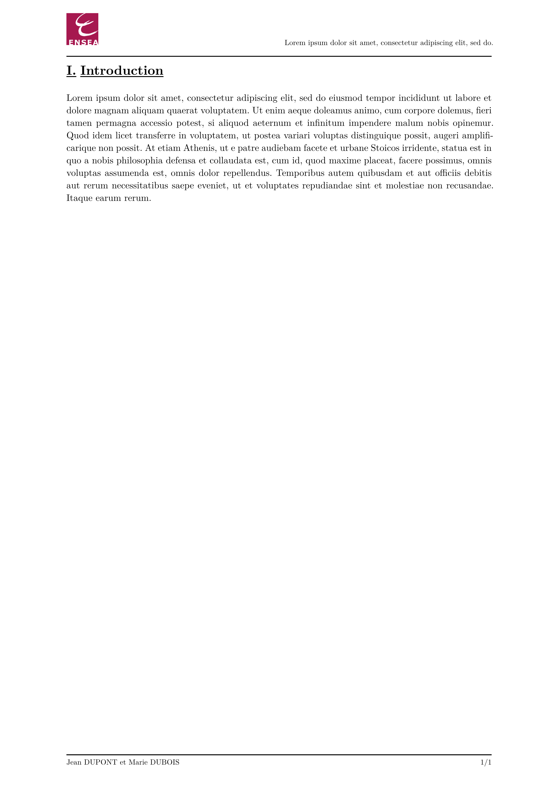

# ENSEA - Typst Lab Template (unofficial)

Unofficial template for lab reports at ENSEA, a French engineering school.

## README [here](https://github.com/Dawod-G/ENSEA_Typst-Template/blob/main/volt-lab-ensea/0.1.1/README.md)

## Usage

Either use this template in the Typst web app:
```typst
#import "@preview/volt-lab-ensea:0.1.1": *
```
or use the command line to initialize a new project based on this template:
```typst
typst init @preview/volt-lab-ensea:0.1.1
```

## Default Values

| Parameter        | Default Value | Description                                          |
|------------------|---------------|------------------------------------------------------|
| `title`          | `none`        | Title of the lab report                              |
| `authors`        | `none`        | Name(s) of the student(s) contributing to the report |
| `student-info`   | `none`        | Information about the student(s)                     |
| `lab-description`| `none`        | Description of the lab objectives                    |

All fields listed above are **mandatory**.

## Example

```typst
#import "@preview/volt-lab-ensea:0.1.1": *

#show: report.with(
  title: [#lorem(10)],
  authors: (
    "Jean DUPONT",
    "Marie DUBOIS",
  ),
  student-info: [*Élève ingénieur en X#super[ème] année* #linebreak()
    Promotion 20XX #linebreak()
    Année 20XX/20XX],
  lab-description: [
    - #lorem(15) #linebreak()
    - #lorem(15) #linebreak()
    - #lorem(15)
  ],
)

= Introduction
#lorem(120)
```

<p align="center">
  
  
</p>

## Changelog

v0.1.1 :
- Disable hyphenation and paragraph justification in outline  
- Add bold to equation numbering and figure prefix  
- Fix heading spacing

v0.1.0 : Initial release

## Contributions

If you find any issues or have suggestions for improvements, feel free to open an issue or submit a pull request. 

## License

The Typst template is licensed under the [MIT license](https://github.com/Dawod-G/ENSEA_Typst-Template/blob/main/LICENSE.md). This license does not apply to the ENSEA logo or associated image files, which remain the property of ENSEA.