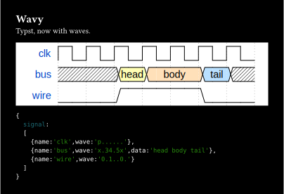

# [Wavy](https://github.com/Enter-tainer/wavy)

Draw digital timing diagram in Typst using [Wavedrom](https://wavedrom.com/).




````typ
#import "@preview/wavy:0.1.0": render as wavy-render

#set page(height: auto, width: auto, fill: black, margin: 2em)
#set text(fill: white)

#show raw.where(lang: "wavy"): it => wavy-render(it.text)

= Wavy

Typst, now with waves.

```wavy
{
  signal:
  [
    {name:'clk',wave:'p......'},
    {name:'bus',wave:'x.34.5x',data:'head body tail'},
    {name:'wire',wave:'0.1..0.'}
  ]
}
```

```js
{
  signal:
  [
    {name:'clk',wave:'p......'},
    {name:'bus',wave:'x.34.5x',data:'head body tail'},
    {name:'wire',wave:'0.1..0.'}
  ]
}
```

````


## Documentation

### `render`

Render a wavedrom json5 string to an image

#### Arguments

* `src`: `str` - wavedrom json5 string

#### Returns

The image, of type `content`
