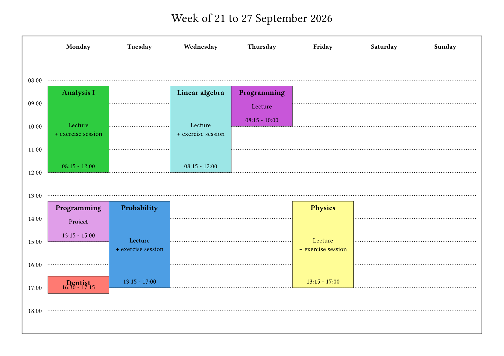
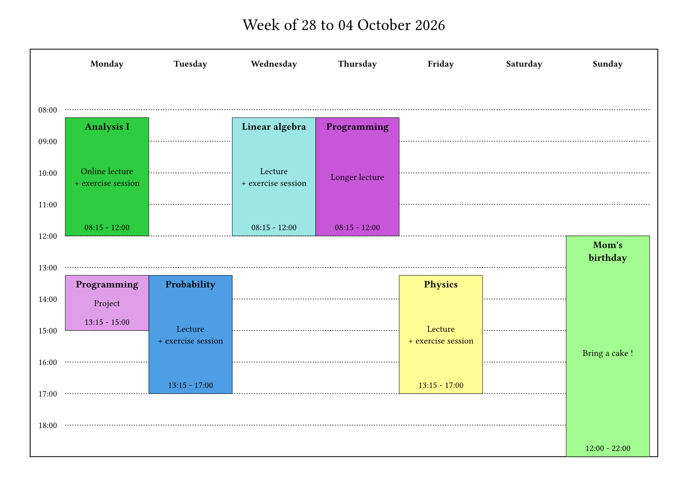
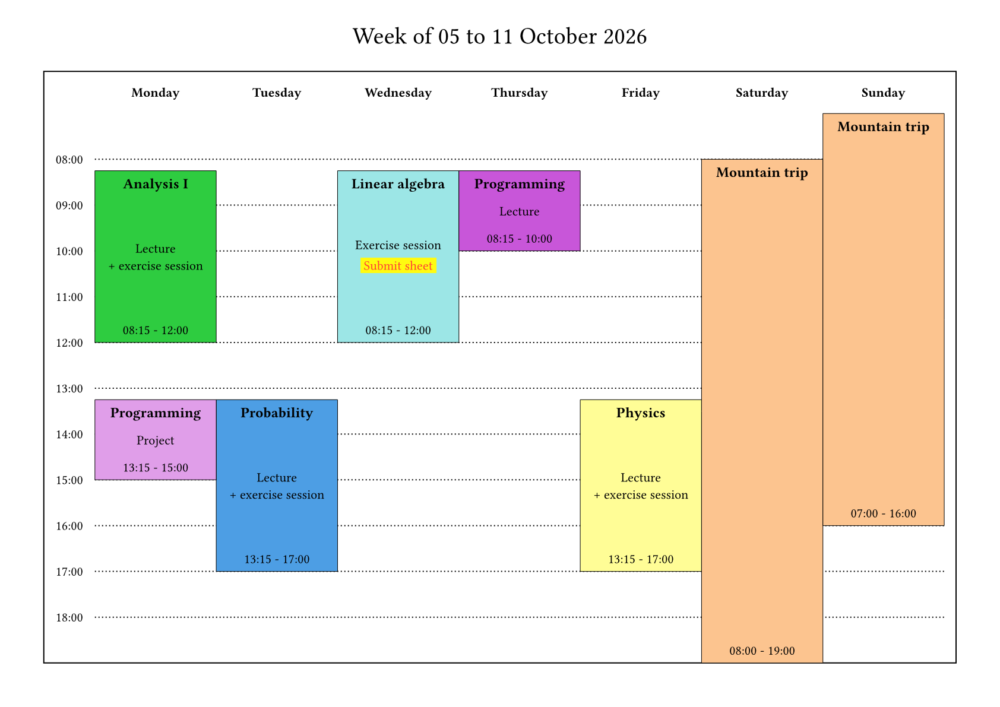

# weeklendar

Weeklendar is a Typst package for creating flexible weekly calendars. Its visual design is based on the LaTeX [timetable](https://www.overleaf.com/latex/templates/timetable/npdzfmychtjm) template on Overleaf. It is ideal for people whose weekly timetables vary from week to week. 

## Dependencies

Weeklendar is using [Cetz 0.5.2](https://typst.app/universe/package/cetz/).

## Example

An example with default styling. Information on styling customization can be found in the [manual](https://github.com/Yesteeer/typst-weeklendar/releases/download/latest/manual.pdf). 

_Click on any image to see the source code._

[](assets/readme-example.typ)
[](assets/readme-example.typ)
[](assets/readme-example.typ)

## Features 

- highly customizable title, time slices, week days, and event styling
- manage events spanning on multiple days or weeks
- a compact syntax for periodic events

## Limitations

- no support for simultaneous events (they simply overlap)
- no support for external calendar files (.ics, ...) import

## Usage

Import and use weeklendar. 

```typst
#import "@preview/weeklendar:0.1.0": *

#weeklendar(
    // ..events
)
```

## Changelog

### 0.1.0

- Initial release
