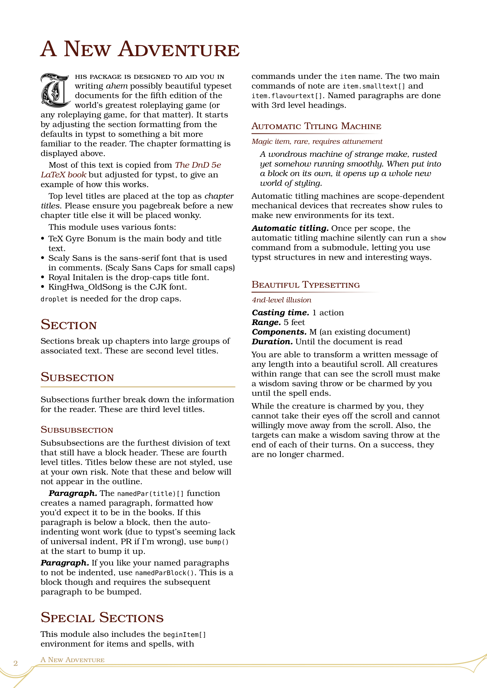

# wenyuan-campaign

A template for writing RPG campaigns imitating the 5e theme. This was made as a typst version of the $\LaTeX$ package [DnD 5e LaTeX Template](https://github.com/rpgtex/DND-5e-LaTeX-Template), though it is not functionally nor entirely visually similar.

# Dependencies

Packages:
- `droplet:0.3.1`

Fonts: 
- TeX Gyre Bonum
- Scaly Sans
- Scaly Sans Caps
- Royal Initalen
- 京華老宋体 KingHwa OldSong

***Please note: in an effort to reduce the file size of the template, fonts are included in MY repository only, not in the typst official one.*** You may find the fonts in my [github repository in the fonts folder](https://github.com/yanwenywan/typst-packages/tree/master/wenyuan-campaign/0.1.0/template/fonts), or download them yourself, or heck provide your own fonts to your liking.

# Usage

```
typst init @preview/wenyuan-campaign:0.1.0
```

This will copy over all required fonts and comes prefilled with the standard template so you can see how it works. To use this you need to either install all the fonts locally or pass the folder into --font-path when compiling.

# Configuration

To initialise the style, do:

```typ
#import "@preview/wenyuan-campaign:0.1.0": *

#show: conf.with() 
```

Very easy.

Optionally, you may set all the theme fonts from the configure function (the defaults are shown):

```typ
#import "@preview/wenyuan-campaign:0.1.0": *

#show: conf.with(
    fontsize: 10pt,
    mainFont: ("TeX Gyre Bonum", "KingHwa_OldSong"),
    titleFont: ("TeX Gyre Bonum", "KingHwa_OldSong"),
    sansFont: ("Scaly Sans Remake", "KingHwa_OldSong"),
    sansSmallcapsFont: ("Scaly Sans Caps", "KingHwa_OldSong"),
    dropcapFont: "Royal Initialen"
) 
```

You are encouraged to copy the template files and modify them if they are not up to your liking.

# Main Functions

**set-theme-colour**`(colour: color)`.  
Sets a theme colour from the colours package of this module or any other colour you want—up to you if it looks bad :)  
The colours recommended are:  
> phbgreen, phbcyan, phbmauve, phbtan, dmglavender, dmgcoral, dmgslategrey (-ay), dmglilac

---

**make-title**`(title: content, subtitle: content = [], author: content = [], date: content = [], anything-before: content = [], anything-after: content = [])`.  
Makes a simple title page.

Parameters:  
- title: main book title  
- subtitle: (optional) subtitle  
- author: (optional)  
- date: (optional) -- just acts as a separate line, can be used for anything else  
- anything-before: (optional) this is put before the title  
- anything-after: (optional) this is put after the date  

---

**drop-paragraph**`(small-caps: string = "", body: content)`.  
Makes a paragraph with a drop capital.

Parameters:  
- small-caps: (optional) any text you wish to be rendered in small caps, like how DnD does it  
- body: anything else  

---

**bump**`()`.  
Manually does a 1em paragraph space  

---

**namedpar**`(title: content, content: content)`.  
A paragraph with a bold italic name at the start.

Parameters:  
- title: the bold italic name; a full stop/period is added immediately after for you  
- content: everything else  

---

**namedpar-block**`(title: content, content: content)`.  
See **namedpar**, but this one is in a block environment.  

---

**readaloud**`[]`.  
A tan-coloured read-aloud box with some decorations.  

---

**comment-box**`(title: content = [], content: content)`.  
A theme-coloured plain comment box.

Parameters:  
- title: (optional) a title in bold small caps  
- content  

---

**fancy-comment-box**`(title: content = [], content: content)`.  
A theme-coloured fancy comment box with decorations.

Parameters:  
- title: (optional) a title in bold small caps  
- content  

---

**dndtable**`(...)`.
A theme-coloured dnd-style table. Parameters are identical to table except stroke, fill, and inset are not included.

---

**sctitle**`[]`.  
Makes a small caps header block.  

---

**begin-stat**`[]`.  
Begins the monster statblock environment.  

---

**begin-item**`[]`.  
Begins the item environment.  


# Statblock

***Important.*** Statblocks are provided under the `stat` namespace, and will only work as intended in a `beginStat` block. All statblock functions must be prepended with `stat`.

## stat functions

**dice**`(value: str)`  
Parses a dice string (e.g., `3d6`, `3d6+2`, or `3d6-1`) and returns a formatted dice value (e.g., "10 (3d6)"). Specifically, the types of strings it accepts are:

> `\d+d\d+([+-]\d+)?` (number `d` number `+/-` number)  

(You need to ensure the string is correct.)  

---

**dice-raw**`(num-dice: int, dice-face: int, modifier: int)`  
A helper function for the above, optionally used. It takes all values as integers and prints the correct formatting.  

---

**statheading**`(title, desc = [])`  
Takes a title and description, formatting it into a top-level monster name heading. `desc` is the description of the monster, e.g., *Medium humanoid, neutral evil*, but it can be anything.  

---

**stroke**`()`.  
Draws a red stroke with a fading right edge.  

---

**main-stats**`(ac = "", hp-dice = "", speed = "30ft", hp-etc = "")`  
Produces **Armor Class**, **Hit Points**, and **Speed** in one go. All fields are optional. `hp-dice` accepts a *valid dice string only*—if you do not want to use dice, leave it blank and use `hp-etc`. No restrictions on other fields.  

---

**ability**`(str, dex, con, int, wis, cha)`  
Takes the six ability scores (base values) as integers and formats them into a table with appropriate modifiers.  

---

**challenge**`(cr: str)`  
Takes a numeric challenge rating (as a string) and formats it along with the XP (if the challenge rating is valid). All CRs between 0–30 are valid, including the fractional `1/8`, `1/4`, `1/2` (which can also be written in decimal form, e.g., `0.125`).  

---

**skill**`(title, contents)`  
Takes a title and description, creating a single skills entry. For example, `#skill("Challenge", challenge(1))` will produce (in red):  

> **Challenge** 1 (200 XP)  

(This uses `challenge` from above.)  

**Section headers** such as *Actions* or *Reactions* are done using the second-level header `==`

**Action names** -- the names that go in front of actions / abilities are done using the third level header `===` (do not leave a blank line between the header and its body text) 

# Item

***Important.*** Basic item capability is provided under the `item` namespace, and will only work as intended in a `beginItem` block. All item functions must be prepended with `item`.

## item functions

**Item Name** is done with the top-level header `=`

**Section headers** are the second level header `==`

**Abilities and named paragraphs** are the third level header `===`

---

**smalltext**`[]`. Half-size text for item subheadings

**flavourtext**`[]`. Indented italic flavour text


# Sample



# Acknowledgments

- The overall style is based on the [Dnd 5e LaTeX Template](https://github.com/rpgtex/DND-5e-LaTeX-Template), which in turn replicate the base DnD aesthetic.
- TeX Gyre Bonum by GUST e-Foundry is used for the body text
- Scaly Sans and Scaly Sans Caps are part of [Solbera's CC Alternatives to DnD Fonts](https://github.com/jonathonf/solbera-dnd-fonts) and are used for main body text. ***Note that these fonts are CC-BY-SA i.e. Share-Alike, so keep that in mind. This shouldn't affect homebrew created using these fonts (just like how a painting made with a CC-BY-SA art program isn't itself CC-BY-SA) but what do I know I'm not a lawyer.***
- [KingHwa_OldSong](https://zhuanlan.zhihu.com/p/637491623) (京華老宋体) is a traditional Chinese print font used for all CJK text (if present, mostly because I need it)

