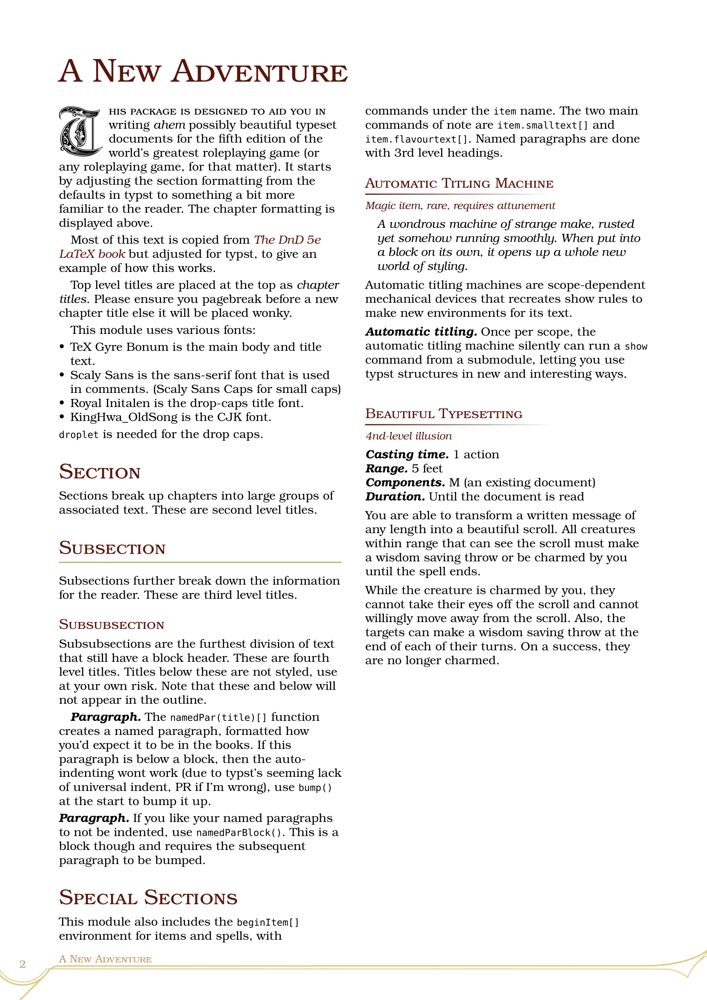

# wenyuan-campaign

A template for writing RPG campaigns imitating the 5e theme. This was made as a typst version of the LaTeX package [DnD 5e LaTeX Template](https://github.com/rpgtex/DND-5e-LaTeX-Template), though it is not functionally nor entirely visually similar.

***New in 0.1.1.*** `make-title` now exposes the page background and main title colour, allowing greater customisability. All gradient strokes now properly use transparency so they won't look weird on non-default backgrounds. 

# Dependencies

Packages:
- `droplet:0.3.1`

Fonts: 
- TeX Gyre Bonum
- Scaly Sans
- Scaly Sans Caps
- Royal Initalen
- 京華老宋体 KingHwa OldSong

***Please note: in an effort to reduce the file size of the template, fonts are not included.*** See the footer for sources to the font files, you will have to download them yourself, or configure the template to use your own fonts!

# Usage

```
typst init @preview/wenyuan-campaign:0.1.1
```

This will copy over all required fonts and comes prefilled with the standard template so you can see how it works. To use this you need to either install all the fonts locally or pass the folder into --font-path when compiling.

[See the guide for more info](https://github.com/yanwenywan/typst-packages/tree/master/wenyuan-campaign/0.1.1/docs.pdf)

# Configuration

To initialise the style, do:

```typ
#import "@preview/wenyuan-campaign:0.1.1": *

#show: conf.with() 
```

Very easy.

Optionally, you may set all the theme fonts from the configure function (the defaults are shown):

```typ
#import "@preview/wenyuan-campaign:0.1.1": *

#show: conf.with(
    fontsize: 10pt,
    mainFont: ("TeX Gyre Bonum", "KingHwa_OldSong"),
    titleFont: ("TeX Gyre Bonum", "KingHwa_OldSong"),
    sansFont: ("Scaly Sans Remake", "KingHwa_OldSong"),
    sansSmallcapsFont: ("Scaly Sans Caps", "KingHwa_OldSong"),
    dropcapFont: "Royal Initialen"
) 
```

You are encouraged to copy the template files and modify them if they are not up to your liking.

# Sample



# Acknowledgments

- The overall style is based on the [Dnd 5e LaTeX Template](https://github.com/rpgtex/DND-5e-LaTeX-Template), which in turn replicate the base DnD aesthetic.
- TeX Gyre Bonum by GUST e-Foundry is used for the body text
- Scaly Sans and Scaly Sans Caps are part of [Solbera's CC Alternatives to DnD Fonts](https://github.com/jonathonf/solbera-dnd-fonts) and are used for main body text. ***Note that these fonts are CC-BY-SA i.e. Share-Alike, so keep that in mind. This shouldn't affect homebrew created using these fonts (just like how a painting made with a CC-BY-SA art program isn't itself CC-BY-SA) but what do I know I'm not a lawyer.***
- [KingHwa_OldSong](https://zhuanlan.zhihu.com/p/637491623) (京華老宋体) is a traditional Chinese print font used for all CJK text (if present, mostly because I need it)

