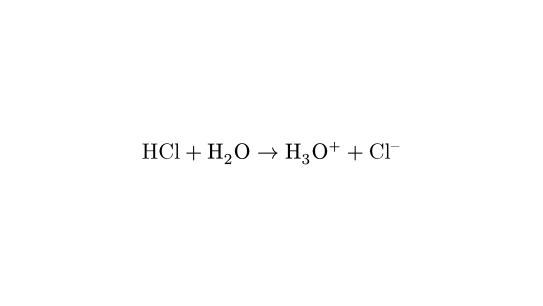

# whalogen

whalogen is a library for typsetting chemical formulae with Typst, inspired by mhchem.

GitHub repository: https://github.com/schang412/typst-whalogen

## Examples



```typst
#import "@preview/whalogen:0.2.0": ce

$ #ce("HCl + H2O -> H3O+ + Cl-") $
```

See the [manual](manual.pdf) for more details and examples.
