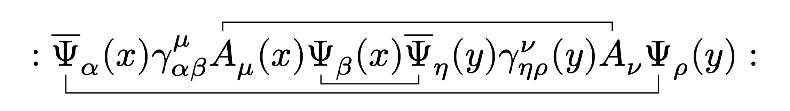

# wicked

This small [Typst](https://typst.app/) package handles the typesetting of [Wick contractions](https://en.wikipedia.org/wiki/Wick%27s_theorem). Read [`docs.pdf`](docs.pdf) for more information. 

<p align="center">
    
</p>

```typ
#import "@preview/wicked:0.1.0": wick

$ :
wick(id: #1, overline(Psi))_alpha (x)
gamma^mu_(alpha beta) 
wick(pos: #top, A)_mu (x) 
wick(Psi)_beta (x)
wick(overline(Psi))_eta (y)
gamma^nu_(eta rho) (y)
wick(pos: #top, A)_nu 
wick(id: #1, Psi)_rho (y)
: $
```