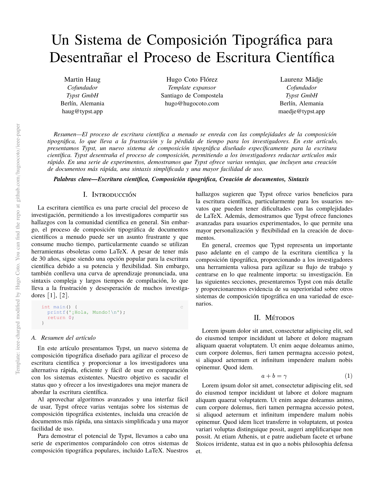

# IEEE Article in Typst

A multilanguage Typst template for writing academic papers in the IEEE style (Unofficial). Based on the ieee-charged template.



---

## Usage

### From Typst Universe

```typst
#import "@preview/wired-ieee:1.0.0": ieee

#show: ieee.with(
  title: [A Novel Approach to Typst Templates],
  authors: (
    (name: "Jane Doe", organization: "University of Typst", email: "jane@example.com"),
  ),
  abstract: [This paper introduces a comprehensive IEEE template...],
  index-terms: ("Typst", "IEEE", "Typesetting"),
  bibliography: bibliography("refs.bib"),
  lang: "en",
)

= Introduction
Your article content goes here...
```

### Locally

Run `./install.sh` to copy the package to your local typst path, then:

```
typst init @local/wired-ieee:1.0.0
```
