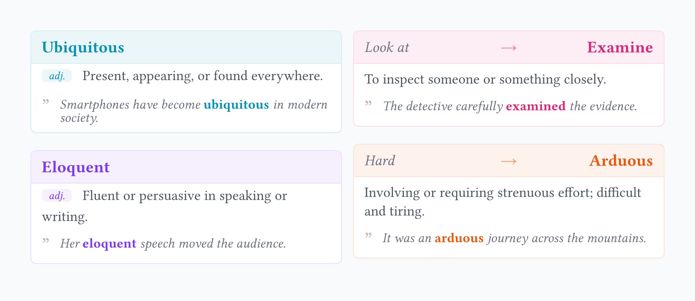

# wordc

A beautiful, compact, and smart vocabulary card package for Typst. 
Designed for language learners and writers who want to build elegant vocabulary lists or flashcards.



## Features

- **✨ Dual Modes**: Automatically switches between **Standard Definition** (Word + POS) and **Comparison/Upgrade** (Basic $\to$ Advanced) modes based on input.
- **🔍 Smart Highlighting**: Automatically detects and highlights the target word (and its morphological variations) within example sentences.
- **🎨 Visual Hierarchy**: Clean typography with accent colors, tags, and masonry-layout compatibility.

## Getting Started

Usage Examples
1. Standard Vocabulary Card
Use this mode for definitions. The examples parameter supports auto-highlighting (e.g., "meticulous" matches "meticulous" in the sentence).
```typst
#import "@preview/wordc:0.1.0": wordc

#set page(width: auto, height: auto, margin: 1em)

#wordc(
  "Meticulous",
  pos: "adj.",
  def: "Showing great attention to detail; very careful and precise.",
  examples: "He was meticulous about hygiene.",
  accent-color: rgb("#0f766e")
)
```

2. Synonym / Writing Upgrade Card
Pass an array ("Basic", "Advanced") to the first parameter to activate Comparison Mode. This is perfect for "Word Choice" notes.

```typst

#import "@preview/wordc:0.1.0": wordc

#set page(width: auto, height: auto, margin: 1em)

#wordc(
  ("Hard", "Arduous"),
  pos: "adj.",
  def: "Involving or requiring strenuous effort; difficult and tiring.",
  examples: "It was an arduous journey across the mountains.",
  accent-color: rgb("#ea580c")
)
```