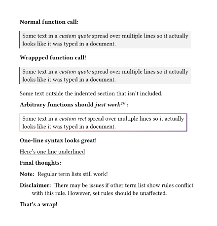

# wrap-indent

This package lets you wrap blocks of indented content with arbitrary
functions without square brackets. It works by using Typst's existing
[term-list](https://typst.app/docs/reference/model/terms/) syntax with a
custom function, `wrap-in()`, (accepting a wrapper function), and a
show-rule on `terms.item` as `wrap-term-item`.

You can find the original writeup here: \
<https://typst.app/project/r5ogFas7lj7E48iHw_M4yh>

Here's an example!



And here's the code:

```typ
// ---- initialization ---- //

#import "@preview/wrap-indent:0.1.0": wrap-term-item, wrap-in

#show terms.item: wrap-term-item
```

```typ
// ---- example document ---- //

#set page(width: 5.5in, margin: 0.5in, height: auto)

// A function for wrapping some text:
#let custom-quote(body) = rect(
  body,
  fill: luma(95%),
  stroke: (left: 2pt + luma(30%))
)

*Normal function call:*

#custom-quote[
  Some text in a _custom quote_ spread over
  multiple lines so it actually looks like
  it was typed in a document.
]

*Wrappped function call!*

/ #wrap-in(custom-quote):
  Some text in a _custom quote_ spread over
  multiple lines so it actually looks like
  it was typed in a document.

Some text outside the indented section
that isn't included.

*Arbitrary functions should _just work#emoji.tm;_ :*

/ #wrap-in(
    x => rect(x, stroke: gradient.linear(..color.map.flare))
  ):
  Some text in a _custom rect_ spread over
  multiple lines so it actually looks like
  it was typed in a document.

*One-line syntax looks great!*

/ #wrap-in(underline): Here's one line underlined

*Final thoughts:*

/ Note\: :
  Regular term lists still work!

/ Disclaimer\: :
  There may be issues if other term list show rules
  conflict with this rule. However, set rules should
  be unaffected.

*That's a wrap!*
```
