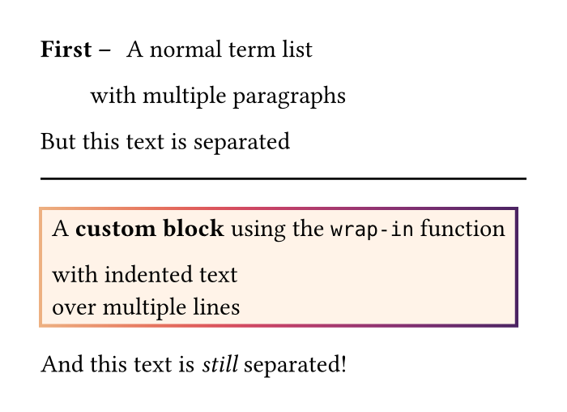
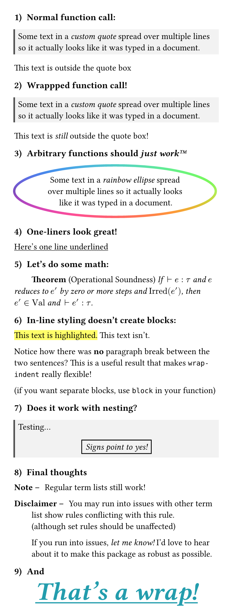

# wrap-indent

`wrap-indent` is a package for wrapping content in custom functions
with just indentation. This lets you avoid using trailing square brackets
to wrap content, instead you just indent it!

This system works by re-purposing Typst's existing
[term-list](https://typst.app/docs/reference/model/terms/) syntax via a
custom show rule on `terms.item`. We give it our custom function
within [state](https://typst.app/docs/reference/introspection/state/)
via a new `wrap-in()` function.

## Here's a minimal example!



```typ
#set page(height: auto, width: 3.5in, margin: 0.25in)

#import "@preview/wrap-indent:0.1.0": wrap-in, allow-wrapping

#show terms.item: allow-wrapping

/ First --:
  A normal term list

  with multiple paragraphs

But this text is separated


#line(length: 100%)


#let custom-block(content) = rect(content,
  fill: orange.lighten(90%),
  stroke: 1.5pt + gradient.linear(..color.map.flare)
)

/ #wrap-in(custom-block):
  A *custom block* using the `wrap-in` function

  with indented text \
  over multiple lines

And this text is _still_ separated!
```


And in its own code block, here's the required initialization:

```typ
#import "@preview/wrap-indent:0.1.0": wrap-in, allow-wrapping

#show terms.item: allow-wrapping
```

## And here's a more complicated example!



```typ
#set page(height: auto, width: 4.1in, margin: 0.25in)

#show heading: set text(size: 0.75em)
#show heading: set block(below: 1em)
#set heading(numbering: "1) ")

= Normal function call:

// A function for wrapping some text:
#let custom-quote(body) = rect(
  body,
  width: 100%,
  fill: luma(95%),
  stroke: (left: 2pt + luma(30%))
)

#custom-quote[
  Some text in a _custom quote_ spread over multiple lines
  so it actually looks like it was typed in a document.
]
This text is outside the quote box


= Wrappped function call!

/ #wrap-in(custom-quote):
  Some text in a _custom quote_ spread over multiple lines
  so it actually looks like it was typed in a document.

This text is _still_ outside the quote box!


= Arbitrary functions should _just work#emoji.tm;_

/ #wrap-in(x => ellipse(align(center, x),
    stroke: 3pt + gradient.conic(..color.map.rainbow)
  )):
  Some text in a _rainbow ellipse_ spread
  over multiple lines so it actually looks
  like it was typed in a document.


= One-liners look great!

/ #wrap-in(underline): Here's one line underlined


= Let's do some math:

#let named-thm(name) = (content) => {
  pad(left: 2em, par(hanging-indent: -2em)[
    *Theorem* (#name) #emph(content)
  ])
}

/ #wrap-in(named-thm("Operational Soundness")):
  If $med tack e : tau$ and $e$ reduces to $e'$
  by zero or more steps and $"Irred"(e')$,
  then $e' in "Val"$ and $med tack e' : tau$.


= In-line styling doesn't create blocks:

/ #wrap-in(highlight):
  This text is highlighted.
This text isn't.

Notice how there was *no* paragraph break between the
two sentences? This is a useful result that makes
`wrap-indent` really flexible!

(if you want separate blocks, use `block` in your function)


= Does it work with nesting?

/ #wrap-in(custom-quote):
  Testing...
  / #wrap-in(align.with(center)):
    / #wrap-in(rect):
      / #wrap-in(emph):
        Signs point to yes!


= Final thoughts

/ Note --:
  Regular term lists still work!

/ Disclaimer --:
  You may run into issues with other term list
  show rules conflicting with this rule. \
  (although set rules should be unaffected)

  If you run into issues, _let me know!_ I'd love to hear
  about it to make this package as robust as possible.


= And

#let big-statement(content) = {
  align(center, text(
    underline(stroke: 1.5pt, content),
    size: 32pt,
    weight: "bold",
    style: "italic",
    fill: eastern,
  ))
}

/ #wrap-in(big-statement):
  That's a wrap!
```

## References

You can find my original writeup here for more context: \
<https://typst.app/project/r5ogFas7lj7E48iHw_M4yh>

And also see the GitHub issue that prompted me to make this: \
<https://github.com/typst/typst/issues/1921>
