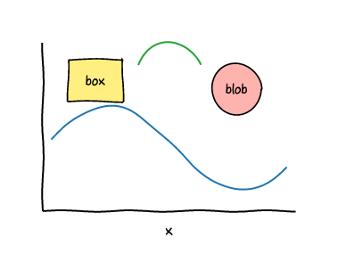
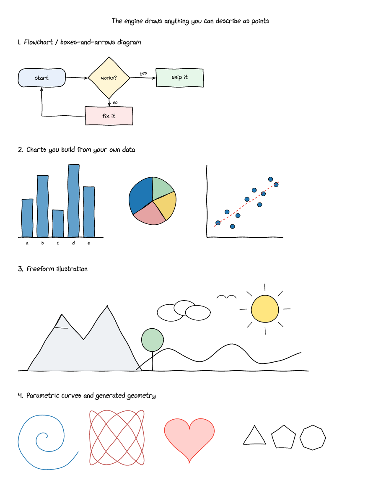

# xkcd-style TikZ → Typst + Rust/WASM

Port of <https://tex.stackexchange.com/a/445690> (Frunobulax, CC BY-SA 4.0)
to **Typst 0.15.1** + **CeTZ 0.5.2**, with the PGF `sketch` decoration
reimplemented as a **Rust WASM plugin**.



```
xkcd.typ          the document (4 figures)
xkcd-lib.typ      Typst side: path flattening + plugin binding
sketch.wasm       compiled plugin (78 KB, committed so it builds without Rust)
plugin/src/lib.rs the Rust source
fonts/            xkcd Script + xkcd (the original wants "Humor Sans")
build.sh          cargo build + typst compile
```

Build: `./build.sh` — or just `typst compile xkcd.typ --font-path fonts`
using the committed `sketch.wasm`.




## Why WASM here

The `penciline` port needed one Bézier per path segment — fine in Typst
markup. `sketch` is different: it steps along the path every **0.5 pt** and
offsets each step, so a single figure is tens of thousands of iterations,
each with a `pow`, a `sin` and a PRNG draw. In interpreted Typst that is
slow and awkward; in Rust the whole document compiles in **~0.6 s**.

## The PGF PRNG, bit for bit

`\pgfmathsetseed{1}` only means something if `rand` means the same thing, so
`PgfRng` replicates `pgfmathfunctions.random.code.tex` exactly — a
Park–Miller/Lehmer generator evaluated with **Schrage's trick** to stay
inside TeX's 31-bit integers:

```
a = 69621   q = 30845   r = 23902   m = 2^31 - 1     (a*q + r == m, verified)
z <- a*(z mod q) - r*(z div q)          (+m if negative)
rand = ((z mod 200001) - 100000) / 100000
```

That last line is the part worth noting: `rand` is **not** a plain
`z/m` float. TeX builds it digit-wise, so it is quantised to multiples of
1/100000. Same seed ⇒ same wobble as LuaLaTeX.

The decoration state machine is then a direct transcription:

```
t <- mod(t + randomness^rand, wavelength)        randomness=2, wavelength=100
offset = amplitude * sin(2*pi*t/wavelength)      amplitude=0.5pt, step=0.5pt
```

## Two things that bite

**Decorate in paper space, not data space.** Figures 1 and 2 use
`xscale=4, yscale=0.05` / `xscale=0.08, yscale=0.15`. TikZ applies the
scale, *then* decorates, so the wobble is always ~0.5 pt on paper. Feeding
the plugin unscaled data coordinates and scaling afterwards divides the
offset by `yscale` — at `yscale=0.05` that is a **20× overshoot**, which
turned the first plot into a zigzag. All coordinates are mapped to canvas
units before the plugin sees them.

**Typst's `str(-1.5)` uses U+2212**, a Unicode minus, not ASCII `-`. Rust's
`f64::from_str` rejects it, so `fmt()` normalises it before handing numbers
to the plugin.

## Notes

- Output is ~15× lighter than the raw 0.5 pt sampling thanks to
  Ramer–Douglas–Peucker simplification (`epsilon`, in pt; set `0` to disable).
- Unlike `penciline`, `sketch` *follows* the path, so arcs stay arcs and the
  circle stays a circle — the "that's not even an ellipse" bugs are gone.
- The hatch fill is a Typst `tiling`, which clips at the tile edge rather
  than tracing the sketchy outline.
- "Humor Sans" is not redistributable here; bundled xkcd Script is the same
  design lineage. Swap the `#set text(font: ...)` line to use another.
