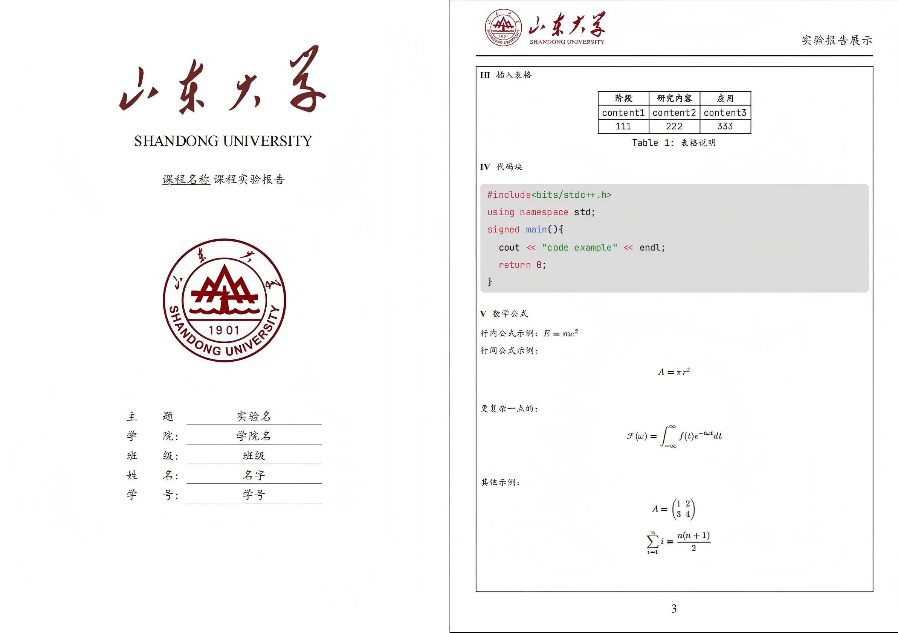
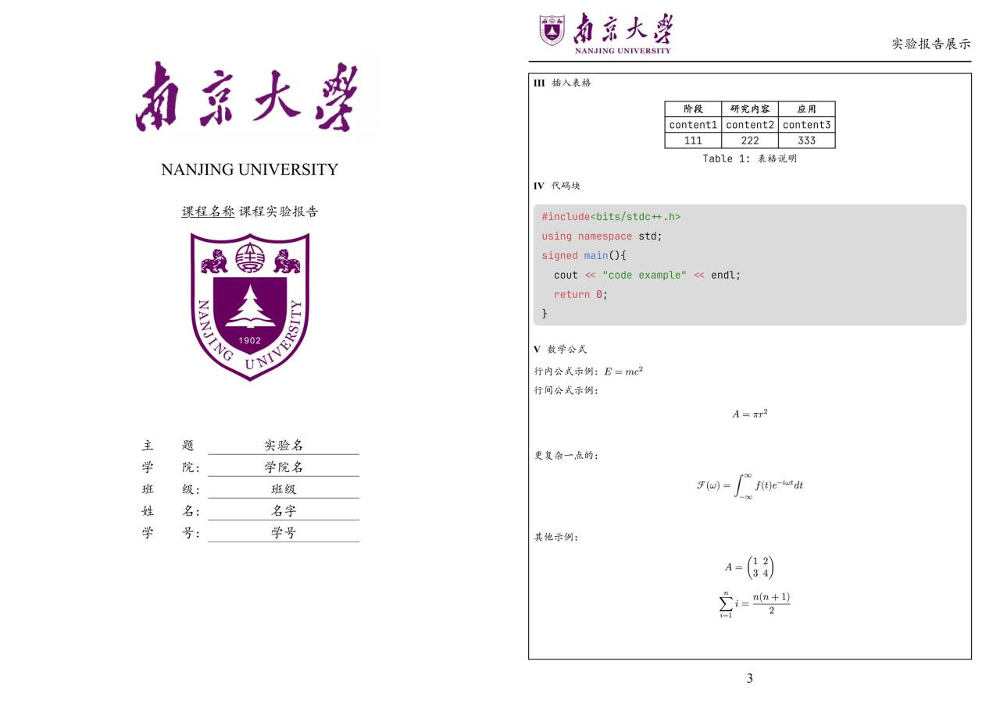

*A simple experiment report template for typst*
简单、通用的实验报告模板，使用typst制作

---
- 该模板在主题页设置了鲜明的关于学校信息的元素，适合学校课程的实验报告来使用，集成了封面生成、自动化排版、代码块高亮、文献引用等功能，便捷美观
- 模板默认学校为山东大学，同时接受其他学校的自定义设置，修改方法见下文
- 使用typst编写模板，语法简洁，功能上不输latex，编译速度快、使用简单
---
## Preview


---
## Usage
### 使用前请确保安装了以下字体：
- 宋体、楷体、黑体
- JetBrains Mono 
[Get JetBrains Mono and insatll](https://www.jetbrains.com/ja-jp/lp/mono/)
### 项目结构说明
```text
exp-report/
├── lib.typ         # 模板文件，可进行定制修改
└── template/
    ├── main.typ     # 你的报告正文文件
    |—— ref.bib      # 参考文献引用
    └── images/      # 模板图片资源目录，以及你的报告需要用的图片
```

## Quick start
### 方式一：使用typst web编辑器(最简单)
1、访问[typst网页版](https://typst.app/)，注册并登录
2、点击**Start from template**，搜索模板`xmdjy-simple-report-template`
3、选择模板并点击 **"Create"** 即可开始编辑
### 方式二：vscode本地编辑(推荐)
#### 第一步：安装插件

在 VS Code 中安装 [Tinymist Typst](https://marketplace.visualstudio.com/items?itemName=myriad-dreamin.tinymist) 插件

- 提供语法高亮、智能补全、错误检查
- 支持实时 PDF 预览和导出
#### 第二步：下载模板
```bash
git clone https://github.com/xmdjy/exp-report-template
cd template
```
新建typst文件并导入模板
```typst
#import "@preview/xmdjy-simple-report-template:0.1.0" : *
#showpage(
  course: "课程名称",
  college: "学院名",
  author : "名字",
  stdid: "学号",
  title: "实验名",
  class: "班级"
)
#reportpage[
    //正文内容
]
```
随后按照你的需要自行修改即可
## Customization
即便你不是山东大学的学生，依旧可以通过修改模板中的一些信息达到简单的定制效果，在`lib.typ`中修改全局变量并放入你的学校相关图片即可，具体方法如下：
```typst
#let school_title_pic = "./template/images/sdu-title-image.jpg"
#let school_logo_pic = "./template/images/sdu-pic-image.jpg"
#let school_title = "shandong university"
#let main_show_pic = "./template/images/sdu-report-image.png"
#let main_show_text = "实验报告展示"
```
- `school_title_pic`：学校中文名图片
- `school_logo_pic`：学校校徽图片
- `school_title`：学校英文全拼
- `main_show_pic`：正文部分左上角图标，建议学校图标+中&拼图片
- `main_show_text`：正文右上角文字，可以写与你的实验报告相关的内容

**注：请将上述图片放在./template/images目录下，修改时只需要改图片的文件名即可
如果修改好排版不太协调，请尝试修改$v()$中的间隔参数**


**经过简单替换之后达到的效果，同样适用！**
## Reference
- [typst官网](https://typst.app/)
- [typst中文教程](https://typst-doc-cn.github.io/docs/tutorial/)
- [小蓝书](https://typst-doc-cn.github.io/tutorial/)
- [南京大学-并不复杂的Typst讲座](https://www.bilibili.com/video/BV1AJ4m1j7Sa)
- [上海交通大学本科生毕业设计（论文）中期检查报告-模板](https://github.com/zh1-z/SJTU-Bachelor-Thesis-Midterm-Typst-Template)

**感谢以上资源对模板开发的帮助！**
