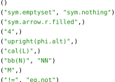

# Xodec

This package makes it possible to find the names of a symbol in [Codex](https://github.com/typst/codex), the library that populates the `sym` and `emoji` modules in Typst.


## Usage

```typ
#get-names("x") \
#get-names("∅") \
#get-names("➡\u{FE0E}") \
#get-math-names("4") \
#get-math-names("ϕ") \
#get-math-names("ℒ\u{FE00}") \
#get-math-names("ℕ") \
#get-math-names("𝑀") \
#get-math-names("≠")
```




## Changelog

### Version 0.2.0

- `get-names`, `get-deprecated-names`, and `get-math-names` functions.
- `codex-version` constant.