<p align="center">
  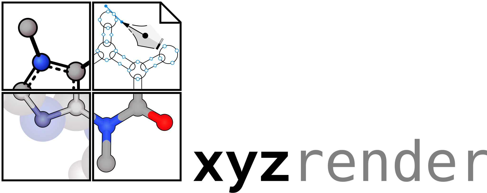
</p>

# xyzrender

**Molecules that look like they belong in a paper — rendered straight
inside your Typst document, no external tools involved.**

[](LICENSE)
[](https://typst.app)

<p align="center">
  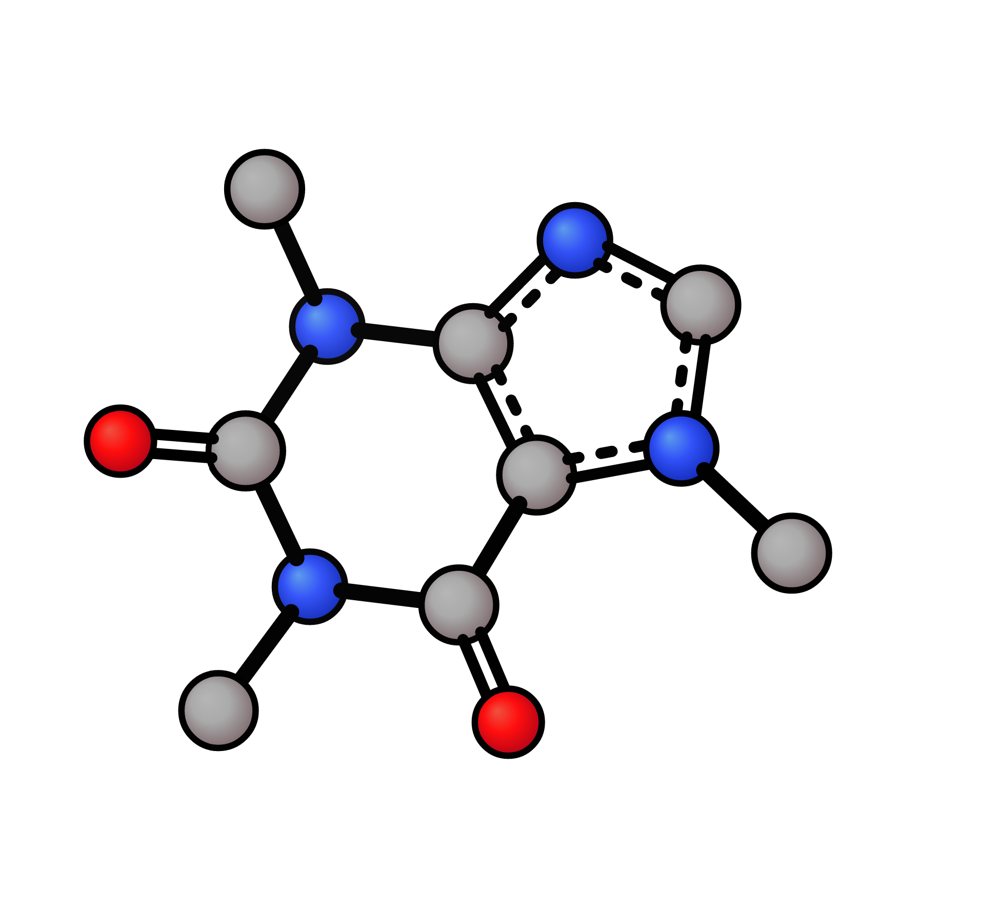
</p>

Hand it an XYZ or PDB file and get back a depth-cued, publication-quality
structure. Bonds, bond orders, and aromatic rings are all perceived
straight from the atomic geometry — no image files to manage, no
pre-rendering step, nothing to leave your document for.

This is a Typst port of [**xyzrender**](https://github.com/aligfellow/xyzrender)
by [Ali Goodfellow (@aligfellow)](https://github.com/aligfellow).

## What you get

- **Chemistry that figures itself out** — bonds, bond orders, and aromatic rings detected from geometry alone, via a Rust → WASM port of [`xyzgraph`](https://github.com/aligfellow/xyzgraph). Prefer alternating double bonds over aromatic circles? `kekule: true`.
- **11 built-in looks** — from clean vector line art (`wire`, `flat`) to shaded ball-and-stick (`tube`, `bubble`, `pmol`) to interlocked vdW spheres, CineMol-style.
- **Styling with real range** — colour, radius, opacity, gradients, and depth-fog, overridable per call, per document, or from a JSON config.
- **The details real papers need** — manual bond edits, dashed transition-state bonds, dotted NCI overlays, selective hydrogen display, automatic PCA orientation or explicit rotation.

Every override key above is documented with a live-rendered example in [`manual.pdf`](manual.pdf) — this README is the five-minute version.

## Installation

```typst
#import "@preview/xyzrender:0.1.0": xyzrender
```

## Quick start

```typst
#import "@preview/xyzrender:0.1.0": xyzrender

// Typst can't resolve file paths from inside a package, so read the file
// yourself and pass the bytes:
#xyzrender(
  read("caffeine.xyz", encoding: none),
  config: "tube",
  width: 8cm,
  rotate: (x: 30deg, y: -45deg),
)

// Document-wide defaults (optional): rebind the import with `.with()` —
// every later call merges its own kwargs on top of these.
#let xyzrender = xyzrender.with(config: "pmol", width: 6cm)
#xyzrender(read("caffeine.xyz", encoding: none))
```

## Representations

The same caffeine molecule across every built-in preset.

| Default | Flat | Paton (PyMOL-like) | Pmol |
|---------|------|--------------------|------|
|  |  | 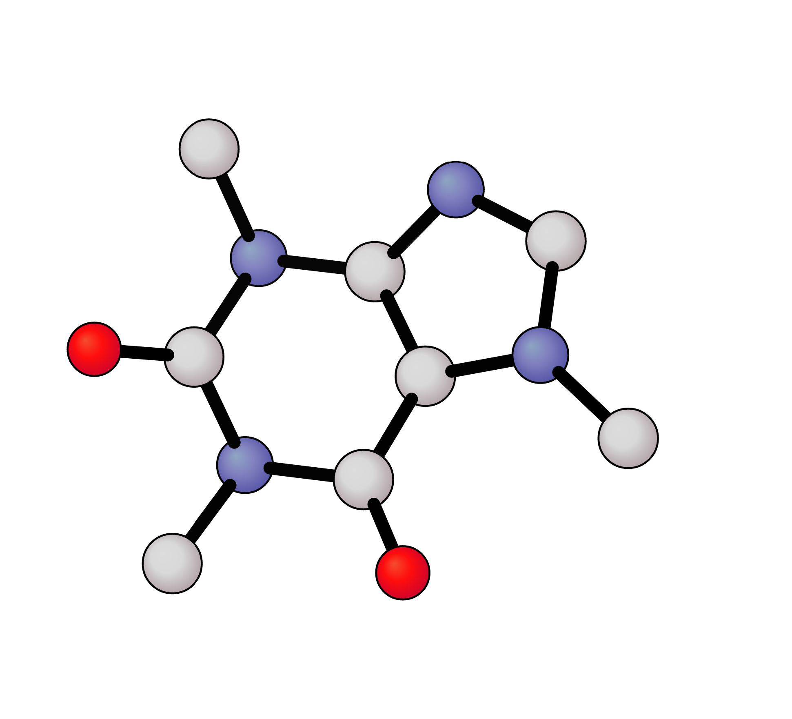 | 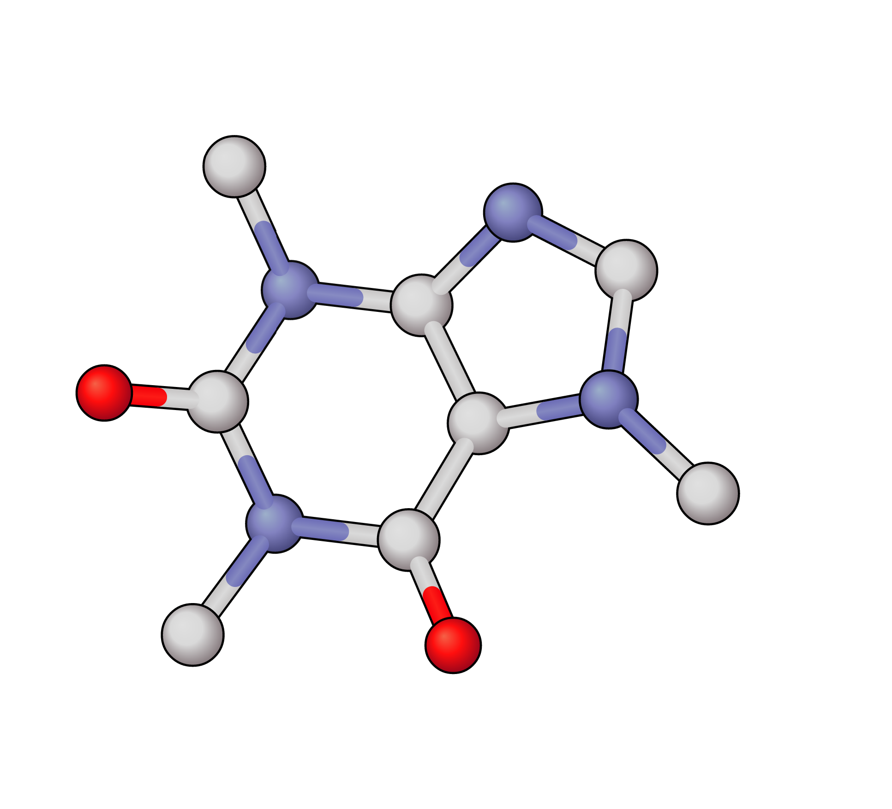 |

| Bubble | Tube | BTube | MTube |
|--------|------|-------|-------|
| 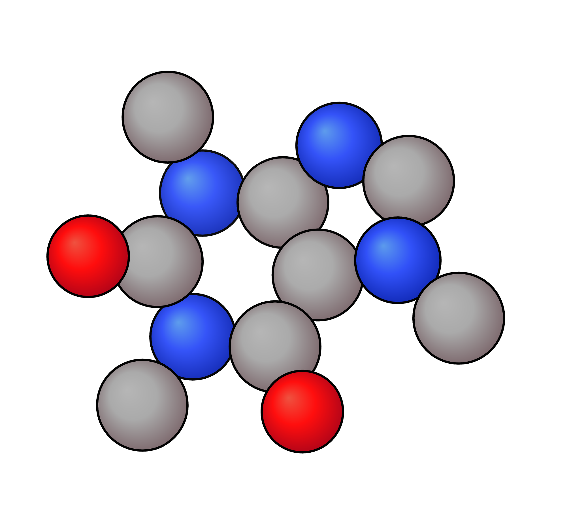 | 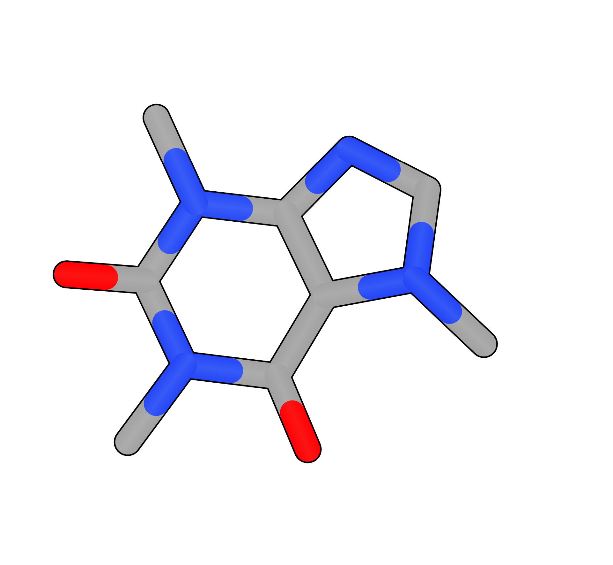 | 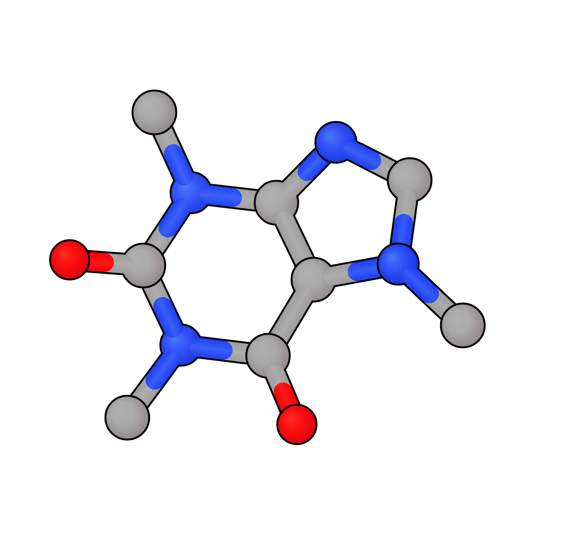 | 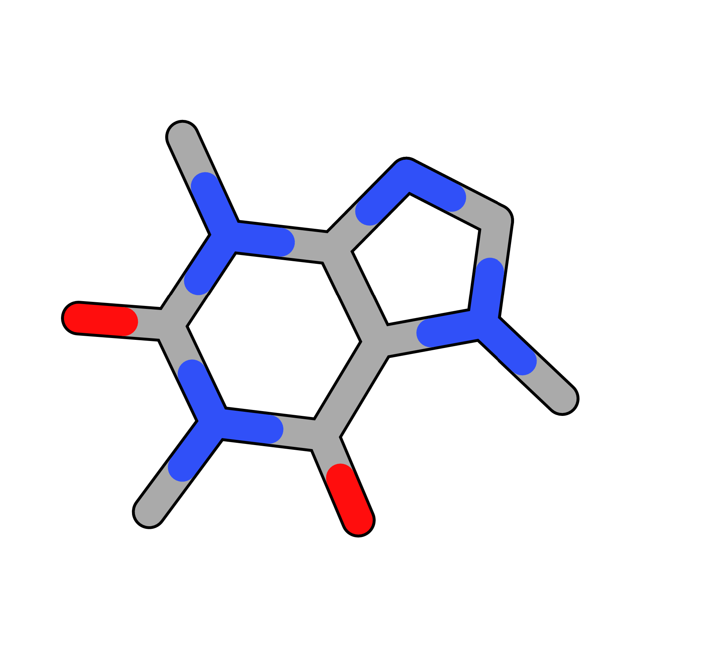 |

| Wire | Graph | vdW |
|------|-------|-----|
| 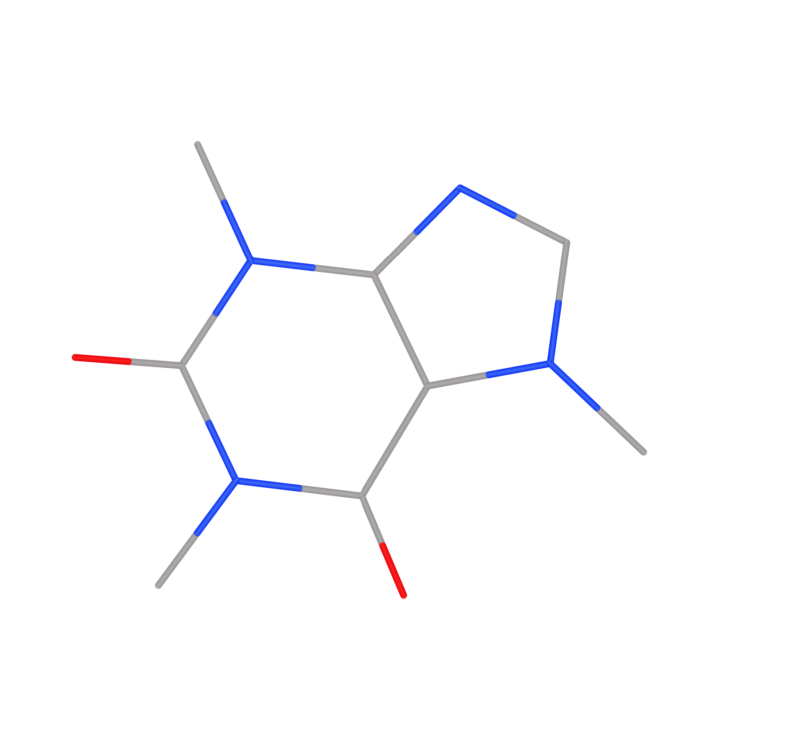 | 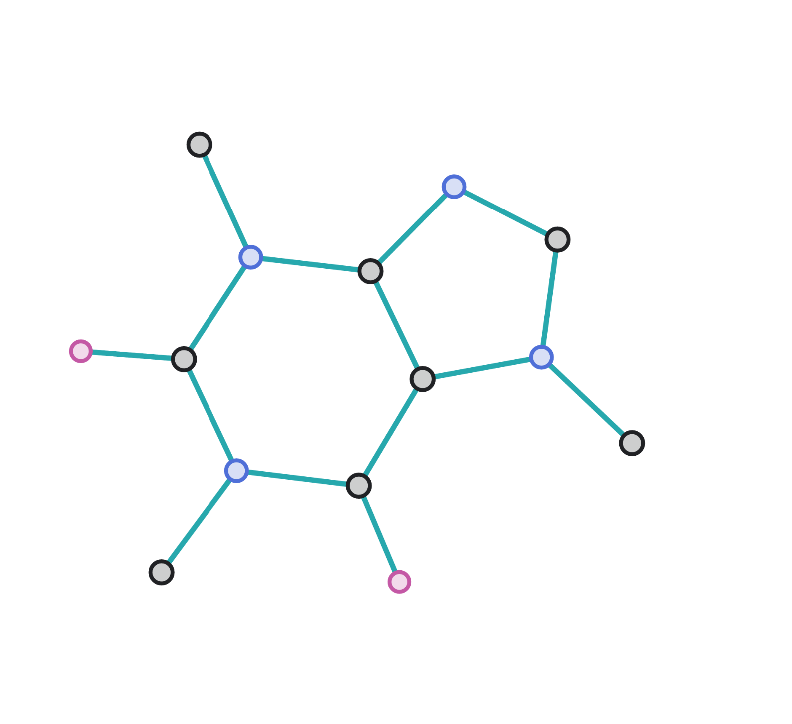 | 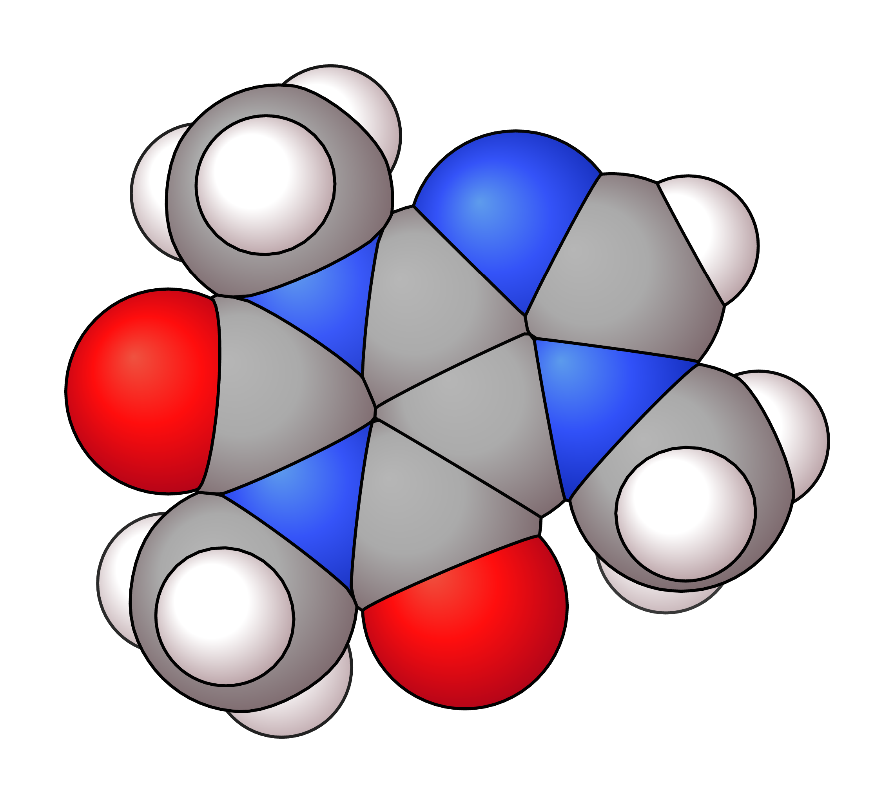 |

### Aromatic vs. Kekulé

Aromatic rings render as a solid-outer / dashed-inner pair by default; pass `kekule: true` for alternating single/double bonds instead.

| Aromatic (default) | Kekulé (`kekule: true`) |
|--------------------|-------------------------|
|  | 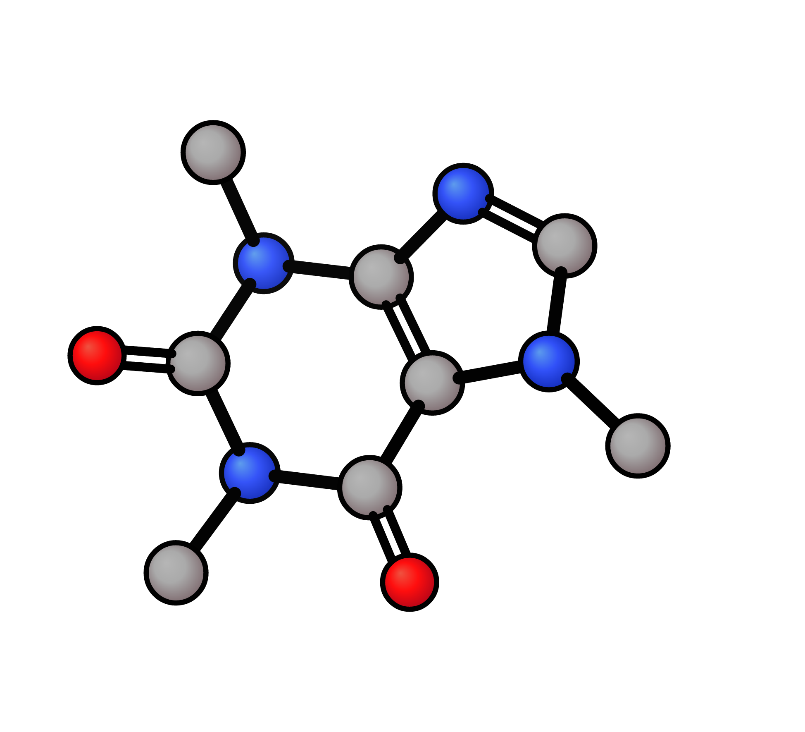 |

## Usage

```typst
xyzrender(source, config, width, height, rotate, frame, background, hy, no_hy, ..overrides)
```

`source` is XYZ or PDB bytes (or an inline string, or — once a `reader` is bound, see below — a bare path). `config` picks a built-in preset name or a `.json` file. Everything else is optional: framing (`width`, `height`, `rotate`, `frame`), hydrogens (`hy`, `no_hy`), `background`, and any recognised override key, merged on top of the preset (`defaults < default.json < preset.json < call-site kwargs`).

By default `source` needs `read(...)` called at the call site, since a package's own `read()` resolves paths relative to the package, not your document. Bind a `reader` once to use bare paths everywhere after:

```typst
#let xyzrender = xyzrender.with(reader: p => read(p, encoding: none))
#xyzrender("Structures/caffeine.pdb")
```

**Every recognised override — atom geometry, bonds, TS/NCI overlays, fog/shading, hydrogens, the VDW overlay, labels, style regions, canvas & framing — gets a live-rendered example in [`manual.pdf`](manual.pdf).**

## How it works

A small Rust → WASM plugin does XYZ/PDB parsing and bond / aromatic perception (a faithful port of [`xyzgraph`](https://github.com/aligfellow/xyzgraph), plus a direct port of upstream's `parse_pdb`). The Typst code handles styling and SVG emission, mirroring upstream's Python module layout 1:1 so new visual features port over by translating the matching file.

## Out of scope (for now)

Surfaces / molecular orbitals / cube files, GIF animations, stereochemistry labels, structural overlay & ensembles, convex-hull faces, crystal / periodic structures, the `skeletal` preset, and other non-XYZ input formats (MOL/SDF/MOL2/SMILES/CIF) are not ported. PDB is supported (see Usage above) but doesn't extract residue name, chain ID, occupancy/B-factor, or recognize multi-`MODEL` files — matching upstream, which doesn't either.

## License

[MIT](LICENSE). Upstream `xyzrender` is also MIT.

## Acknowledgements

All visual design, presets, and rendering algorithms are the work of the upstream `xyzrender` authors and the projects it builds on. This package is a port that aims to faithfully reproduce that output inside Typst documents.

## Citation

`xyzrender` uses [`xyzgraph`](https://github.com/aligfellow/xyzgraph) for all molecular graph construction — bond orders and aromaticity detection. If you use it in published work, please cite:

> A.S. Goodfellow* and B.N. Nguyen, *J. Chem. Theory Comput.*, 2026, DOI:
> [10.1021/acs.jctc.5c02073](https://doi.org/10.1021/acs.jctc.5c02073).
> Preprint [here](https://doi.org/10.26434/chemrxiv-2025-k69gt).

```bibtex
@article{goodfellow2026xyzgraph,
  author  = {Goodfellow, A.S. and Nguyen, B.N.},
  title   = {Graph-Based Internal Coordinate Analysis for Transition State Characterization},
  journal = {J. Chem. Theory Comput.},
  year    = {2026},
  doi     = {10.1021/acs.jctc.5c02073},
}
```
