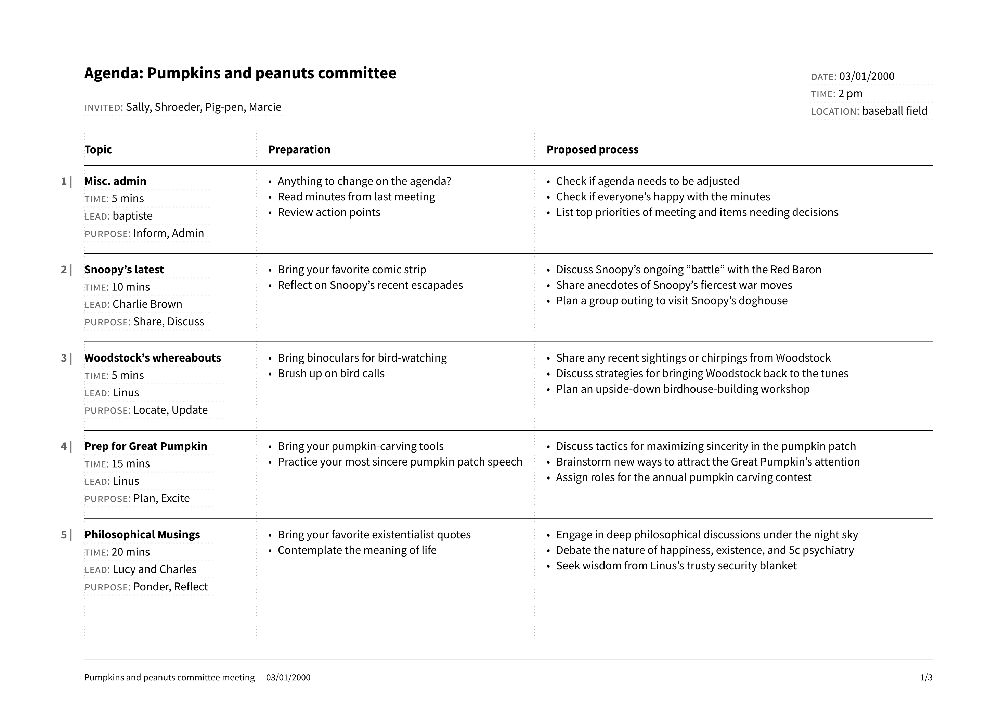

# yagenda

A Typst template for meeting agendas using Yaml for agenda items. To get started:

```typst
typst init @preview/yagenda:0.1.0
```

And edit the `main.typ` example. The data are drawn from `agenda.yaml`.



## Contributing

PRs are welcome! And if you encounter any bugs or have any requests/ideas, feel free to open an issue.

## Acknowledgements

The Typst grid layout was designed by [PgSuper on Discord](https://discord.com/channels/1054443721975922748/1219401775908655115).