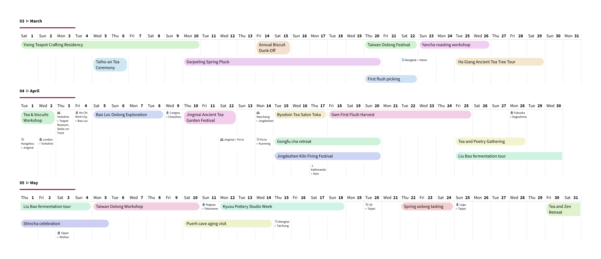

# yaml-dadaism

Calendar with linear monthly layout filled with yaml-defined events.

## Usage

This package aims to produce calendars, where each month is laid out horizontally, i.e. with 28 to 31 columns. This layout provides little space for event details but helps visualise extended events such as travel visits, etc. Two types of events are considered:

- `event`: with `Start` and `End` dates, they are rendered as coloured bars with a title
- `travel`: `Start` and `End` dates may also include timestamps, e.g for flight or train details, though these are not used currently. Three other fields indicate the `Origin` and `Destination`, and `Medium` of transportation ("train", "plane", "bicycle", "bus" are recognised and turned into emojis). These are rendered without background in a small font.

### Notes on implementation

A lot of the package is hard-coded at this stage, so little customisation is offered. The colour palette is drawn from equally-spaced hues bunched into 10 groups and paired, to offer good contrast between neighbouring entries. 

Possible extensions could include:

- Importing ICS files. The main concern is to support time zones, which is probably best approached with a robust external library (either as pre-processing, or via a WASM plugin perhaps).
- Other layouts. It would be nice to offer a more detailed layout for a single month, week, or even day, using the same format for the input data, but presenting it differently.
- Manual tweaks. Currently an algorithm decides where to place the entries in each month's grid to minimise the number of rows, but this may not always be the ideal choice. The user could provide a preferred row position for some events, and perhaps also a preferred colour, which would take precedence.

## Example

The script below illustrates an enviable year of travels around the world,

```typ
#import "@preview/yaml-dadaism:0.1.0": *

#set page(width: auto, height: auto, margin: 40pt)
#set text(size: 9pt, font: "Source Sans Pro")

#let el = yaml("tea.yaml")

#let events-by-month = import-events(el)

#for m in range(1,13){
 month-header(m)
 month-view(events-by-month.at(m - 1), month: m)
}
```


