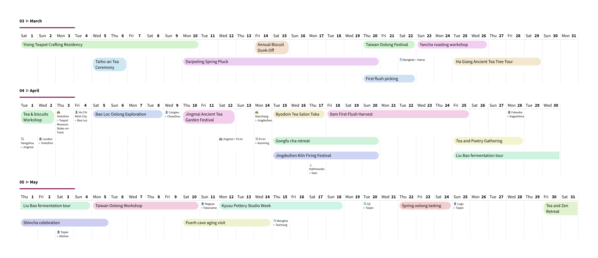

# yaml-dadaism 

Yet another machine-leaning dating app divided annually in separate months.

Calendar with linear monthly layout filled with yaml-defined events.

## Usage

This package aims to produce calendars, where each month is laid out horizontally, i.e. with 28 to 31 columns. This layout provides little space for details but helps visualise extended events such as travel visits, teaching periods, etc. 

The key fields are shared with package `typst-cineca` for compatibility:

- `dtstart`: date or datetime of event start
- `dtend`: date or datetime of event start
- `summary`: concise label

and optional fields, computed internally if not provided explicitly:

- `colour`: used to display the event
- `label`: string actually displayed
- `y`: row position in the table (may lead to errors if clashing)

A few types of events are built-in:

- `duration`: they are rendered as coloured bars with a title
- `travel`: Three other fields indicate the `origin` and `destination`, and `transport` ("train", "plane", "bicycle", "bus" are recognised and turned into emojis). These are rendered without background in a small font.
- `holiday`: they are rendered as light grey-hatched rectangles with a title
- `default`: they are rendered as white rectangles with a title

Custom types can be defined by the user by providing a rendering function (see [examples/example-json-custom.typ](examples/example-json-custom.typ)).

### Further examples

- [examples/example-recolour.typ](examples/example-recolour.typ): similar to main example, but assigning specific colours to events by country
- [examples/example-low-level.typ](examples/example-low-level.typ): providing events directly as typst objects
- [examples/example-csv-combo.typ](examples/example-csv-combo.typ): combined the tea example with a list of holidays imported from a CSV file
- [examples/example-ics.typ](examples/example-ics.typ): importing data from a ics file
- [examples/example-json-custom.typ](examples/example-json-custom.typ): importing JSON term times and holidays data from a university's API, and displaying with a custom rendering function.

### Notes on implementation

A lot of the package is hard-coded at this stage, so little customisation is offered. The colour palette is drawn from equally-spaced hues bunched into 10 groups and paired, to offer good contrast between neighbouring entries. 

Possible extensions could include:

- Importing ICS files. The main concern is to support time zones, which is probably best approached with a robust external library (either as pre-processing, or via a WASM plugin perhaps).
- Other layouts. It would be nice to offer a more detailed layout for a single month, week, or even day, using the same format for the input data, but presenting it differently.
- Manual tweaks. Currently an algorithm decides where to place the entries in each month's grid to minimise the number of rows, but this may not always be the ideal choice. The user could provide a preferred row position for some events, and perhaps also a preferred colour, which would take precedence.

## Example

The script below illustrates an enviable year of travels around the world,

```typ
#import "@preview/yaml-dadaism:0.2.0": *

#set page(width: auto, height: auto, margin: 40pt)
#set text(size: 9pt, font: "Source Sans Pro")

#let el = yaml("tea.yaml")

#let events-by-month = import-events(el)

#for m in range(1,13){
 month-header(m)
 month-view(events-by-month.at(m - 1), month: m)
}
```



