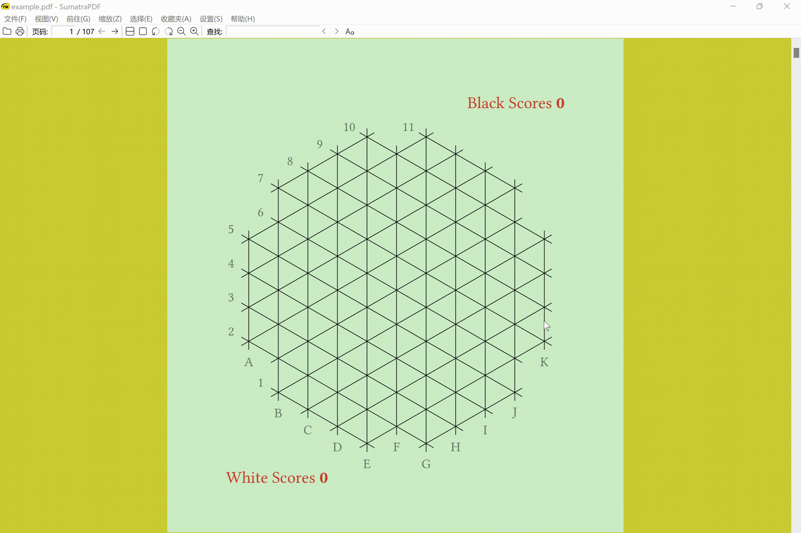

# yinsh

Playing yinsh with typst is made easy, this package provides an api to draw game records for yinsh. It can verify whether each step compilies with the rules. So, users can use it to play yinsh directly. It is also possible to display the specified roud or show records step by step. To see effects, users need to utilize the preview function in code editor.

## example

Click the gif to see source codes.

## usage

See <a href="docs/manual.pdf">
     pdf manual
    </a>, or compile doc from the <a href="docs/manual.typ">
     source code
    </a>.