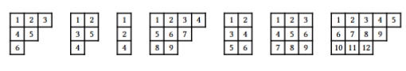
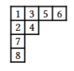
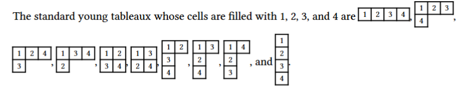
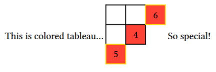
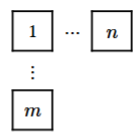

# ytableausp

## What is this package?
This package enables you to make many variety of Young Tableaux like this. 



If you make a document of the representation theory in Typst, this package may be your friend. 

## How to import.
To import this package, you need only to write the following in your typst document. 

```typst
#import "@preview/ytableausp:0.1.0": *
```

## How to use.
There are 3 steps to make your basic tableau. \
Firrst, you have better to set your shape. 

```typst
#let my-tableau-1 = (
    (1,3,5,6),
    (2,4),
    (7,),
    (8,)
)
```

Note that, by the specification of typst, you need to type the list which has only one element as `(7,)`, not `(7)`.\
Second, you need to use `ytableausp` funcion as follows. 

```typst
#ytableausp(
    shape: my-tableu-1,
    cellsize: 1em,
    fontsize: 0.8em
)
```

Finally, you can check your tableau displayed correctly. 



Actually, it is not nessecary for you to set the command as first step. It can go well that you set nested list directly into `ytableausp` function correctly. However, the above step is easy to check what shape your tableau forms.

## More settings.
You can set the cell or font size of your tableau freely. And you can insert your tableau into sentences. 



And the element of the nested list which corresponding to each cell has three parameter, letter, border color, filled color. i.e. If you type this, 

```typst
#let my-colored-tableau = (
    ((none, black, none), (none, black, none), (6, yellow, red)),
    ((none, black, none), (4, black, red)),
    ((5,yellow, red),)
)

This is colored tableau... #ytableausp(shape: my-colored-tableau, cellsize: 2em, fontsize: 1.8em) So special!
```

then your tableau is the following. 



If you type `none` in the second, the border of its cell vanishes. 

```typst
#let mytableau = (
  ((1,black, none), ($dots.c$, none, none), ($n$, black, none)),
  (($dots.v$, none, none),),
  (($m$, black, none),)
)

#ytableausp(
  shape: mytableau,
  cellsize: 2em,
  fontsize: 1.8em,
)
```

