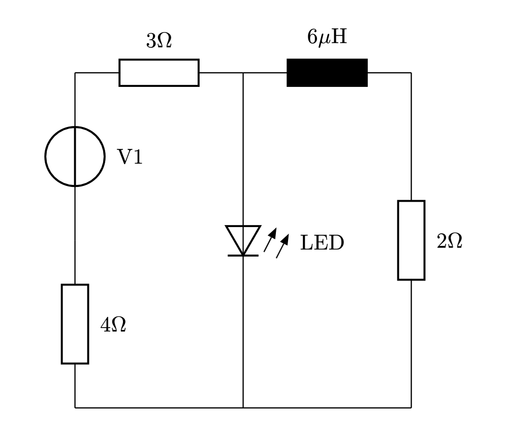
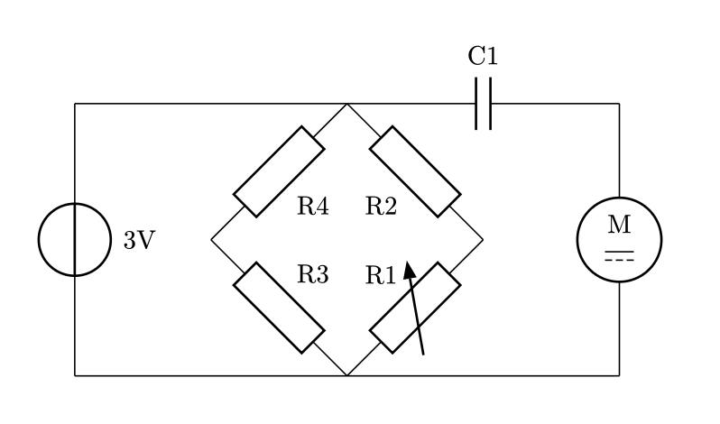

# ⚡️ Zap for Typst


**Zap** is a lightweight 🪶 Typst package that makes drawing electronic circuits simple and intuitive. It's the first Typst library designed to align with widely recognized standards like **IEC** and **IEEE/ANSI** 📜.

## Examples

You can find the full list of examples [here](https://l0uisgrange.github.io/zap/examples).

<table>
<tr>
  <td>
    
  </td>
  <td>
    
  </td>
</tr>
<tr>
  <td>Simple example</td>
  <td>Wheatstone bridge</td>
</tr>
</table>


## Usage

```typst
#import "@preview/zap:0.1.0"

#zap.canvas({
    import zap: *

    isource("i1", (0,0), (5,0))
    resistor("r1", (5,5), (0,5))
    wire("r1.out", "i1.minus")
})
```

## Documentation

You can find the full documentation 📚 [available online](https://l0uisgrange.github.io/zap/). It provides comprehensive guides, a detailed list of components, full API references, and example codes to get you started easily.

## Contributing

I highly welcome contributions 🌱! Creating and maintaining Zap takes time and love. If you'd like to help, check out the [contribution guidelines](CONTRIBUTING.md) and join the journey 🤩!
