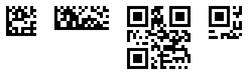
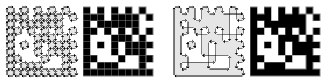

# Zebra

A Typst 2D barcode generator, [natively rendered](#native-rendering) using an [optimized path](#optimized-path).  
It supports:
  - [Data Matrix](#data-matrix) (ECC 200 including DMRE)
  - [QR code](#qr-code) (Model 2 and Micro variants)



```typ
#import "@preview/zebra:0.1.0": datamatrix, qrcode

#datamatrix("Data Matrix")
#qrcode("QR code")
```

## Arguments

Both `datamatrix` and `qrcode` share the same arguments.

- `data`: `str` | `bytes` (positional)

  When providing a string that includes non‑ASCII characters, an ECI UTF-8 designator is automatically added.  
  If that is not desired, pass the string as `bytes`.

- `options`: `dictionary` (default: `(:)`)

  Barcode specific encoding options. See below.

- `quiet-zone`: `int` | `bool` | `none` (default: `0`)

  When `true`, the recommended quiet zone is added (4 for QR codes, 1 for Data Matrix).

- `width` or `height` or `module-size`: `auto` | `length` (default: `module-size: 3pt`)

  The other two properties are calculated automatically.  
  `module-size` is the size of a single black or white square.

- `fill`: `color` | `gradient` (default: `black`)
- `background-fill`: `none` | `color` | `gradient` (default: `none`)

Examples:
```typ
#qrcode("data")
#qrcode(bytes((1, 2, 3)))
#qrcode("Bär") // with UTF-8 ECI
#qrcode(bytes("Bär")) // without UTF-8 ECI

#qrcode("data", quiet-zone: true, background-fill: white)
#qrcode("data", quiet-zone: 2, background-fill: white)

#qrcode("data", width: 5em)
#qrcode("data", height: 5em)
#qrcode("data", module-size: 0.5em)

#qrcode("data", fill: purple, background-fill: lime)
```

## Data Matrix

Options:
- `encodation-type`
  - **`none`**: Automatically determines the best encoding (default)
  - `"ascii"`: Used for numeric and ASCII
  - `"c40"`
  - `"text"`
  - `"x12"`
  - `"edifact"`
  - `"base256"`: Arbitrary data
- `symbols`
  - **`"square"`** (default)
  - `"rect"`: Rectangular symbols
  - `"rect-8"`,  
    `"rect-12"`,  
    `"rect-16"`: Sizes with a specific height
  - `"rect-ext"`: Rectangular symbols including symbols introduced in the rectangular extension (DMRE)
  - `"rect-ext-8"`,  
    `"rect-ext-12"`,  
    `"rect-ext-16"`,  
    `"rect-ext-20"`,  
    `"rect-ext-24"`,  
    `"rect-ext-26"`: Sizes with a specific height

Examples:
```typ
// A rectangular code
#datamatrix("A rectangular Data Matrix", options: (symbols: "rect"))

// Forcing `base256` to encode the data
// Useful for consistently sized codes regardless of the data value, e.g. for UUIDs
#datamatrix(bytes(range(0, 16)), options: (encodation-type: "base256"))
```

The encoding is done by the [`datamatrix`](https://crates.io/crates/datamatrix) crate.

## QR Code

Options:
- `versions`
  - **`"normal"`** (default)
  - `"micro"`: Micro QR code
- `mode`: The character set used to encode the data
  - **`none`**: Automatically determines the best encoding (default)
  - `"numeric"`: 0-9
  - `"alphanumeric"`: 0-9, A-Z, space, `$%*+-./:`
  - `"byte"`: Arbitrary data
- `ec-level`: The error correction level
  - `"l"`: Low ~7%
  - **`"m"`**: Medium ~15% (default)
  - `"q"`: Quartile ~25%
  - `"h"`: High ~30%

Examples:
```typ
// Decrease or increase the error correction level
#qrcode("QR code with low ec", options: (ec-level: "l"))

// Force `alphanumeric` mode
// Useful for consistently sized codes regardless of the data value
#qrcode("0-9 A-Z $%*+-./:", options: (mode: "alphanumeric"))

// A Micro QR code
#qrcode("01234", options: (versions: "micro", ec-level: "l"))
```

The encoding is done by the [`qrcode`](https://crates.io/crates/qrcode) crate.

## Native Rendering

Zebra renders the barcode using a single [curve](https://typst.app/docs/reference/visualize/curve/) scaled to the desired size:
```typ
#block(width: 3.5pt, height: 3.5pt, {
  scale(350%, origin: top + left, {
    curve(fill: black, fill-rule: "even-odd", ..path)
  })
})
```
When exporting to SVG, this results in:
```svg
<path fill-rule="evenodd" d="M 0 0h 1 v 1 h 1 v -1 h 1 v 2 h 1 ..." transform="matrix(3.5 0 0 3.5 0 0)" />
```

Compared to generating an SVG and passing it to the `image` element:
```typ
#image("<svg ...", width: 3.5pt, height: 3.5pt)
```
```svg
<image href="data:image/svg+xml;base64,PHN2ZyAuLi4 ..." width="3.5" height="3.5" />
```

This does not affect the PDF export, but offers all color options in Typst (such as CMYK) that are not available in an SVG.

## Optimized Path

Zebra always combines all horizontally or vertically adjacent modules (black squares) into one shape and further optimizes the path to decrease the number of draw instructions.



The algorithm used for all barcodes is [implemented in the `datamatrix` crate](https://github.com/jannschu/datamatrix-rs/blob/30ba51a838d93940779c62270e2d45586ef95082/src/placement/path.rs#L72).

## Other Packages

- [`cades`](https://typst.app/universe/package/cades)

  Uses the JavaScript package `qrcode-svg`.  
  The generated SVG contains a `<rect>` element for every black module. This results in a small gap between modules.

- [`codetastic`](https://typst.app/universe/package/codetastic)

  Impressive Typst-only implementation of the encoding.  
  Typst-native rendering using a `block` element for every black module. This results in a small gap between modules.

- [`rustycure`](https://typst.app/universe/package/rustycure)

  Uses the `qrcode` crate as well.  
  The generated SVG contains a single path with separate draw instructions for every black module.

- [`tiaoma`](https://typst.app/universe/package/tiaoma)

  Uses the `zint` C library containing a large number of different barcodes.  
  The generated SVG contains a single path which combines adjacent modules in the same row.  
  The best alternative package.
