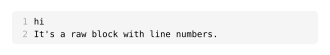
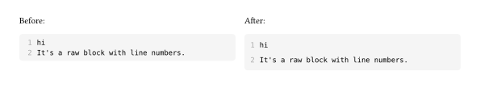
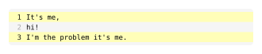
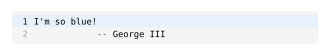

# typst-zebraw

Zebraw is a lightweight and fast package for displaying code blocks with line numbers in typst, supporting code line highlighting. The term "_**Zebraw**_" is a combination of "**_zebra_**" and "**_raw_**", for the highlighted lines will be displayed in the code block like a zebra lines.

## Example

To use, import `zebraw` package then follow with `#show zebraw.with()`.

````typ
#import "@preview/zebraw:0.1.0": *

#show: zebraw.with()

```typ
hi
It's a raw block with line numbers.
```
````



The line spacing can be adjusted by passing the `inset` parameter to the `zebraw` function. The default value is `top: 3pt, bottom: 3pt, left: 3pt, right: 3pt`.

````typ
#show: zebraw.with(inset: (top: 6pt, bottom: 6pt))

```typ
hi
It's a raw block with line numbers.
```
````



For cases where code line highlighting is needed, you should use `#zebraw()` function with `highlight-lines` parameter to specify the line numbers that need to be highlighted, as shown below:

````typ
#zebraw(
  highlight-lines: (1, 3),
  ```typ
  It's me,
  hi!
  I'm the problem it's me.
  ```
)
````



Customize the highlight color by passing the `highlight-color` parameter to the `zebraw` function:

````typ
#zebraw(
  highlight-lines: (1,),
  highlight-color: blue.lighten(90%),
  ```typ
  I'm so blue!
              -- George III
  ```
)
````


