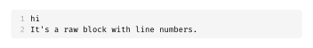
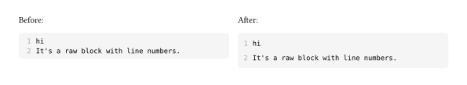
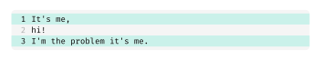
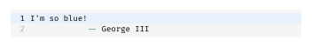
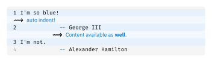
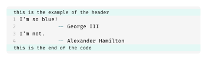
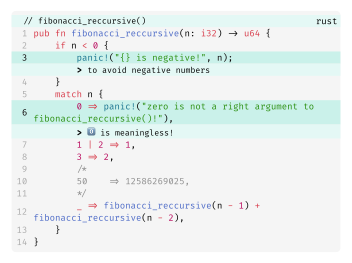

# 🦓 Zebraw

Zebraw is a **lightweight** and **fast** package for displaying code blocks with line numbers in typst, supporting code line highlighting. The term "_**Zebraw**_" is a combination of "**_zebra_**" and "**_raw_**", for the highlighted lines will be displayed in the code block like a zebra lines.

## Example

To use, import `zebraw` package then follow with `#show zebraw.with()`.

````typ
#import "@preview/zebraw:0.2.0": *

#show: zebraw.with()

```typ
hi
It's a raw block with line numbers.
```
````



The line spacing can be adjusted by passing the `inset` parameter to the `zebraw` function. The default value is `top: 3pt, bottom: 3pt, left: 3pt, right: 3pt`.

````typ
#show: zebraw.with(inset: (top: 6pt, bottom: 6pt))

```typ
hi
It's a raw block with line numbers.
```
````



For cases where code line highlighting is needed, you should use `#zebraw()` function with `highlight-lines` parameter to specify the line numbers that need to be highlighted, as shown below:

````typ
#zebraw(
  highlight-lines: (1, 3),
  ```typ
  It's me,
  hi!
  I'm the problem it's me.
  ```
)
````



Customize the highlight color by passing the `highlight-color` parameter to the `zebraw` function:

````typ
#zebraw(
  highlight-lines: (1,),
  highlight-color: blue.lighten(90%),
  ```typ
  I'm so blue!
              -- George III
  ```
)
````



For more complex highlighting, you can also add comments to the highlighted lines by passing an array of line numbers and comments to the `highlight-lines` parameter. The comments will be displayed in the code block with the specified `comment-flag` and `comment-font-args`:

````typ
#zebraw(
  highlight-lines: (
    (1, "auto indent!"),
    (2, [Content available as *well*.]),
    3,
  ),
  highlight-color: blue.lighten(90%),
  comment-font-args: (fill: blue, font: "IBM Plex Sans"),
  comment-flag: "~~>",
  ```typ
  I'm so blue!
              -- George III
  I'm not.
              -- Alexander Hamilton
  ```,
)
````



You can also add a header or footer to the code block by passing the `header` / `footer` parameter to the `zebraw` function, as shown below:

````typ
#zebraw(
  header: "this is the example of the header",
  lang: false,
  ```typ
  I'm so blue!
              -- George III
  I'm not.
              -- Alexander Hamilton
  ```,
  footer: "this is the end of the code",
)
````



## Real-world Example

Here is an example of using `zebraw` to highlight lines in a Rust code block:

````typ
#zebraw(
  highlight-lines: (
    (3, [to avoid negative numbers]),
    (6, [0️⃣ is not a right argument to fibonacci_reccursive()!]),
  ),
  comment-font-args: (font: "IBM Plex Sans"),
  header: "// fibonacci_reccursive()",
  ```rust
  pub fn fibonacci_reccursive(n: i32) -> u64 {
      if n < 0 {
          panic!("{} is negative!", n);
      }
      match n {
          0 => panic!("zero is not a right argument to fibonacci_reccursive()!"),
          1 | 2 => 1,
          3 => 2,
          /*
          50    => 12586269025,
          */
          _ => fibonacci_reccursive(n - 1) + fibonacci_reccursive(n - 2),
      }
  }
  ```,
)
````



## Performance

Focusing on performance, Zebraw is designed to be lightweight and fast with simple and proper features. It can handle code blocks with ease. The following is a test of a typst file with over 2000 code blocks, each containing 3 lines of code and a test of another typst file with only 30 code blocks.

| Package             | 2000 code blocks | 30 code blocks |
| ------------------- | ---------------- | -------------- |
| Typst 0.12.0 Native | 0.62s            | 0.10s          |
| Zebraw 0.1.0        | 0.86s            | 0.10s          |
| Codly 1.2.0         | 4.03s            | 0.14s          |

Though zebraw is faster than codly, it does not support features as much as codly does. Zebraw is designed to be lightweight and fast with useful features.

## License

Zebraw is licensed under the MIT License. See the [LICENSE](LICENSE) file for more information.
