# 🦓 Zebraw

Zebraw is a **lightweight** and **fast** package for displaying code blocks with line numbers in typst, supporting code line highlighting. The term _**Zebraw**_ is a combination of **_zebra_** and **_raw_**, for the highlighted lines will be displayed in the code block like a zebra lines.

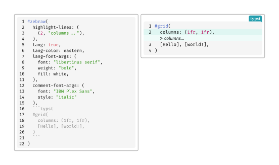

## Starting

Import `zebraw` package by `#import "@preview/zebraw:0.4.0": *` then follow with `#show: zebraw` to start using zebraw in the simplest way. To manually display some specific code blocks in zebraw, you can use `#zebraw()` function:

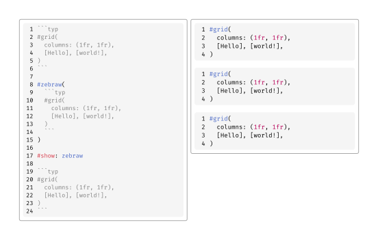

By passing parameters to ```#show: zebraw-init.with()``` will affect every raw block after the ```#show``` rule, **including** blocks created manually by ```#zebraw()``` function. By using `zebraw-init` without any parameters, the values will be reset to default.

## Features

### Line Highlighting

You can highlight specific lines in the code block by passing the `highlight-lines` parameter to the `zebraw` function. The `highlight-lines` parameter can be a single line number or an array of line numbers.

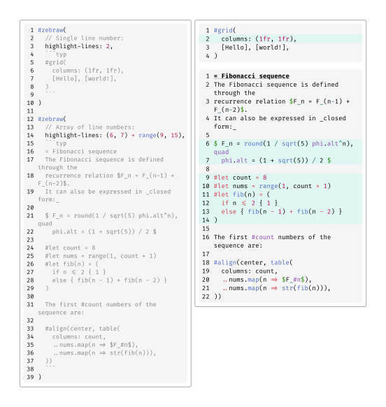

### Comment

You can add comments to the highlighted lines by passing an array of line numbers and comments to the `highlight-lines` parameter.

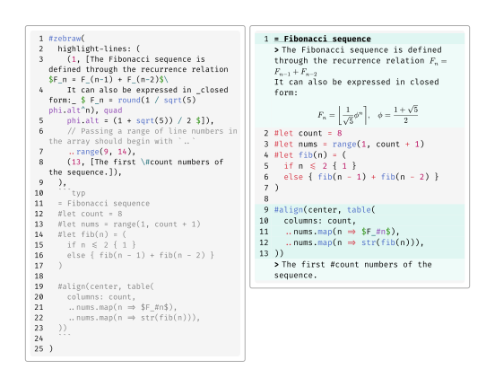

Comments can begin with a flag, which is `">"` by default. You can change the flag by passing the `comment-flag` parameter to the `zebraw` function:

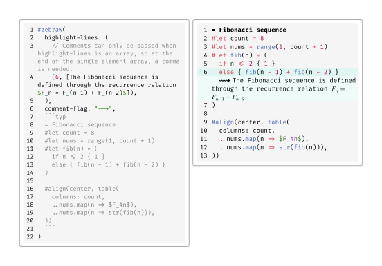

To disable the flag feature, pass `""` to the `comment-flag` parameter (the indentation of the comment will be disabled as well):

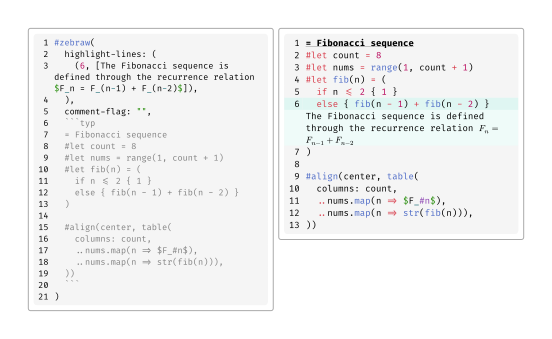

### Header and Footer

Usually, the comments passing by a dictionary of line numbers and comments are used to add a header or footer to the code block:

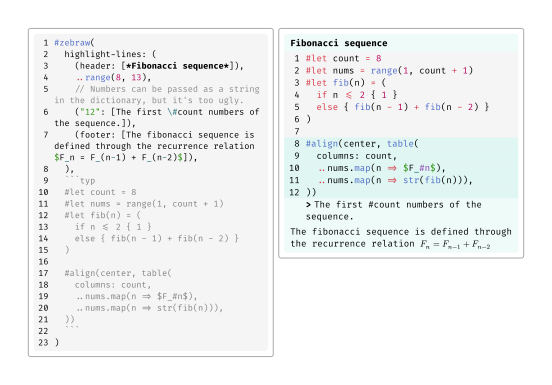

Or you can use `header` and `footer` parameters to add a header or footer to the code block:

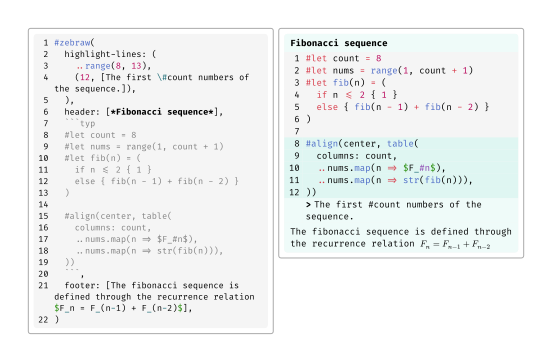

### Language Tab

If `lang` is set to `true`, then there will be a language tab on the top right corner of the code block:

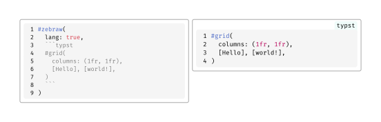

### Copyable

If `copyable` is set to `true`, line numbers will not be copied when copying exported code.

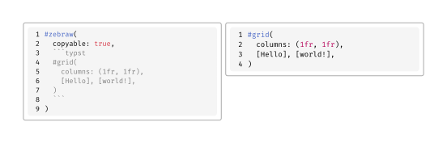

For comparison:

| `copyable: false`(Default)                   | `copyable: true`                           |
| -------------------------------------------- | ------------------------------------------ |
| 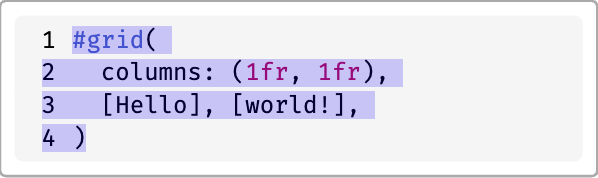 | 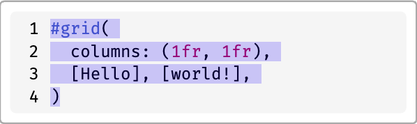 |

However when a code block is `copyable`, it won't be able to cross page. Only line numbers will be excluded for being selected.

### Theme

0.4.0 adds predefined themes `zebra` and `zebra-reverse`. Theme defines the customization values and make it easy to use.

PRs are welcome!

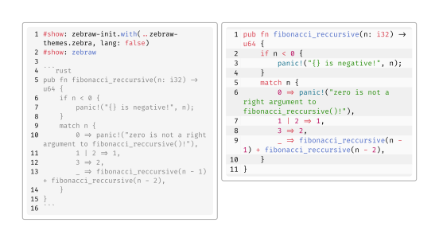

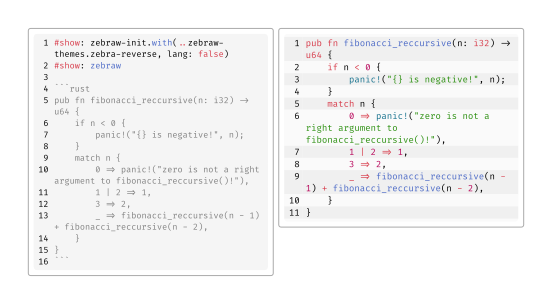

## Customization and Documentation

You can customize inset of each line, colors and fonts of different parts of the block. See [manual](./manual.pdf).

## License

Zebraw is licensed under the MIT License. See the [LICENSE](LICENSE) file for more information.
