# 🦓 Zebraw

Zebraw is a lightweight and fast package for displaying code blocks with line numbers in typst, supporting code line highlighting. The term _**Zebraw**_ is a combination of _**zebra**_ and _**raw**_, for the highlighted lines will be displayed in the code block like a zebra lines.

## Starting

Import `zebraw` package by `#import "@preview/zebraw:0.4.1": *` then follow with `#show: zebraw` to start using zebraw in the simplest way. To manually display some specific code blocks in zebraw, you can use `#zebraw()` function:

````typ
```typ
#grid(
  columns: (1fr, 1fr),
  [Hello], [world!],
)
```

#zebraw(
  ```typ
  #grid(
    columns: (1fr, 1fr),
    [Hello], [world!],
  )
  ```
)

#show: zebraw

```typ
#grid(
  columns: (1fr, 1fr),
  [Hello], [world!],
)
```

````

<p align="center"><picture><source media="(prefers-color-scheme: dark)" srcset="assets/1_Dark.svg">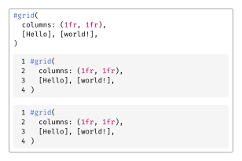</picture></p>

## Features

### Line Highlighting

You can highlight specific lines in the code block by passing the `highlight-lines` parameter to the `zebraw` function. The `highlight-lines` parameter can be a single line number or an array of line numbers.

````typ
#zebraw(
  // Single line number:
  highlight-lines: 2,
  ```typ
  #grid(
    columns: (1fr, 1fr),
    [Hello], [world!],
  )
  ```
)

#zebraw(
  // Array of line numbers:
  highlight-lines: (6, 7) + range(9, 15),
  ```typ
  = Fibonacci sequence
  The Fibonacci sequence is defined through the
  recurrence relation $F_n = F_(n-1) + F_(n-2)$.
  It can also be expressed in _closed form:_

  $ F_n = round(1 / sqrt(5) phi.alt^n), quad
    phi.alt = (1 + sqrt(5)) / 2 $

  #let count = 8
  #let nums = range(1, count + 1)
  #let fib(n) = (
    if n <= 2 { 1 }
    else { fib(n - 1) + fib(n - 2) }
  )

  The first #count numbers of the sequence are:

  #align(center, table(
    columns: count,
    ..nums.map(n => $F_#n$),
    ..nums.map(n => str(fib(n))),
  ))
  ```
)

````

<p align="center"><picture><source media="(prefers-color-scheme: dark)" srcset="assets/2_Dark.svg">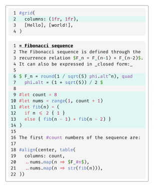</picture></p>

### Comment

You can add comments to the highlighted lines by passing an array of line numbers and comments to the `highlight-lines` parameter.

````typ
#zebraw(
  highlight-lines: (
    (1, [The Fibonacci sequence is defined through the recurrence relation $F_n = F_(n-1) + F_(n-2)$\
    It can also be expressed in _closed form:_ $ F_n = round(1 / sqrt(5) phi.alt^n), quad
    phi.alt = (1 + sqrt(5)) / 2 $]),
    // Passing a range of line numbers in the array should begin with `..`
    ..range(9, 14),
    (13, [The first \#count numbers of the sequence.]),
  ),
  ```typ
  = Fibonacci sequence
  #let count = 8
  #let nums = range(1, count + 1)
  #let fib(n) = (
    if n <= 2 { 1 }
    else { fib(n - 1) + fib(n - 2) }
  )

  #align(center, table(
    columns: count,
    ..nums.map(n => $F_#n$),
    ..nums.map(n => str(fib(n))),
  ))
  ```
)

````

<p align="center"><picture><source media="(prefers-color-scheme: dark)" srcset="assets/3_Dark.svg">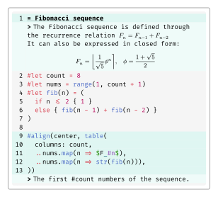</picture></p>

Comments can begin with a flag, which is `">"` by default. You can change the flag by passing the `comment-flag` parameter to the `zebraw` function:

````typ
#zebraw(
  highlight-lines: (
    // Comments can only be passed when highlight-lines is an array, so at the end of the single element array, a comma is needed.
    (6, [The Fibonacci sequence is defined through the recurrence relation $F_n = F_(n-1) + F_(n-2)$]),
  ),
  comment-flag: "~~>",
  ```typ
  = Fibonacci sequence
  #let count = 8
  #let nums = range(1, count + 1)
  #let fib(n) = (
    if n <= 2 { 1 }
    else { fib(n - 1) + fib(n - 2) }
  )

  #align(center, table(
    columns: count,
    ..nums.map(n => $F_#n$),
    ..nums.map(n => str(fib(n))),
  ))
  ```
)

````

<p align="center"><picture><source media="(prefers-color-scheme: dark)" srcset="assets/4_Dark.svg">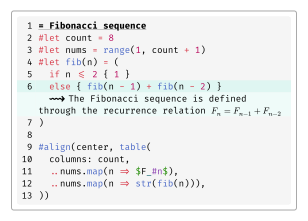</picture></p>

To disable the flag feature, pass `""` to the `comment-flag` parameter (the indentation of the comment will be disabled as well):

````typ
#zebraw(
  highlight-lines: (
    (6, [The Fibonacci sequence is defined through the recurrence relation $F_n = F_(n-1) + F_(n-2)$]),
  ),
  comment-flag: "",
  ```typ
  = Fibonacci sequence
  #let count = 8
  #let nums = range(1, count + 1)
  #let fib(n) = (
    if n <= 2 { 1 }
    else { fib(n - 1) + fib(n - 2) }
  )

  #align(center, table(
    columns: count,
    ..nums.map(n => $F_#n$),
    ..nums.map(n => str(fib(n))),
  ))
  ```
)

````

<p align="center"><picture><source media="(prefers-color-scheme: dark)" srcset="assets/5_Dark.svg">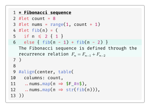</picture></p>

### Header and Footer

Usually, the comments passing by a dictionary of line numbers and comments are used to add a header or footer to the code block:

````typ
#zebraw(
  highlight-lines: (
    (header: [*Fibonacci sequence*]),
    ..range(8, 13),
    // Numbers can be passed as a string in the dictionary, but it's too ugly.
    ("12": [The first \#count numbers of the sequence.]),
    (footer: [The fibonacci sequence is defined through the recurrence relation $F_n = F_(n-1) + F_(n-2)$]),
  ),
  ```typ
  #let count = 8
  #let nums = range(1, count + 1)
  #let fib(n) = (
    if n <= 2 { 1 }
    else { fib(n - 1) + fib(n - 2) }
  )

  #align(center, table(
    columns: count,
    ..nums.map(n => $F_#n$),
    ..nums.map(n => str(fib(n))),
  ))
  ```
)

````

<p align="center"><picture><source media="(prefers-color-scheme: dark)" srcset="assets/6_Dark.svg">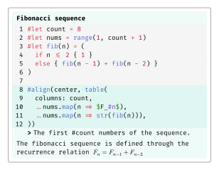</picture></p>

Or you can use `header` and `footer` parameters to add a header or footer to the code block:

````typ
#zebraw(
  highlight-lines: (
    ..range(8, 13),
    (12, [The first \#count numbers of the sequence.]),
  ),
  header: [*Fibonacci sequence*],
  ```typ
  #let count = 8
  #let nums = range(1, count + 1)
  #let fib(n) = (
    if n <= 2 { 1 }
    else { fib(n - 1) + fib(n - 2) }
  )

  #align(center, table(
    columns: count,
    ..nums.map(n => $F_#n$),
    ..nums.map(n => str(fib(n))),
  ))
  ```,
  footer: [The fibonacci sequence is defined through the recurrence relation $F_n = F_(n-1) + F_(n-2)$],
)

````

<p align="center"><picture><source media="(prefers-color-scheme: dark)" srcset="assets/7_Dark.svg"></picture></p>

### Language Tab

If `lang` is set to `true`, then there will be a language tab on the top right corner of the code block:

````typ
#zebraw(
  lang: true,
  ```typst
  #grid(
    columns: (1fr, 1fr),
    [Hello], [world!],
  )
  ```
)

````

<p align="center"><picture><source media="(prefers-color-scheme: dark)" srcset="assets/8_Dark.svg">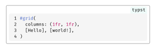</picture></p>

Customize the language to display by pass a string or content to the `lang` parameter.

````typ
#zebraw(
  lang: strong[Typst],
  ```typst
  #grid(
    columns: (1fr, 1fr),
    [Hello], [world!],
  )
  ```
)

````

<p align="center"><picture><source media="(prefers-color-scheme: dark)" srcset="assets/9_Dark.svg">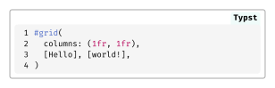</picture></p>

### Copyable

Line numbers will not be selected when selecting exported code in one page.

|without `copyable` feature| with `copyable` feature|
|:---:|:---:|
|||

### Theme

PRs are welcome!

````typ
#show: zebraw-init.with(..zebraw-themes.zebra, lang: false)
#show: zebraw

```rust
pub fn fibonacci_reccursive(n: i32) -> u64 {
    if n < 0 {
        panic!("{} is negative!", n);
    }
    match n {
        0 => panic!("zero is not a right argument to fibonacci_reccursive()!"),
        1 | 2 => 1,
        3 => 2,
        _ => fibonacci_reccursive(n - 1) + fibonacci_reccursive(n - 2),
    }
}
```

````

<p align="center"><picture><source media="(prefers-color-scheme: dark)" srcset="assets/11_Dark.svg">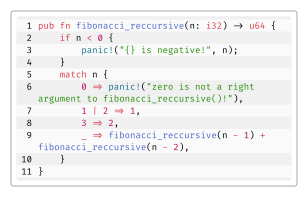</picture></p>

````typ
#show: zebraw-init.with(..zebraw-themes.zebra-reverse, lang: false)
#show: zebraw

```rust
pub fn fibonacci_reccursive(n: i32) -> u64 {
    if n < 0 {
        panic!("{} is negative!", n);
    }
    match n {
        0 => panic!("zero is not a right argument to fibonacci_reccursive()!"),
        1 | 2 => 1,
        3 => 2,
        _ => fibonacci_reccursive(n - 1) + fibonacci_reccursive(n - 2),
    }
}
```

````

<p align="center"><picture><source media="(prefers-color-scheme: dark)" srcset="assets/12_Dark.svg">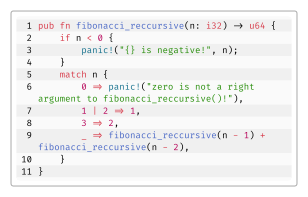</picture></p>

## Customization

There are 3 ways to customize code blocks in your document:

- Manually render some specific blocks by `#zebraw()` function and passing parameters to it.
- By passing parameters to `#show: zebraw.with()` will affect every raw block after the `#show` rule, **except** blocks created manually by `#zebraw()` function.
- By passing parameters to `#show: zebraw-init.with()` will affect every raw block after the `#show` rule, **including** blocks created manually by `#zebraw()` function. By using `zebraw-init` without any parameters, the values will be reset to default.

### Inset

Customize the inset of each line by passing a dictionary to the `inset` parameter:

````typ
#zebraw(
  inset: (top: 6pt, bottom: 6pt),
  ```typ
  #grid(
    columns: (1fr, 1fr),
    [Hello], [world!],
  )
  ```
)

````

<p align="center"><picture><source media="(prefers-color-scheme: dark)" srcset="assets/13_Dark.svg">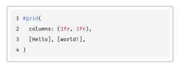</picture></p>

### Colors

Customize the background color by passing a color or an array of colors to the `background-color` parameter.

````typ
#zebraw(
  background-color: luma(235),
  ```typ
  #grid(
    columns: (1fr, 1fr),
    [Hello], [world!],
  )
  ```,
)

#zebraw(
  background-color: (luma(235), luma(245), luma(255), luma(245)),
  ```typ
  #grid(
    columns: (1fr, 1fr),
    [Hello], [world!],
  )
  ```,
)

````

<p align="center"><picture><source media="(prefers-color-scheme: dark)" srcset="assets/14_Dark.svg">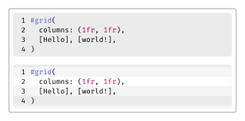</picture></p>

Customize the highlight color by passing a color to the `highlight-color` parameter:

````typ
#zebraw(
  highlight-lines: 1,
  highlight-color: blue.lighten(90%),
  ```text
  I'm so blue!
              -- George III
  ```,
)

````

<p align="center"><picture><source media="(prefers-color-scheme: dark)" srcset="assets/15_Dark.svg">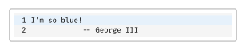</picture></p>

Customize the comments' background color by passing a color to the `comment-color` parameter:

````typ
#zebraw(
  highlight-lines: (
    (2, "auto indent!"),
  ),
  comment-color: yellow.lighten(90%),
  ```text
  I'm so blue!
              -- George III
  I'm not.
              -- Hamilton
  ```,
)

````

<p align="center"><picture><source media="(prefers-color-scheme: dark)" srcset="assets/16_Dark.svg">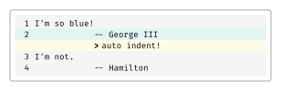</picture></p>

Customize the language tab's background color by passing a color to the `lang-color` parameter.

````typ
#zebraw(
  lang: true,
  lang-color: teal,
  ```typst
  #grid(
    columns: (1fr, 1fr),
    [Hello], [world!],
  )
  ```
)

````

<p align="center"><picture><source media="(prefers-color-scheme: dark)" srcset="assets/17_Dark.svg">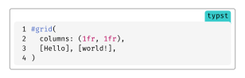</picture></p>

### Font

To customize the arguments of comments' font and the language tab's font, pass a dictionary to `comment-font-args` parameter and `lang-font-args` parameter.

Language tab will be rendered as comments if nothing is passed.

````typ
#zebraw(
  highlight-lines: (
    (2, "columns..."),
  ),
  lang: true,
  comment-color: white,
  comment-font-args: (
    font: "IBM Plex Sans",
    style: "italic"
  ),
  ```typst
  #grid(
    columns: (1fr, 1fr),
    [Hello], [world!],
  )
  ```
)

````

<p align="center"><picture><source media="(prefers-color-scheme: dark)" srcset="assets/18_Dark.svg">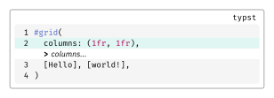</picture></p>

````typ
#zebraw(
  highlight-lines: (
    (2, "columns..."),
  ),
  lang: true,
  lang-color: eastern,
  lang-font-args: (
    font: "libertinus serif",
    weight: "bold",
    fill: white,
  ),
  comment-font-args: (
    font: "IBM Plex Sans",
    style: "italic"
  ),
  ```typst
  #grid(
    columns: (1fr, 1fr),
    [Hello], [world!],
  )
  ```
)

````

<p align="center"><picture><source media="(prefers-color-scheme: dark)" srcset="assets/19_Dark.svg">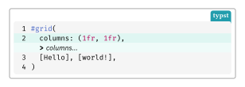</picture></p>

### Extend

Extend at vertical is enabled at default. When there's header or footer it will be automatically disabled.

````typ
#zebraw(
  extend: false,
  ```typst
  #grid(
    columns: (1fr, 1fr),
    [Hello], [world!],
  )
  ```
)

````

<p align="center"><picture><source media="(prefers-color-scheme: dark)" srcset="assets/20_Dark.svg">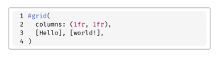</picture></p>

## Documentation

See [manual](manual.pdf).

## Example

<p align="center"><picture><source media="(prefers-color-scheme: dark)" srcset="assets/22_Dark.svg">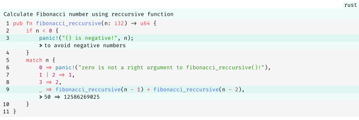</picture></p>

## Performance

See [results in bench.sh](https://github.com/hongjr03/typst-zebraw/blob/07caf7ed61805c96ddaf22dabdd6f8279e2bb2db/bench.sh#L9-L40).

## License

Zebraw is licensed under the MIT License. See the [LICENSE](LICENSE) file for more information.
