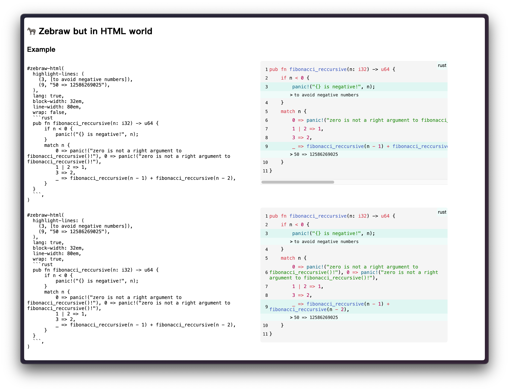

# 🦓 Zebraw

Zebraw is a lightweight and fast package for displaying code blocks with line numbers in typst, supporting code line highlighting. The term _**zebraw**_ is a combination of _**zebra**_ and _**raw**_, for the highlighted lines will be displayed in the code block like a zebra lines.

## Starting

Import `zebraw` package by `#import "@preview/zebraw:0.4.4": *` then follow with `#show: zebraw` to start using zebraw in the simplest way. To manually display some specific code blocks in zebraw, you can use `#zebraw()` function:

<a href="assets/1.typ"><picture><source media="(prefers-color-scheme: dark)" srcset="assets/1_Dark.svg"></picture></a>

## Features

### Line Numbering

Line numbers will be displayed on the left side of the code block. By passing an integer to the `numbering-offset` parameter, you can change the starting line number. The default value is `0`.

<a href="assets/2.typ"><picture><source media="(prefers-color-scheme: dark)" srcset="assets/2_Dark.svg"></picture></a>

### Line Highlighting

You can highlight specific lines in the code block by passing the `highlight-lines` parameter to the `zebraw` function. The `highlight-lines` parameter can be a single line number or an array of line numbers.

<a href="assets/3.typ"><picture><source media="(prefers-color-scheme: dark)" srcset="assets/3_Dark.svg"></picture></a>

### Comment

You can add comments to the highlighted lines by passing an array of line numbers and comments to the `highlight-lines` parameter.

<a href="assets/4.typ"><picture><source media="(prefers-color-scheme: dark)" srcset="assets/4_Dark.svg"></picture></a>

Comments can begin with a flag, which is `">"` by default. You can change the flag by passing the `comment-flag` parameter to the `zebraw` function:

<a href="assets/5.typ"><picture><source media="(prefers-color-scheme: dark)" srcset="assets/5_Dark.svg"></picture></a>

To disable the flag feature, pass `""` to the `comment-flag` parameter (the indentation of the comment will be disabled as well):

<a href="assets/6.typ"><picture><source media="(prefers-color-scheme: dark)" srcset="assets/6_Dark.svg"></picture></a>

### Header and Footer

Usually, the comments passing by a dictionary of line numbers and comments are used to add a header or footer to the code block:

<a href="assets/7.typ"><picture><source media="(prefers-color-scheme: dark)" srcset="assets/7_Dark.svg"></picture></a>

Or you can use `header` and `footer` parameters to add a header or footer to the code block:

<a href="assets/8.typ"><picture><source media="(prefers-color-scheme: dark)" srcset="assets/8_Dark.svg"></picture></a>

### Language Tab

If `lang` is set to `true`, then there will be a language tab on the top right corner of the code block:

<a href="assets/9.typ"><picture><source media="(prefers-color-scheme: dark)" srcset="assets/9_Dark.svg"></picture></a>

Customize the language to display by pass a string or content to the `lang` parameter.

<a href="assets/10.typ"><picture><source media="(prefers-color-scheme: dark)" srcset="assets/10_Dark.svg"></picture></a>

### Copyable

Line numbers will not be selected when selecting exported code in one page.

<a href="assets/11.typ"><picture><source media="(prefers-color-scheme: dark)" srcset="assets/11_Dark.svg"></picture></a>

### Theme

PRs are welcome!

<a href="assets/12.typ"><picture><source media="(prefers-color-scheme: dark)" srcset="assets/12_Dark.svg"></picture></a>

<a href="assets/13.typ"><picture><source media="(prefers-color-scheme: dark)" srcset="assets/13_Dark.svg"></picture></a>

### (Experimental) HTML Variant

See [example-html.typ](example-html.typ) or [GitHub Pages](https://hongjr03.github.io/typst-zebraw/) for more information.

## Customization

There are 3 ways to customize code blocks in your document:

- Manually render some specific blocks by `#zebraw()` function and passing parameters to it.
- By passing parameters to `#show: zebraw.with()` will affect every raw block after the `#show` rule, **except** blocks created manually by `#zebraw()` function.
- By passing parameters to `#show: zebraw-init.with()` will affect every raw block after the `#show` rule, **including** blocks created manually by `#zebraw()` function. By using `zebraw-init` without any parameters, the values will be reset to default.

### Inset

Customize the inset of each line by passing a  to the `inset` parameter:

<a href="assets/15.typ"><picture><source media="(prefers-color-scheme: dark)" srcset="assets/15_Dark.svg"></picture></a>

### Colors

Customize the background color by passing a  or an  of s to the `background-color` parameter.

<a href="assets/16.typ"><picture><source media="(prefers-color-scheme: dark)" srcset="assets/16_Dark.svg"></picture></a>

Customize the highlight color by passing a  to the `highlight-color` parameter:

<a href="assets/17.typ"><picture><source media="(prefers-color-scheme: dark)" srcset="assets/17_Dark.svg"></picture></a>

Customize the comments' background color by passing a  to the `comment-color` parameter:

<a href="assets/18.typ"><picture><source media="(prefers-color-scheme: dark)" srcset="assets/18_Dark.svg"></picture></a>

Customize the language tab's background color by passing a  to the `lang-color` parameter.

<a href="assets/19.typ"><picture><source media="(prefers-color-scheme: dark)" srcset="assets/19_Dark.svg"></picture></a>

### Font

To customize the arguments of comments' font and the language tab's font, pass a dictionary to `comment-font-args` parameter and `lang-font-args` parameter.

Language tab will be rendered as comments if nothing is passed.

<a href="assets/20.typ"><picture><source media="(prefers-color-scheme: dark)" srcset="assets/20_Dark.svg"></picture></a>

<a href="assets/21.typ"><picture><source media="(prefers-color-scheme: dark)" srcset="assets/21_Dark.svg"></picture></a>

### Extend

Extend at vertical is enabled at default. When there's header or footer it will be automatically disabled.

<a href="assets/22.typ"><picture><source media="(prefers-color-scheme: dark)" srcset="assets/22_Dark.svg"></picture></a>

## Documentation

See [manual.pdf](manual.pdf) for more information.

## Example

<a href="assets/24.typ"><picture><source media="(prefers-color-scheme: dark)" srcset="assets/24_Dark.svg"></picture></a>

## License

Zebraw is licensed under the MIT License. See the [LICENSE](LICENSE) file for more information.
