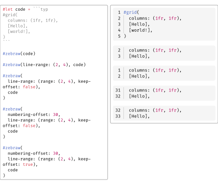
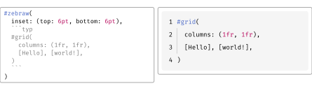

# 🦓 Zebraw

Zebraw is a lightweight and fast package for displaying code blocks with line numbers in Typst, supporting code line highlighting. The term _**zebraw**_ is a combination of _**zebra**_ and _**raw**_, as the highlighted lines display in the code block with a zebra-striped pattern.

## Quick Start

Import the `zebraw` package with `#import "@preview/zebraw:0.5.0": *` then add `#show: zebraw` to start using zebraw in the simplest way.

<a href="assets/1.typ"><picture><source media="(prefers-color-scheme: dark)" srcset="assets/1_Dark.svg"></picture></a>

To manually render specific code blocks with zebraw, use the `#zebraw()` function:

<a href="assets/2.typ"><picture><source media="(prefers-color-scheme: dark)" srcset="assets/2_Dark.svg"></picture></a>

## Features

The `zebraw` function provides a variety of parameters to customize the appearance and behavior of code blocks. The following sections describe these parameters in detail:

- **Core Features**
  - Line numbering, with customizable offset and range slicing
  - Line highlighting and explanatory comments for code
  - Headers and footers
  - Language identifier tabs
  - The indentation line and hanging indentation (and fast preview mode for better performance)
- **Customization Options**
  - Custom colors for background, highlights, and comments
  - Custom fonts for different elements
  - Customizable insets
  - Custom themes
- **Export Options**
  - Experimental HTML export

### Line Numbering

Line numbers appear on the left side of the code block. Change the starting line number by passing an integer to the `numbering-offset` parameter. The default value is `0`.

<a href="assets/3.typ"><picture><source media="(prefers-color-scheme: dark)" srcset="assets/3_Dark.svg"></picture></a>

To disable line numbering, pass `false` to the `numbering` parameter:

<a href="assets/4.typ"><picture><source media="(prefers-color-scheme: dark)" srcset="assets/4_Dark.svg"></picture></a>

### Numbering Separator

You can add a separator line between line numbers and code content by setting the `numbering-separator` parameter to `true`:

<a href="assets/5.typ"><picture><source media="(prefers-color-scheme: dark)" srcset="assets/5_Dark.svg"></picture></a>

### Line Slicing

Slice code blocks by passing the `line-range` parameter to the `zebraw` function. The `line-range` parameter can be either:

- An array of 2 integers representing the range <a href="assets/6.typ"><picture><source media="(prefers-color-scheme: dark)" srcset="assets/6_Dark.svg"></picture></a> (<a href="assets/7.typ"><picture><source media="(prefers-color-scheme: dark)" srcset="assets/7_Dark.svg"></picture></a> can be `none` as this feature is based on Typst array slicing)
- A dictionary with `range` and `keep-offset` keys

When `keep-offset` is set to `true`, line numbers maintain their original values. Otherwise, they reset to start from 1. By default, `keep-offset` is set to `true`.

<a href="assets/8.typ"><picture><source media="(prefers-color-scheme: dark)" srcset="assets/8_Dark.svg"></picture></a>

### Line Highlighting

Highlight specific lines in the code block by passing the `highlight-lines` parameter to the `zebraw` function. The `highlight-lines` parameter accepts either a single line number or an array of line numbers.

<a href="assets/9.typ"><picture><source media="(prefers-color-scheme: dark)" srcset="assets/9_Dark.svg"></picture></a>

### Comments

Add explanatory comments to highlighted lines by passing an array of line numbers and comments to the `highlight-lines` parameter.

<a href="assets/10.typ"><picture><source media="(prefers-color-scheme: dark)" srcset="assets/10_Dark.svg"></picture></a>

Comments begin with a flag character, which is `">"` by default. Change this flag by setting the `comment-flag` parameter:

<a href="assets/11.typ"><picture><source media="(prefers-color-scheme: dark)" srcset="assets/11_Dark.svg"></picture></a>

To disable the flag feature entirely, pass an empty string `""` to the `comment-flag` parameter (this also disables comment indentation):

<a href="assets/12.typ"><picture><source media="(prefers-color-scheme: dark)" srcset="assets/12_Dark.svg"></picture></a>

### Headers and Footers

You can add headers and footers to code blocks. One approach is to use special keys in the `highlight-lines` parameter:

<a href="assets/13.typ"><picture><source media="(prefers-color-scheme: dark)" srcset="assets/13_Dark.svg"></picture></a>

Alternatively, use the dedicated `header` and `footer` parameters for cleaner code:

<a href="assets/14.typ"><picture><source media="(prefers-color-scheme: dark)" srcset="assets/14_Dark.svg"></picture></a>

### Language Tab

Display a floating language identifier tab in the top-right corner of the code block by setting `lang` to `true`:

<a href="assets/15.typ"><picture><source media="(prefers-color-scheme: dark)" srcset="assets/15_Dark.svg"></picture></a>

Customize the language display by passing a string or content to the `lang` parameter:

<a href="assets/16.typ"><picture><source media="(prefers-color-scheme: dark)" srcset="assets/16_Dark.svg"></picture></a>

### Indentation Lines, Hanging Indentation and Fast Preview

Display indentation guides by passing a positive integer to the `indentation` parameter, representing the number of spaces per indentation level:

<a href="assets/17.typ"><picture><source media="(prefers-color-scheme: dark)" srcset="assets/17_Dark.svg"></picture></a>

Enable hanging indentation by setting `hanging-indent` to `true`:

<a href="assets/18.typ"><picture><source media="(prefers-color-scheme: dark)" srcset="assets/18_Dark.svg"></picture></a>

Indentation lines can slow down preview performance. For faster previews, enable fast preview mode by passing `true` to the `fast-preview` parameter in `zebraw-init` or by using `zebraw-fast-preview` in the CLI. This renders indentation lines as simple `|` characters:

<a href="assets/19.typ"><picture><source media="(prefers-color-scheme: dark)" srcset="assets/19_Dark.svg"></picture></a>

### Themes

Zebraw includes built-in themes. PRs for additional themes are welcome!

<a href="assets/20.typ"><picture><source media="(prefers-color-scheme: dark)" srcset="assets/20_Dark.svg"></picture></a>

<a href="assets/21.typ"><picture><source media="(prefers-color-scheme: dark)" srcset="assets/21_Dark.svg"></picture></a>

### (Experimental) HTML Export

See [example-html.typ](example-html.typ) or [GitHub Pages](https://hongjr03.github.io/typst-zebraw/) for more information.

## Customization

There are three ways to customize code blocks in your document:

1. **Per-block customization**: Manually style specific blocks using the `#zebraw()` function with parameters.
2. **Local customization**: Apply styling to all subsequent raw blocks with `#show: zebraw.with()`. This affects all raw blocks after the `#show` rule, **except** those created manually with `#zebraw()`.
3. **Global customization**: Use `#show: zebraw-init.with()` to affect **all** raw blocks after the rule, **including** those created manually with `#zebraw()`. Reset to defaults by using `zebraw-init` without parameters.

### Inset

Customize the padding around each code line(numberings are not affected) by passing a dictionary to the `inset` parameter:

<a href="assets/22.typ"><picture><source media="(prefers-color-scheme: dark)" srcset="assets/22_Dark.svg"></picture></a>

### Colors

Customize the background color with a single color or an array of alternating colors:

<a href="assets/23.typ"><picture><source media="(prefers-color-scheme: dark)" srcset="assets/23_Dark.svg"></picture></a>

Set the highlight color for marked lines with the `highlight-color` parameter:

<a href="assets/24.typ"><picture><source media="(prefers-color-scheme: dark)" srcset="assets/24_Dark.svg"></picture></a>

Change the comment background color with the `comment-color` parameter:

<a href="assets/25.typ"><picture><source media="(prefers-color-scheme: dark)" srcset="assets/25_Dark.svg"></picture></a>

Set the language tab background color with the `lang-color` parameter:

<a href="assets/26.typ"><picture><source media="(prefers-color-scheme: dark)" srcset="assets/26_Dark.svg"></picture></a>

### Font

Customize font properties for comments, language tabs, and line numbers by passing a dictionary to the `comment-font-args`, `lang-font-args`, or `numbering-font-args` parameters respectively.

If no custom `lang-font-args` are provided, language tabs inherit the comment font styling:

<a href="assets/27.typ"><picture><source media="(prefers-color-scheme: dark)" srcset="assets/27_Dark.svg"></picture></a>

Example with custom language tab styling:

<a href="assets/28.typ"><picture><source media="(prefers-color-scheme: dark)" srcset="assets/28_Dark.svg"></picture></a>

### Extend

Extend at vertical is enabled at default. When there's header or footer it will be automatically disabled.

<a href="assets/29.typ"><picture><source media="(prefers-color-scheme: dark)" srcset="assets/29_Dark.svg"></picture></a>

## Example

<a href="assets/30.typ"><picture><source media="(prefers-color-scheme: dark)" srcset="assets/30_Dark.svg"></picture></a>

## License

Zebraw is licensed under the MIT License. See the [LICENSE](LICENSE) file for more information.
