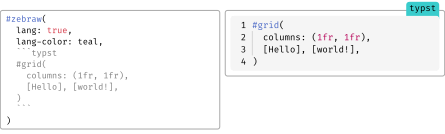

# 🦓 Zebraw

Zebraw 是一个轻量级且快速的 Typst 包，用于显示带有行号的代码块，支持代码行高亮。**_zebraw_** 一词是 **_zebra_**（斑马）和 **_raw_**（原始）的组合，因为高亮显示的代码行在代码块中就像斑马纹一样。

## 快速开始

使用 `#import "@preview/zebraw:0.5.2": *` 导入 `zebraw` 包，然后添加 `#show: zebraw` 以最简单的方式开始使用 zebraw。

<a href="assets/zh/1.typ"><picture><source media="(prefers-color-scheme: dark)" srcset="assets/zh/1_Dark.svg"></picture></a>

要手动使用 zebraw 渲染特定代码块，请使用 `#zebraw()` 函数：

<a href="assets/zh/2.typ"><picture><source media="(prefers-color-scheme: dark)" srcset="assets/zh/2_Dark.svg"></picture></a>

## 功能

`zebraw` 函数提供了多种参数来自定义代码块的外观和行为。以下部分详细描述了这些参数：

- **核心功能**
  - 可自定义的行号显示
  - 选择性显示代码行范围
  - 代码行高亮及注释
  - 代码块标题和页脚
  - 语言标签
  - 缩进指引线和悬挂缩进（含快速预览模式提升性能）
- **自定义选项**
  - 自定义背景、高亮和注释颜色
  - 各元素字体自定义
  - 自定义内边距
  - 内置主题
- **导出功能**
  - 实验性 HTML 导出

### 行号显示

代码块的左侧会显示行号。通过向 `numbering-offset` 参数传递一个整数来更改行号偏移量。默认值为 `0`。

<a href="assets/zh/3.typ"><picture><source media="(prefers-color-scheme: dark)" srcset="assets/zh/3_Dark.svg"></picture></a>

要禁用行号显示，可向 `numbering` 参数传递 `false`：

<a href="assets/zh/4.typ"><picture><source media="(prefers-color-scheme: dark)" srcset="assets/zh/4_Dark.svg"></picture></a>

如果你想要更高级的行号控制，可以向 `numbering` 参数传递一个由数组组成的数组。每个内层数组表示一列内容用来替代行号。这样，一行就可以显示多个行号、标记或者自定义的标识符。

<a href="assets/zh/5.typ"><picture><source media="(prefers-color-scheme: dark)" srcset="assets/zh/5_Dark.svg"></picture></a>

### 行号分隔线

你可以通过设置 `numbering-separator` 参数为 `true` 来在行号和代码内容之间添加分隔线：

<a href="assets/zh/6.typ"><picture><source media="(prefers-color-scheme: dark)" srcset="assets/zh/6_Dark.svg"></picture></a>

### 代码行切片

使用 `line-range` 参数可以显示代码块的特定行范围。该参数支持两种格式：

- 包含 2 个整数的数组，表示范围 <a href="assets/zh/7.typ"><picture><source media="(prefers-color-scheme: dark)" srcset="assets/zh/7_Dark.svg"></picture></a>（<a href="assets/zh/8.typ"><picture><source media="(prefers-color-scheme: dark)" srcset="assets/zh/8_Dark.svg"></picture></a> 可以是 `none`，此功能基于 Typst 数组切片）
- 包含 `range` 和 `keep-offset` 键的字典

当 `keep-offset` 为 `true` 时，行号保留原始值；为 `false` 时，行号从 1 开始重新计数。默认值为 `true`。

<a href="assets/zh/9.typ"><picture><source media="(prefers-color-scheme: dark)" srcset="assets/zh/9_Dark.svg"></picture></a>

### 行高亮

通过向 `zebraw` 函数传递 `highlight-lines` 参数来高亮显示代码块中的特定行。`highlight-lines` 参数可以接受单个行号或行号数组。

<a href="assets/zh/10.typ"><picture><source media="(prefers-color-scheme: dark)" srcset="assets/zh/10_Dark.svg"></picture></a>

### 注释

通过向 `highlight-lines` 参数传递一个包含行号和注释的数组，可以为高亮显示的行添加注释。

<a href="assets/zh/11.typ"><picture><source media="(prefers-color-scheme: dark)" srcset="assets/zh/11_Dark.svg"></picture></a>

注释默认以 `">"` 开头。你可以通过 `comment-flag` 参数更改这个标志：

<a href="assets/zh/12.typ"><picture><source media="(prefers-color-scheme: dark)" srcset="assets/zh/12_Dark.svg"></picture></a>

要完全移除注释标志，可以将 `comment-flag` 参数设为空字符串 `""`（这也会同时禁用注释缩进）：

<a href="assets/zh/13.typ"><picture><source media="(prefers-color-scheme: dark)" srcset="assets/zh/13_Dark.svg"></picture></a>

### 标题和页脚

你可以为代码块添加标题和页脚。可以通过在 `highlight-lines` 参数中传入键为 `header` 或 `footer` 的字典来实现。

<a href="assets/zh/14.typ"><picture><source media="(prefers-color-scheme: dark)" srcset="assets/zh/14_Dark.svg"></picture></a>

或者，可以使用专门的 `header` 和 `footer` 参数使代码更简洁：

<a href="assets/zh/15.typ"><picture><source media="(prefers-color-scheme: dark)" srcset="assets/zh/15_Dark.svg"></picture></a>

### 语言标签

通过设置 `lang` 参数为 `true`，可以在代码块的右上角显示一个浮动的语言标签：

<a href="assets/zh/16.typ"><picture><source media="(prefers-color-scheme: dark)" srcset="assets/zh/16_Dark.svg"></picture></a>

通过向 `lang` 参数传递字符串或内容来自定义显示的语言：

<a href="assets/zh/17.typ"><picture><source media="(prefers-color-scheme: dark)" srcset="assets/zh/17_Dark.svg"></picture></a>

### 缩进指引线、悬挂缩进和快速预览

通过向 `indentation` 参数传递一个正整数来显示缩进指引线，该整数表示每个缩进级别的空格数：

<a href="assets/zh/18.typ"><picture><source media="(prefers-color-scheme: dark)" srcset="assets/zh/18_Dark.svg"></picture></a>

要启用悬挂缩进，只需将 `hanging-indent` 设置为 `true`：

<a href="assets/zh/19.typ"><picture><source media="(prefers-color-scheme: dark)" srcset="assets/zh/19_Dark.svg"></picture></a>

缩进线可能会降低预览性能。为了加快预览速度，可以通过在 `zebraw-init` 中将 `fast-preview` 参数设置为 `true`，或在 typst-cli 中传入 `zebraw-fast-preview`。这会将缩进线渲染为简单的 `|` 字符：

<a href="assets/zh/20.typ"><picture><source media="(prefers-color-scheme: dark)" srcset="assets/zh/20_Dark.svg"></picture></a>

### 主题

Zebraw 包含内置主题。欢迎提交 PR 添加更多主题！

<a href="assets/zh/21.typ"><picture><source media="(prefers-color-scheme: dark)" srcset="assets/zh/21_Dark.svg"></picture></a>

<a href="assets/zh/22.typ"><picture><source media="(prefers-color-scheme: dark)" srcset="assets/zh/22_Dark.svg"></picture></a>

### （实验性）HTML 导出

查看 [example-html.typ](example-html.typ) 或 [GitHub Pages](https://hongjr03.github.io/typst-zebraw/) 获取更多信息。

## 自定义

文档中的代码块有三种自定义方式：

1. **单块自定义**：使用 `#zebraw()` 函数及参数为特定代码块设置样式。
2. **局部自定义**：通过 `#show: zebraw.with()` 为之后的所有原始代码块应用样式。这会影响该规则后的所有原始代码块，但**不包括**使用 `#zebraw()` 手动创建的代码块。
3. **全局自定义**：使用 `#show: zebraw-init.with()` 影响之后的**所有**代码块，**包括**通过 `#zebraw()` 创建的代码块。使用不带参数的 `zebraw-init` 可恢复默认设置。

### 内边距

通过向 `inset` 参数传递一个字典来自定义每行代码周围的内边距（行号不受影响）：

<a href="assets/zh/23.typ"><picture><source media="(prefers-color-scheme: dark)" srcset="assets/zh/23_Dark.svg"></picture></a>

### 颜色

通过 `background-color` 参数设置代码块背景色，可以是单一颜色或一个颜色数组（会循环使用各个颜色）：

<a href="assets/zh/24.typ"><picture><source media="(prefers-color-scheme: dark)" srcset="assets/zh/24_Dark.svg"></picture></a>

通过 `highlight-color` 参数设置高亮行的背景颜色：

<a href="assets/zh/25.typ"><picture><source media="(prefers-color-scheme: dark)" srcset="assets/zh/25_Dark.svg"></picture></a>

通过 `comment-color` 参数更改注释行背景颜色：

<a href="assets/zh/26.typ"><picture><source media="(prefers-color-scheme: dark)" srcset="assets/zh/26_Dark.svg"></picture></a>

通过 `lang-color` 参数设置语言标签的背景颜色：

<a href="assets/zh/27.typ"><picture><source media="(prefers-color-scheme: dark)" srcset="assets/zh/27_Dark.svg"></picture></a>

### 字体

通过向 `comment-font-args`、`lang-font-args` 或 `numbering-font-args` 参数传递字典来自定义注释、语言标签和行号的字体属性。

如果没有提供自定义的 `lang-font-args`，语言标签会继承注释字体的样式：

<a href="assets/zh/28.typ"><picture><source media="(prefers-color-scheme: dark)" srcset="assets/zh/28_Dark.svg"></picture></a>

比如自定义语言标签样式：

<a href="assets/zh/29.typ"><picture><source media="(prefers-color-scheme: dark)" srcset="assets/zh/29_Dark.svg"></picture></a>

### 延展

垂直方向延展默认为启用。当存在标题或页脚时，它会自动禁用。

<a href="assets/zh/30.typ"><picture><source media="(prefers-color-scheme: dark)" srcset="assets/zh/30_Dark.svg"></picture></a>

## 示例

<a href="assets/zh/31.typ"><picture><source media="(prefers-color-scheme: dark)" srcset="assets/zh/31_Dark.svg"></picture></a>

## 许可证

Zebraw 使用 MIT 许可证授权。更多信息请查看 [LICENSE](LICENSE) 文件。
