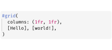
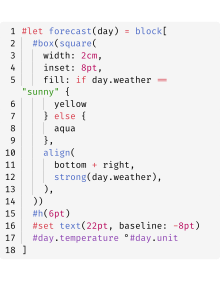

# 🦓 Zebraw

[](README_zh.md)
[](https://typst.app/universe/package/zebraw)
[](https://github.com/hongjr03/typst-zebraw)
[](coverage_report.md)
[](https://github.com/hongjr03/typst-zebraw/actions/workflows/test.yml)

Zebraw is a lightweight and fast package for displaying code blocks with line numbers in Typst, supporting code line highlighting. The term ***zebraw*** is a combination of ***zebra*** and ***raw***, as the highlighted lines display in the code block with a zebra-striped pattern.

## Quick Start

Import the `zebraw` package with `#import "@preview/zebraw:0.5.4": *` then add `#show: zebraw` to start using zebraw in the simplest way.

````typ
#import "@preview/zebraw:0.5.4": *
#show: zebraw

```typ
#grid(
  columns: (1fr, 1fr),
  [Hello], [world!],
)
```
````


To manually render specific code blocks with zebraw, use the `#zebraw()` function:

````typ
#zebraw(
  ```typ
  #grid(
    columns: (1fr, 1fr),
    [Hello], [world!],
  )
  ```
)
````


## Features

The `zebraw` function provides a variety of parameters to customize the appearance and behavior of code blocks. The following sections describe these parameters in detail:

- **Core Features**
  - Customizable line numbering and range slicing
  - Line highlighting and explanatory comments for code
  - Headers and footers
  - Language identifier tabs
  - The indentation guide line and hanging indentation (and fast preview mode for better performance)
- **Customization Options**
  - Custom colors for background, highlights, and comments
  - Custom fonts for different elements
  - Customizable insets
  - Custom themes
- **Export Options**
  - Experimental HTML export

### Line Numbering

Line numbers appear on the left side of the code block. Change the starting line number by passing an integer to the `numbering-offset` parameter. The default value is `0`.

````typ
#zebraw(
  // The first line number will be 2.
  numbering-offset: 1,
  ```typ
  #grid(
    columns: (1fr, 1fr),
    [Hello], [world!],
  )
  ```
)
````


To disable line numbering, pass `false` to the `numbering` parameter:

````typ
#zebraw(
  numbering: false,
  ```typ
  #grid(
    columns: (1fr, 1fr),
    [Hello], [world!],
  )
  ```
)
````



For more advanced numbering control, pass an array of arrays to the numbering parameter. Each inner array represents a column of markers that will be displayed instead of standard line numbers. This allows displaying multiple line numbers, markers or custom identifiers for each line.

````typ
#zebraw(
  numbering: (
    ([\+], [\*], [\#], [\-]),
  ),
  ```typ
  #grid(
    columns: (1fr, 1fr),
    [Hello], [world!],
  )
  ```
)
````


### Numbering Separator

You can add a separator line between line numbers and code content by setting the `numbering-separator` parameter to `true`:

````typ
#zebraw(
  numbering-separator: true,
  ```typ
  #grid(
    columns: (1fr, 1fr),
    [Hello], [world!],
  )
  ```
)
````


### Line Slicing

Slice code blocks by passing the `line-range` parameter to the `zebraw` function. The `line-range` parameter can be either:

- An array of 2 integers representing the range(can be `none` as this feature is based on Typst array slicing)
- A dictionary with `range` and `keep-offset` keys

When `keep-offset` is set to `true`, line numbers maintain their original values. Otherwise, they reset to start from 1. By default, `keep-offset` is set to `true`.

````typ
#let code = ```typ
#grid(
  columns: (1fr, 1fr),
  [Hello],
  [world!],
)
```

#zebraw(code)

#zebraw(line-range: (2, 4), code)

#zebraw(
  line-range: (range: (2, 4), keep-offset: false),
  code
)

#zebraw(
  numbering-offset: 30,
  line-range: (range: (2, 4), keep-offset: false),
  code
)

#zebraw(
  numbering-offset: 30,
  line-range: (range: (2, 4), keep-offset: true),
  code
)
````


### Line Highlighting

Highlight specific lines in the code block by passing the `highlight-lines` parameter to the `zebraw` function. The `highlight-lines` parameter accepts either a single line number or an array of line numbers.

````typ
#zebraw(
  // Single line number:
  highlight-lines: 2,
  ```typ
  #grid(
    columns: (1fr, 1fr),
    [Hello], [world!],
  )
  ```
)

#zebraw(
  // Array of line numbers:
  highlight-lines: (6, 7) + range(9, 15),
  ```typ
  = Fibonacci sequence
  The Fibonacci sequence is defined through the
  recurrence relation $F_n = F_(n-1) + F_(n-2)$.
  It can also be expressed in _closed form:_

  $ F_n = round(1 / sqrt(5) phi.alt^n), quad
    phi.alt = (1 + sqrt(5)) / 2 $

  #let count = 8
  #let nums = range(1, count + 1)
  #let fib(n) = (
    if n <= 2 { 1 }
    else { fib(n - 1) + fib(n - 2) }
  )

  The first #count numbers of the sequence are:

  #align(center, table(
    columns: count,
    ..nums.map(n => $F_#n$),
    ..nums.map(n => str(fib(n))),
  ))
  ```
)
````


### Comments

Add explanatory comments to highlighted lines by passing an array of line numbers and comments to the `highlight-lines` parameter.

````typ
#zebraw(
  highlight-lines: (
    (1, [The Fibonacci sequence is defined through the recurrence relation $F_n = F_(n-1) + F_(n-2)$\
    It can also be expressed in _closed form:_ $ F_n = round(1 / sqrt(5) phi.alt^n), quad
    phi.alt = (1 + sqrt(5)) / 2 $]),
    // Passing a range of line numbers in the array should begin with `..`
    ..range(9, 14),
    (13, [The first \#count numbers of the sequence.]),
  ),
  ```typ
  = Fibonacci sequence
  #let count = 8
  #let nums = range(1, count + 1)
  #let fib(n) = (
    if n <= 2 { 1 }
    else { fib(n - 1) + fib(n - 2) }
  )

  #align(center, table(
    columns: count,
    ..nums.map(n => $F_#n$),
    ..nums.map(n => str(fib(n))),
  ))
  ```
)
````


Comments begin with a flag character, which is `">"` by default. Change this flag by setting the `comment-flag` parameter:

````typ
#zebraw(
  highlight-lines: (
    // Comments can only be passed when highlight-lines is an array, so a comma is needed at the end of a single-element array
    (6, [The Fibonacci sequence is defined through the recurrence relation $F_n = F_(n-1) + F_(n-2)$]),
  ),
  comment-flag: "~~>",
  ```typ
  = Fibonacci sequence
  #let count = 8
  #let nums = range(1, count + 1)
  #let fib(n) = (
    if n <= 2 { 1 }
    else { fib(n - 1) + fib(n - 2) }
  )

  #align(center, table(
    columns: count,
    ..nums.map(n => $F_#n$),
    ..nums.map(n => str(fib(n))),
  ))
  ```
)
````


To disable the flag feature entirely, pass an empty string `""` to the `comment-flag` parameter (this also disables comment indentation):

````typ
#zebraw(
  highlight-lines: (
    (6, [The Fibonacci sequence is defined through the recurrence relation $F_n = F_(n-1) + F_(n-2)$]),
  ),
  comment-flag: "",
  ```typ
  = Fibonacci sequence
  #let count = 8
  #let nums = range(1, count + 1)
  #let fib(n) = (
    if n <= 2 { 1 }
    else { fib(n - 1) + fib(n - 2) }
  )

  #align(center, table(
    columns: count,
    ..nums.map(n => $F_#n$),
    ..nums.map(n => str(fib(n))),
  ))
  ```
)
````


### Headers and Footers

You can add headers and footers to code blocks. One approach is to use special keys in the `highlight-lines` parameter:

````typ
#zebraw(
  highlight-lines: (
    (header: [*Fibonacci sequence*]),
    ..range(8, 13),
    // Numbers can be passed as strings in the dictionary, though this approach is less elegant
    ("12": [The first \#count numbers of the sequence.]),
    (footer: [The fibonacci sequence is defined through the recurrence relation $F_n = F_(n-1) + F_(n-2)$]),
  ),
  ```typ
  #let count = 8
  #let nums = range(1, count + 1)
  #let fib(n) = (
    if n <= 2 { 1 }
    else { fib(n - 1) + fib(n - 2) }
  )

  #align(center, table(
    columns: count,
    ..nums.map(n => $F_#n$),
    ..nums.map(n => str(fib(n))),
  ))
  ```
)
````


Alternatively, use the dedicated `header` and `footer` parameters for cleaner code:

````typ
#zebraw(
  highlight-lines: (
    ..range(8, 13),
    (12, [The first \#count numbers of the sequence.]),
  ),
  header: [*Fibonacci sequence*],
  ```typ
  #let count = 8
  #let nums = range(1, count + 1)
  #let fib(n) = (
    if n <= 2 { 1 }
    else { fib(n - 1) + fib(n - 2) }
  )

  #align(center, table(
    columns: count,
    ..nums.map(n => $F_#n$),
    ..nums.map(n => str(fib(n))),
  ))
  ```,
  footer: [The fibonacci sequence is defined through the recurrence relation $F_n = F_(n-1) + F_(n-2)$],
)
````


### Language Tab

Display a floating language identifier tab in the top-right corner of the code block by setting `lang` to `true`:

````typ
#zebraw(
  lang: true,
  ```typst
  #grid(
    columns: (1fr, 1fr),
    [Hello], [world!],
  )
  ```
)
````


Customize the language display by passing a string or content to the `lang` parameter:

````typ
#zebraw(
  lang: strong[Typst],
  ```typst
  #grid(
    columns: (1fr, 1fr),
    [Hello], [world!],
  )
  ```
)
````


### Indentation Lines, Hanging Indentation and Fast Preview

Display indentation guides by passing a positive integer to the `indentation` parameter, representing the number of spaces per indentation level:

````typ
#zebraw(
  indentation: 2,
  ```typ
  #let forecast(day) = block[
    #box(square(
      width: 2cm,
      inset: 8pt,
      fill: if day.weather == "sunny" {
        yellow
      } else {
        aqua
      },
      align(
        bottom + right,
        strong(day.weather),
      ),
    ))
    #h(6pt)
    #set text(22pt, baseline: -8pt)
    #day.temperature °#day.unit
  ]
  ```
)
````



Enable hanging indentation by setting `hanging-indent` to `true`:

````typ
#zebraw(
  hanging-indent: true,
  ```typ
  #let forecast(day) = block[
    #box(square(
      width: 2cm,
      inset: 8pt,
      fill: if day.weather == "sunny" {
        yellow
      } else {
        aqua
      },
      align(
        bottom + right,
        strong(day.weather),
      ),
    ))
    #h(6pt)
    #set text(22pt, baseline: -8pt)
    #day.temperature °#day.unit
  ]
  ```
)
````


Indentation lines can slow down preview performance. For faster previews, enable fast preview mode by passing `true` to the `fast-preview` parameter in `zebraw-init` or by using `zebraw-fast-preview` in the CLI. This renders indentation lines as simple `|` characters:

````typ
#zebraw(
  hanging-indent: true,
  ```typ
  #let forecast(day) = block[
    #box(square(
      width: 2cm,
      inset: 8pt,
      fill: if day.weather == "sunny" {
        yellow
      } else {
        aqua
      },
      align(
        bottom + right,
        strong(day.weather),
      ),
    ))
    #h(6pt)
    #set text(22pt, baseline: -8pt)
    #day.temperature °#day.unit
  ]
  ```
)
````


### Themes

Zebraw includes built-in themes. PRs for additional themes are welcome!

````typ
#show: zebraw.with(..zebraw-themes.zebra)

```rust
pub fn fibonacci_reccursive(n: i32) -> u64 {
    if n < 0 {
        panic!("{} is negative!", n);
    }
    match n {
        0 => panic!("zero is not a right argument to fibonacci_reccursive()!"),
        1 | 2 => 1,
        3 => 2,
        _ => fibonacci_reccursive(n - 1) + fibonacci_reccursive(n - 2),
    }
}
```
````


````typ
#show: zebraw.with(..zebraw-themes.zebra-reverse)

```rust
pub fn fibonacci_reccursive(n: i32) -> u64 {
    if n < 0 {
        panic!("{} is negative!", n);
    }
    match n {
        0 => panic!("zero is not a right argument to fibonacci_reccursive()!"),
        1 | 2 => 1,
        3 => 2,
        _ => fibonacci_reccursive(n - 1) + fibonacci_reccursive(n - 2),
    }
}
```
````


### (Experimental) HTML Export

See [example-html.typ](example-html.typ) or [GitHub Pages](https://hongjr03.github.io/typst-zebraw/) for more information.

## Customization

There are three ways to customize code blocks in your document:

1. **Per-block customization**: Manually style specific blocks using the `#zebraw()` function with parameters.
2. **Local customization**: Apply styling to all subsequent raw blocks with `#show: zebraw.with()`. This affects all raw blocks after the `#show` rule, **except** those created manually with `#zebraw()`.
3. **Global customization**: Use `#show: zebraw-init.with()` to affect **all** raw blocks after the rule, **including** those created manually with `#zebraw()`. Reset to defaults by using `zebraw-init` without parameters.

### Inset

Customize the padding around each code line(numberings are not affected) by passing a dictionary to the `inset` parameter:

````typ
#zebraw(
  inset: (top: 6pt, bottom: 6pt),
  ```typ
  #grid(
    columns: (1fr, 1fr),
    [Hello], [world!],
  )
  ```
)
````


### Colors

Customize the background color with a single color or an array of alternating colors:

````typ
#zebraw(
  background-color: luma(250),
  ```typ
  #grid(
    columns: (1fr, 1fr),
    [Hello], [world!],
  )
  ```,
)

#zebraw(
  background-color: (luma(235), luma(245), luma(255), luma(245)),
  ```typ
  #grid(
    columns: (1fr, 1fr),
    [Hello], [world!],
  )
  ```,
)
````


Set the highlight color for marked lines with the `highlight-color` parameter:

````typ
#zebraw(
  highlight-lines: 1,
  highlight-color: blue.lighten(90%),
  ```text
  I'm so blue!
              -- George III
  ```,
)
````


Change the comment background color with the `comment-color` parameter:

````typ
#zebraw(
  highlight-lines: (
    (2, "auto indent!"),
  ),
  comment-color: yellow.lighten(90%),
  ```text
  I'm so blue!
              -- George III
  I'm not.
              -- Hamilton
  ```,
)
````


Set the language tab background color with the `lang-color` parameter:

````typ
#zebraw(
  lang: true,
  lang-color: teal,
  ```typst
  #grid(
    columns: (1fr, 1fr),
    [Hello], [world!],
  )
  ```
)
````


### Font

Customize font properties for comments, language tabs, and line numbers by passing a dictionary to the `comment-font-args`, `lang-font-args`, or `numbering-font-args` parameters respectively.

If no custom `lang-font-args` are provided, language tabs inherit the comment font styling:

````typ
#zebraw(
  highlight-lines: (
    (2, "columns..."),
  ),
  lang: true,
  comment-color: white,
  comment-font-args: (
    font: "IBM Plex Sans",
    style: "italic"
  ),
  ```typst
  #grid(
    columns: (1fr, 1fr),
    [Hello], [world!],
  )
  ```
)
````


Example with custom language tab styling:

````typ
#zebraw(
  highlight-lines: (
    (2, "columns..."),
  ),
  lang: true,
  lang-color: eastern,
  lang-font-args: (
    font: "Buenard",
    weight: "bold",
    fill: white,
  ),
  comment-font-args: (
    font: "IBM Plex Sans",
    style: "italic"
  ),
  ```typst
  #grid(
    columns: (1fr, 1fr),
    [Hello], [world!],
  )
  ```
)
````


### Extend

Extend at vertical is enabled at default. When there's header or footer it will be automatically disabled.

````typ
#zebraw(
  extend: false,
  ```typst
  #grid(
    columns: (1fr, 1fr),
    [Hello], [world!],
  )
  ```
)
````


## Example


### License

Zebraw is licensed under the MIT License. See the [LICENSE](LICENSE) file for more information.
