# 🦓 Zebraw

<a href="README_zh.md"></a> <a href="https://typst.app/universe/package/zebraw"></a> <a href="https://github.com/hongjr03/typst-zebraw"></a> <a href="coverage_report.md"></a> <a href="https://github.com/hongjr03/typst-zebraw/actions/workflows/test.yml"></a>

Zebraw 是一个轻量级且快速的 Typst 包，用于显示带有行号的代码块，支持代码行高亮。***zebraw*** 一词是 ***zebra***（斑马）和 ***raw***（原始）的组合，因为高亮显示的代码行在代码块中就像斑马纹一样。

## 快速开始

使用 `#import "@preview/zebraw:0.5.5": *` 导入 `zebraw` 包，然后添加 `#show: zebraw` 以最简单的方式开始使用 zebraw。

````typ
#import "@preview/zebraw:0.5.5": *
#show: zebraw

```typ
#grid(
  columns: (1fr, 1fr),
  [Hello], [world!],
)
```
````


要手动使用 zebraw 渲染特定代码块，请使用 `#zebraw()` 函数：

````typ
#zebraw(
  ```typ
  #grid(
    columns: (1fr, 1fr),
    [Hello], [world!],
  )
  ```
)
````

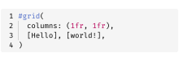

## 功能

`zebraw` 函数提供了多种参数来自定义代码块的外观和行为。以下部分详细描述了这些参数：

- **核心功能**
  - 可自定义的行号显示
  - 选择性显示代码行范围
  - 代码行高亮及注释
  - 代码块标题和页脚
  - 语言标签
  - 缩进指引线和悬挂缩进（含快速预览模式提升性能）
- **自定义选项**
  - 自定义背景、高亮和注释颜色
  - 各元素字体自定义
  - 自定义内边距
  - 内置主题
- **导出功能**
  - 实验性 HTML 导出

### 行号显示

代码块的左侧会显示行号。通过向 `numbering-offset` 参数传递一个整数来更改行号偏移量。默认值为 `0`。

````typ
#zebraw(
  // The first line number will be 2.
  numbering-offset: 1,
  ```typ
  #grid(
    columns: (1fr, 1fr),
    [Hello], [world!],
  )
  ```
)
````


要禁用行号显示，可向 `numbering` 参数传递 `false`：

````typ
#zebraw(
  numbering: false,
  ```typ
  #grid(
    columns: (1fr, 1fr),
    [Hello], [world!],
  )
  ```
)
````

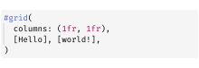

如果你想要更高级的行号控制，可以向 `numbering` 参数传递一个由数组组成的数组。每个内层数组表示一列内容用来替代行号。这样，一行就可以显示多个行号、标记或者自定义的标识符。

````typ
#zebraw(
  numbering: (
    ([\+], [\*], [\#], [\-]),
  ),
  ```typ
  #grid(
    columns: (1fr, 1fr),
    [Hello], [world!],
  )
  ```
)
````

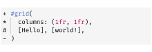

### 行号分隔线

你可以通过设置 `numbering-separator` 参数为 `true` 来在行号和代码内容之间添加分隔线：

````typ
#zebraw(
  numbering-separator: true,
  ```typ
  #grid(
    columns: (1fr, 1fr),
    [Hello], [world!],
  )
  ```
)
````

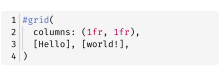

### 代码行切片

使用 `line-range` 参数可以显示代码块的特定行范围。该参数支持两种格式：

- 包含2个整数的数组，表示范围（可以是 `none`，此功能基于 Typst 数组切片）
- 包含 `range` 和 `keep-offset` 键的字典

当 `keep-offset` 为 `true` 时，行号保留原始值；为 `false` 时，行号从1开始重新计数。默认值为 `true`。

````typ
#let code = ```typ
#grid(
  columns: (1fr, 1fr),
  [Hello],
  [world!],
)
```

#zebraw(code)

#zebraw(line-range: (2, 4), code)

#zebraw(
  line-range: (range: (2, 4), keep-offset: false),
  code
)

#zebraw(
  numbering-offset: 30,
  line-range: (range: (2, 4), keep-offset: false),
  code
)

#zebraw(
  numbering-offset: 30,
  line-range: (range: (2, 4), keep-offset: true),
  code
)
````


### 行高亮

通过向 `zebraw` 函数传递 `highlight-lines` 参数来高亮显示代码块中的特定行。`highlight-lines` 参数可以接受单个行号或行号数组。

````typ
#zebraw(
  // Single line number:
  highlight-lines: 2,
  ```typ
  #grid(
    columns: (1fr, 1fr),
    [Hello], [world!],
  )
  ```
)

#zebraw(
  // Array of line numbers:
  highlight-lines: (6, 7) + range(9, 15),
  ```typ
  = Fibonacci sequence
  The Fibonacci sequence is defined through the
  recurrence relation $F_n = F_(n-1) + F_(n-2)$.
  It can also be expressed in _closed form:_

  $ F_n = round(1 / sqrt(5) phi.alt^n), quad
    phi.alt = (1 + sqrt(5)) / 2 $

  #let count = 8
  #let nums = range(1, count + 1)
  #let fib(n) = (
    if n <= 2 { 1 }
    else { fib(n - 1) + fib(n - 2) }
  )

  The first #count numbers of the sequence are:

  #align(center, table(
    columns: count,
    ..nums.map(n => $F_#n$),
    ..nums.map(n => str(fib(n))),
  ))
  ```
)
````

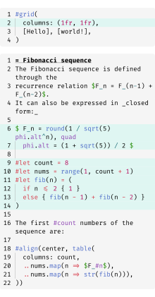

### 注释

通过向 `highlight-lines` 参数传递一个包含行号和注释的数组，可以为高亮显示的行添加注释。

````typ
#zebraw(
  highlight-lines: (
    (1, [The Fibonacci sequence is defined through the recurrence relation $F_n = F_(n-1) + F_(n-2)$\
    It can also be expressed in _closed form:_ $ F_n = round(1 / sqrt(5) phi.alt^n), quad
    phi.alt = (1 + sqrt(5)) / 2 $]),
    // Passing a range of line numbers in the array should begin with `..`
    ..range(9, 14),
    (13, [The first \#count numbers of the sequence.]),
  ),
  ```typ
  = Fibonacci sequence
  #let count = 8
  #let nums = range(1, count + 1)
  #let fib(n) = (
    if n <= 2 { 1 }
    else { fib(n - 1) + fib(n - 2) }
  )

  #align(center, table(
    columns: count,
    ..nums.map(n => $F_#n$),
    ..nums.map(n => str(fib(n))),
  ))
  ```
)
````

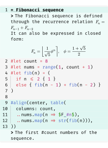

注释默认以 `">"` 开头。你可以通过 `comment-flag` 参数更改这个标志：

````typ
#zebraw(
  highlight-lines: (
    // Comments can only be passed when highlight-lines is an array, so a comma is needed at the end of a single-element array
    (6, [The Fibonacci sequence is defined through the recurrence relation $F_n = F_(n-1) + F_(n-2)$]),
  ),
  comment-flag: "~~>",
  ```typ
  = Fibonacci sequence
  #let count = 8
  #let nums = range(1, count + 1)
  #let fib(n) = (
    if n <= 2 { 1 }
    else { fib(n - 1) + fib(n - 2) }
  )

  #align(center, table(
    columns: count,
    ..nums.map(n => $F_#n$),
    ..nums.map(n => str(fib(n))),
  ))
  ```
)
````

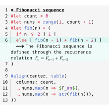

要完全移除注释标志，可以将 `comment-flag` 参数设为空字符串 `""`（这也会同时禁用注释缩进）：

````typ
#zebraw(
  highlight-lines: (
    (6, [The Fibonacci sequence is defined through the recurrence relation $F_n = F_(n-1) + F_(n-2)$]),
  ),
  comment-flag: "",
  ```typ
  = Fibonacci sequence
  #let count = 8
  #let nums = range(1, count + 1)
  #let fib(n) = (
    if n <= 2 { 1 }
    else { fib(n - 1) + fib(n - 2) }
  )

  #align(center, table(
    columns: count,
    ..nums.map(n => $F_#n$),
    ..nums.map(n => str(fib(n))),
  ))
  ```
)
````

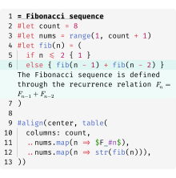

### 标题和页脚

你可以为代码块添加标题和页脚。可以通过在 `highlight-lines` 参数中传入键为 `header` 或 `footer` 的字典来实现。

````typ
#zebraw(
  highlight-lines: (
    (header: [*Fibonacci sequence*]),
    ..range(8, 13),
    // Numbers can be passed as strings in the dictionary, though this approach is less elegant
    ("12": [The first \#count numbers of the sequence.]),
    (footer: [The fibonacci sequence is defined through the recurrence relation $F_n = F_(n-1) + F_(n-2)$]),
  ),
  ```typ
  #let count = 8
  #let nums = range(1, count + 1)
  #let fib(n) = (
    if n <= 2 { 1 }
    else { fib(n - 1) + fib(n - 2) }
  )

  #align(center, table(
    columns: count,
    ..nums.map(n => $F_#n$),
    ..nums.map(n => str(fib(n))),
  ))
  ```
)
````

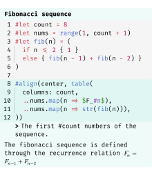

或者，可以使用专门的 `header` 和 `footer` 参数使代码更简洁：

````typ
#zebraw(
  highlight-lines: (
    ..range(8, 13),
    (12, [The first \#count numbers of the sequence.]),
  ),
  header: [*Fibonacci sequence*],
  ```typ
  #let count = 8
  #let nums = range(1, count + 1)
  #let fib(n) = (
    if n <= 2 { 1 }
    else { fib(n - 1) + fib(n - 2) }
  )

  #align(center, table(
    columns: count,
    ..nums.map(n => $F_#n$),
    ..nums.map(n => str(fib(n))),
  ))
  ```,
  footer: [The fibonacci sequence is defined through the recurrence relation $F_n = F_(n-1) + F_(n-2)$],
)
````


### 语言标签

通过设置 `lang` 参数为 `true`，可以在代码块的右上角显示一个浮动的语言标签：

````typ
#zebraw(
  lang: true,
  ```typst
  #grid(
    columns: (1fr, 1fr),
    [Hello], [world!],
  )
  ```
)
````

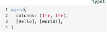

通过向 `lang` 参数传递字符串或内容来自定义显示的语言：

````typ
#zebraw(
  lang: strong[Typst],
  ```typst
  #grid(
    columns: (1fr, 1fr),
    [Hello], [world!],
  )
  ```
)
````

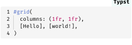

### 缩进指引线、悬挂缩进和快速预览

通过向 `indentation` 参数传递一个正整数来显示缩进指引线，该整数表示每个缩进级别的空格数：

````typ
#zebraw(
  indentation: 2,
  ```typ
  #let forecast(day) = block[
    #box(square(
      width: 2cm,
      inset: 8pt,
      fill: if day.weather == "sunny" {
        yellow
      } else {
        aqua
      },
      align(
        bottom + right,
        strong(day.weather),
      ),
    ))
    #h(6pt)
    #set text(22pt, baseline: -8pt)
    #day.temperature °#day.unit
  ]
  ```
)
````

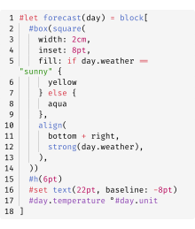

要启用悬挂缩进，只需将 `hanging-indent` 设置为 `true`：

````typ
#zebraw(
  hanging-indent: true,
  ```typ
  #let forecast(day) = block[
    #box(square(
      width: 2cm,
      inset: 8pt,
      fill: if day.weather == "sunny" {
        yellow
      } else {
        aqua
      },
      align(
        bottom + right,
        strong(day.weather),
      ),
    ))
    #h(6pt)
    #set text(22pt, baseline: -8pt)
    #day.temperature °#day.unit
  ]
  ```
)
````

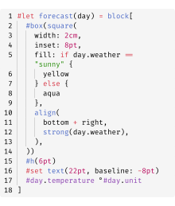

缩进线可能会降低预览性能。为了加快预览速度，可以通过在 `zebraw-init` 中将 `fast-preview` 参数设置为 `true`，或在 typst-cli 中传入 `zebraw-fast-preview`。这会将缩进线渲染为简单的 `|` 字符：

````typ
#zebraw(
  hanging-indent: true,
  ```typ
  #let forecast(day) = block[
    #box(square(
      width: 2cm,
      inset: 8pt,
      fill: if day.weather == "sunny" {
        yellow
      } else {
        aqua
      },
      align(
        bottom + right,
        strong(day.weather),
      ),
    ))
    #h(6pt)
    #set text(22pt, baseline: -8pt)
    #day.temperature °#day.unit
  ]
  ```
)
````

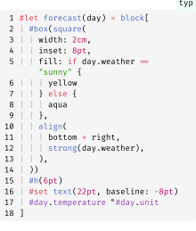

### 主题

Zebraw 包含内置主题。欢迎提交PR添加更多主题！

````typ
#show: zebraw.with(..zebraw-themes.zebra)

```rust
pub fn fibonacci_reccursive(n: i32) -> u64 {
    if n < 0 {
        panic!("{} is negative!", n);
    }
    match n {
        0 => panic!("zero is not a right argument to fibonacci_reccursive()!"),
        1 | 2 => 1,
        3 => 2,
        _ => fibonacci_reccursive(n - 1) + fibonacci_reccursive(n - 2),
    }
}
```
````

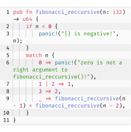

````typ
#show: zebraw.with(..zebraw-themes.zebra-reverse)

```rust
pub fn fibonacci_reccursive(n: i32) -> u64 {
    if n < 0 {
        panic!("{} is negative!", n);
    }
    match n {
        0 => panic!("zero is not a right argument to fibonacci_reccursive()!"),
        1 | 2 => 1,
        3 => 2,
        _ => fibonacci_reccursive(n - 1) + fibonacci_reccursive(n - 2),
    }
}
```
````

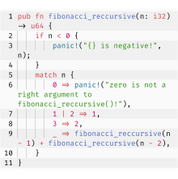

### （实验性） HTML 导出

查看 [example-html.typ](example-html.typ) 或 [GitHub Pages](https://hongjr03.github.io/typst-zebraw/) 获取更多信息。

## 自定义

文档中的代码块有三种自定义方式：

1. **单块自定义**：使用 `#zebraw()` 函数及参数为特定代码块设置样式。
2. **局部自定义**：通过 `#show: zebraw.with()` 为之后的所有原始代码块应用样式。这会影响该规则后的所有原始代码块，但**不包括**使用 `#zebraw()` 手动创建的代码块。
3. **全局自定义**：使用 `#show: zebraw-init.with()` 影响之后的**所有**代码块，**包括**通过 `#zebraw()` 创建的代码块。使用不带参数的 `zebraw-init` 可恢复默认设置。

### 内边距

通过向 `inset` 参数传递一个字典来自定义每行代码周围的内边距（行号不受影响）：

````typ
#zebraw(
  inset: (top: 6pt, bottom: 6pt),
  ```typ
  #grid(
    columns: (1fr, 1fr),
    [Hello], [world!],
  )
  ```
)
````

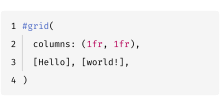

### 颜色

通过 `background-color` 参数设置代码块背景色，可以是单一颜色或一个颜色数组（会循环使用各个颜色）：

````typ
#zebraw(
  background-color: luma(250),
  ```typ
  #grid(
    columns: (1fr, 1fr),
    [Hello], [world!],
  )
  ```,
)

#zebraw(
  background-color: (luma(235), luma(245), luma(255), luma(245)),
  ```typ
  #grid(
    columns: (1fr, 1fr),
    [Hello], [world!],
  )
  ```,
)
````

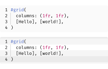

通过 `highlight-color` 参数设置高亮行的背景颜色：

````typ
#zebraw(
  highlight-lines: 1,
  highlight-color: blue.lighten(90%),
  ```text
  I'm so blue!
              -- George III
  ```,
)
````

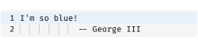

通过 `comment-color` 参数更改注释行背景颜色：

````typ
#zebraw(
  highlight-lines: (
    (2, "auto indent!"),
  ),
  comment-color: yellow.lighten(90%),
  ```text
  I'm so blue!
              -- George III
  I'm not.
              -- Hamilton
  ```,
)
````

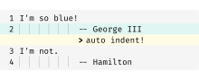

通过 `lang-color` 参数设置语言标签的背景颜色：

````typ
#zebraw(
  lang: true,
  lang-color: teal,
  ```typst
  #grid(
    columns: (1fr, 1fr),
    [Hello], [world!],
  )
  ```
)
````

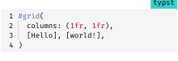

### 字体

通过向 `comment-font-args`、`lang-font-args` 或 `numbering-font-args` 参数传递字典来自定义注释、语言标签和行号的字体属性。

如果没有提供自定义的 `lang-font-args`，语言标签会继承注释字体的样式：

````typ
#zebraw(
  highlight-lines: (
    (2, "columns..."),
  ),
  lang: true,
  comment-color: white,
  comment-font-args: (
    font: "IBM Plex Sans",
    style: "italic"
  ),
  ```typst
  #grid(
    columns: (1fr, 1fr),
    [Hello], [world!],
  )
  ```
)
````

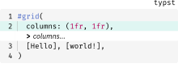

比如自定义语言标签样式：

````typ
#zebraw(
  highlight-lines: (
    (2, "columns..."),
  ),
  lang: true,
  lang-color: eastern,
  lang-font-args: (
    font: "Buenard",
    weight: "bold",
    fill: white,
  ),
  comment-font-args: (
    font: "IBM Plex Sans",
    style: "italic"
  ),
  ```typst
  #grid(
    columns: (1fr, 1fr),
    [Hello], [world!],
  )
  ```
)
````

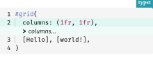

### 延展

垂直方向延展默认为启用。当存在标题或页脚时，它会自动禁用。

````typ
#zebraw(
  extend: false,
  ```typst
  #grid(
    columns: (1fr, 1fr),
    [Hello], [world!],
  )
  ```
)
````

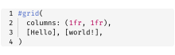

## 示例

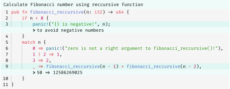

## 许可证

Zebraw 使用 MIT 许可证授权。更多信息请查看 [LICENSE](LICENSE) 文件。

## Star History

<a href="https://www.star-history.com/#hongjr03/typst-zebraw&Date"><picture><source media="(prefers-color-scheme: dark)" srcset="https://api.star-history.com/svg?repos=hongjr03/typst-zebraw&type=Date&theme=dark" /><source media="(prefers-color-scheme: light)" srcset="https://api.star-history.com/svg?repos=hongjr03/typst-zebraw&type=Date" /></picture></a>
