## 🦓 Zebraw

<a href="README.md">


</a> <a href="https://typst.app/universe/package/zebraw">


</a> <a href="https://github.com/hongjr03/typst-zebraw">


</a> <a href="coverage_report.md">


</a> <a href="https://github.com/hongjr03/typst-zebraw/actions/workflows/test.yml">


</a>

Zebraw 是一个轻量级且快速的包，用于在 Typst 中显示带有行号的代码块，支持代码行高亮。术语 _**zebraw**_ 是 _**zebra**_ 和 _**raw**_ 的组合，因为高亮行在代码块中以斑马条纹图案显示。

### 快速开始

使用 `#import "@preview/zebraw:0.6.1": *` 导入 `zebraw` 包，然后添加 `#show: zebraw` 以最简单的方式开始使用 zebraw。

````typ
#import "@preview/zebraw:0.6.1": *
#show: zebraw

```typ
#grid(
  columns: (1fr, 1fr),
  [Hello], [world!],
)
```
````

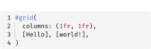

要手动渲染特定的代码块，请使用 `#zebraw()` 函数：

````typ
#zebraw(
  ```typ
  #grid(
    columns: (1fr, 1fr),
    [Hello], [world!],
  )
  ```
)
````


### 功能

`zebraw` 函数提供了多种参数来自定义代码块的外观和行为。以下部分详细描述了这些参数：

- **核心功能**
  - 可自定义的行号和范围切片
  - 代码行高亮和解释性注释
  - 页眉和页脚
  - 语言标识符标签
  - 缩进引导线和悬挂缩进（以及快速预览模式以获得更好的性能）
- **自定义选项**
  - 背景、高亮和注释的自定义颜色
  - 不同元素的自定义字体
  - 可自定义的内边距
  - 自定义主题
- **导出选项**
  - 实验性 HTML 导出

#### 行号

行号出现在代码块的左侧。通过将整数传递给 `numbering-offset` 参数来更改起始行号。默认值为 `0`。

````typ
#zebraw(
  // 第一行行号将是 2。
  numbering-offset: 1,
  ```typ
  #grid(
    columns: (1fr, 1fr),
    [Hello], [world!],
  )
  ```
)
````


要禁用行号，请将 `false` 传递给 `numbering` 参数：

````typ
#zebraw(
  numbering: false,
  ```typ
  #grid(
    columns: (1fr, 1fr),
    [Hello], [world!],
  )
  ```
)
````


对于更高级的行号控制，请将数组的数组传递给 numbering 参数。每个内部数组表示将显示的标记列，而不是标准行号。这允许显示多个行号、标记或每行的自定义标识符。

````typ
#zebraw(
  numbering: (
    ([\+], [\*], [\#], [\-]),
  ),
  ```typ
  #grid(
    columns: (1fr, 1fr),
    [Hello], [world!],
  )
  ```
)
````


#### 行号分隔符

您可以通过将 `numbering-separator` 参数设置为 `true` 来在行号和代码内容之间添加分隔线：

````typ
#zebraw(
  numbering-separator: true,
  ```typ
  #grid(
    columns: (1fr, 1fr),
    [Hello], [world!],
  )
  ```
)
````


#### 行切片

通过将 `line-range` 参数传递给 `zebraw` 函数来切片代码块。`line-range` 参数可以是：

- 表示范围
  的 2 个整数的数组（
  可以是 `none`，因为此功能基于 Typst 数组切片）
- 具有 `range` 和 `keep-offset` 键的字典

当 `keep-offset` 设置为 `true` 时，行号保持其原始值。否则，它们重置为从 1 开始。默认情况下，`keep-offset` 设置为 `true`。

````typ
#let code = ```typ
#grid(
  columns: (1fr, 1fr),
  [Hello],
  [world!],
)
```

#zebraw(code)

#zebraw(line-range: (2, 4), code)

#zebraw(
  line-range: (range: (2, 4), keep-offset: false),
  code
)

#zebraw(
  numbering-offset: 30,
  line-range: (range: (2, 4), keep-offset: false),
  code
)

#zebraw(
  numbering-offset: 30,
  line-range: (range: (2, 4), keep-offset: true),
  code
)
````

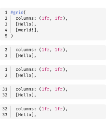

#### 行高亮

通过将 `highlight-lines` 参数传递给 `zebraw` 函数来高亮代码块中的特定行。`highlight-lines` 参数接受单个行号或行号数组。

````typ
#zebraw(
  // 单个行号：
  highlight-lines: 2,
  ```typ
  #grid(
    columns: (1fr, 1fr),
    [Hello], [world!],
  )
  ```
)

#zebraw(
  // 行号数组：
  highlight-lines: (6, 7) + range(9, 15),
  ```typ
  = Fibonacci sequence
  The Fibonacci sequence is defined through the
  recurrence relation $F_n = F_(n-1) + F_(n-2)$.
  It can also be expressed in _closed form:_

  $ F_n = round(1 / sqrt(5) phi.alt^n), quad
    phi.alt = (1 + sqrt(5)) / 2 $

  #let count = 8
  #let nums = range(1, count + 1)
  #let fib(n) = (
    if n <= 2 { 1 }
    else { fib(n - 1) + fib(n - 2) }
  )

  The first #count numbers of the sequence are:

  #align(center, table(
    columns: count,
    ..nums.map(n => $F_#n$),
    ..nums.map(n => str(fib(n))),
  ))
  ```
)
````


#### 注释

通过将行号和注释的数组传递给 `highlight-lines` 参数来为高亮行添加解释性注释。

````typ
#zebraw(
  highlight-lines: (
    (1, [The Fibonacci sequence is defined through the recurrence relation $F_n = F_(n-1) + F_(n-2)$\
    It can also be expressed in _closed form:_ $ F_n = round(1 / sqrt(5) phi.alt^n), quad
    phi.alt = (1 + sqrt(5)) / 2 $]),
    // Passing a range of line numbers in the array should begin with `..`
    ..range(9, 14),
    (13, [The first \#count numbers of the sequence.]),
  ),
  ```typ
  = Fibonacci sequence
  #let count = 8
  #let nums = range(1, count + 1)
  #let fib(n) = (
    if n <= 2 { 1 }
    else { fib(n - 1) + fib(n - 2) }
  )

  #align(center, table(
    columns: count,
    ..nums.map(n => $F_#n$),
    ..nums.map(n => str(fib(n))),
  ))
  ```
)
````


注释以标志字符开头，默认是 `">"`。通过设置 `comment-flag` 参数来更改此标志：

````typ
#zebraw(
  highlight-lines: (
    // Comments can only be passed when highlight-lines is an array, so a comma is needed at the end of a single-element array
    (6, [The Fibonacci sequence is defined through the recurrence relation $F_n = F_(n-1) + F_(n-2)$]),
  ),
  comment-flag: "~~>",
  ```typ
  = Fibonacci sequence
  #let count = 8
  #let nums = range(1, count + 1)
  #let fib(n) = (
    if n <= 2 { 1 }
    else { fib(n - 1) + fib(n - 2) }
  )

  #align(center, table(
    columns: count,
    ..nums.map(n => $F_#n$),
    ..nums.map(n => str(fib(n))),
  ))
  ```
)
````


要完全禁用标志功能，请将空字符串 `""` 传递给 `comment-flag` 参数（这也会禁用注释缩进）：

````typ
#zebraw(
  highlight-lines: (
    (6, [The Fibonacci sequence is defined through the recurrence relation $F_n = F_(n-1) + F_(n-2)$]),
  ),
  comment-flag: "",
  ```typ
  = Fibonacci sequence
  #let count = 8
  #let nums = range(1, count + 1)
  #let fib(n) = (
    if n <= 2 { 1 }
    else { fib(n - 1) + fib(n - 2) }
  )

  #align(center, table(
    columns: count,
    ..nums.map(n => $F_#n$),
    ..nums.map(n => str(fib(n))),
  ))
  ```
)
````


#### 多种高亮颜色

您可以为特定的高亮行分配不同的颜色。有两种方法可以实现：

1. **每行颜色**：通过在 `highlight-lines` 数组中的每个元组中添加颜色作为第二个元素来直接指定颜色：
   ````typ
   #zebraw(
     highlight-lines: (
       (1, rgb("#edb4b0").lighten(50%)),
       (2, rgb("#a4c9a6").lighten(50%)),
     ),
     ```python
     - device = "cuda"
     + device = accelerator.device
       model.to(device)
     ```,
   )
   ````

2. **循环颜色**：将颜色数组传递给 `highlight-color`，这些颜色将循环应用于高亮行：
   ````typ
   #zebraw(
     highlight-lines: (1, 2, 3),
     highlight-color: (
       rgb("#edb4b0"),
       rgb("#a4c9a6"),
       rgb("#94e2d5")
     ).map(c => c.lighten(70%)),
     ```python
     line 1
     line 2
     line 3
     ```,
   )
   ````

您还可以将每行颜色与默认 `highlight-color` 混合。没有特定颜色的行将使用默认颜色：

````typ
#zebraw(
  highlight-lines: (
    ("1": rgb("#ff0000").lighten(80%)),
    2,  // 使用默认颜色
    (3, rgb("#00ff00").lighten(80%)),
  ),
  highlight-color: rgb("#0000ff").lighten(80%),
  ```python
  line 1
  line 2
  line 3
  ```,
)
````


当将颜色与注释组合时，颜色应在元组中的注释之前：

````typ
#zebraw(
  highlight-lines: (
    (1, rgb("#edb4b0").lighten(50%), [Removed line]),
    (2, rgb("#a4c9a6").lighten(50%), [Added line]),
  ),
  ```python
  - device = "cuda"
  + device = accelerator.device
    model.to(device)
  ```,
)
````


#### 页眉和页脚

您可以为代码块添加页眉和页脚。一种方法是在 `highlight-lines` 参数中使用特殊键：

````typ
#zebraw(
  highlight-lines: (
    (header: [*Fibonacci sequence*]),
    ..range(8, 13),
    // Numbers can be passed as strings in the dictionary, though this approach is less elegant
    ("12": [The first \#count numbers of the sequence.]),
    (footer: [The fibonacci sequence is defined through the recurrence relation $F_n = F_(n-1) + F_(n-2)$]),
  ),
  ```typ
  #let count = 8
  #let nums = range(1, count + 1)
  #let fib(n) = (
    if n <= 2 { 1 }
    else { fib(n - 1) + fib(n - 2) }
  )

  #align(center, table(
    columns: count,
    ..nums.map(n => $F_#n$),
    ..nums.map(n => str(fib(n))),
  ))
  ```
)
````

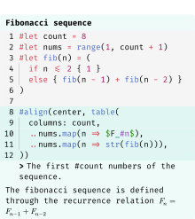

或者，使用专用的 `header` 和 `footer` 参数以获得更清洁的代码：

````typ
#zebraw(
  highlight-lines: (
    ..range(8, 13),
    (12, [The first \#count numbers of the sequence.]),
  ),
  header: [*Fibonacci sequence*],
  ```typ
  #let count = 8
  #let nums = range(1, count + 1)
  #let fib(n) = (
    if n <= 2 { 1 }
    else { fib(n - 1) + fib(n - 2) }
  )

  #align(center, table(
    columns: count,
    ..nums.map(n => $F_#n$),
    ..nums.map(n => str(fib(n))),
  ))
  ```,
  footer: [The fibonacci sequence is defined through the recurrence relation $F_n = F_(n-1) + F_(n-2)$],
)
````


#### 语言标签

通过将 `lang` 设置为 `true` 来在代码块的右上角显示浮动语言标识符标签：

````typ
#zebraw(
  lang: true,
  ```typst
  #grid(
    columns: (1fr, 1fr),
    [Hello], [world!],
  )
  ```
)
````


通过将字符串或内容传递给 `lang` 参数来自定义语言显示：

````typ
#zebraw(
  lang: strong[Typst],
  ```typst
  #grid(
    columns: (1fr, 1fr),
    [Hello], [world!],
  )
  ```
)
````


#### 缩进线、悬挂缩进和快速预览

通过将正整数传递给 `indentation` 参数来显示缩进引导线，表示每个缩进级别的空格数：

````typ
#zebraw(
  indentation: 2,
  ```typ
  #let forecast(day) = block[
    #box(square(
      width: 2cm,
      inset: 8pt,
      fill: if day.weather == "sunny" {
        yellow
      } else {
        aqua
      },
      align(
        bottom + right,
        strong(day.weather),
      ),
    ))
    #h(6pt)
    #set text(22pt, baseline: -8pt)
    #day.temperature °#day.unit
  ]
  ```
)
````


通过将 `hanging-indent` 设置为 `true` 来启用悬挂缩进：

````typ
#zebraw(
  hanging-indent: true,
  ```typ
  #let forecast(day) = block[
    #box(square(
      width: 2cm,
      inset: 8pt,
      fill: if day.weather == "sunny" {
        yellow
      } else {
        aqua
      },
      align(
        bottom + right,
        strong(day.weather),
      ),
    ))
    #h(6pt)
    #set text(22pt, baseline: -8pt)
    #day.temperature °#day.unit
  ]
  ```
)
````


缩进线可能会减慢预览性能。为了更快的预览，通过将 `true` 传递给 `zebraw-init` 中的 `fast-preview` 参数或在 CLI 中使用 `zebraw-fast-preview` 来启用快速预览模式。这将缩进线渲染为简单的 `|` 字符：

````typ
#zebraw(
  hanging-indent: true,
  ```typ
  #let forecast(day) = block[
    #box(square(
      width: 2cm,
      inset: 8pt,
      fill: if day.weather == "sunny" {
        yellow
      } else {
        aqua
      },
        align(
          bottom + right,
          strong(day.weather),
        ),
      ))
      #h(6pt)
      #set text(22pt, baseline: -8pt)
      #day.temperature °#day.unit
    ]
  ```
)
````

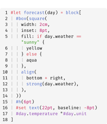

#### 主题

Zebraw 包含内置主题。欢迎提交额外主题的 PR！

````typ
#show: zebraw.with(..zebraw-themes.zebra)

```rust
pub fn fibonacci_reccursive(n: i32) -> u64 {
    if n < 0 {
        panic!("{} is negative!", n);
    }
    match n {
        0 => panic!("zero is not a right argument to fibonacci_reccursive()!"),
        1 | 2 => 1,
        3 => 2,
        _ => fibonacci_reccursive(n - 1) + fibonacci_reccursive(n - 2),
    }
}
```
````

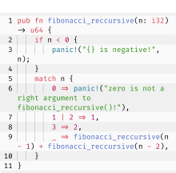

````typ
#show: zebraw.with(..zebraw-themes.zebra-reverse)

```rust
pub fn fibonacci_reccursive(n: i32) -> u64 {
    if n < 0 {
        panic!("{} is negative!", n);
    }
    match n {
        0 => panic!("zero is not a right argument to fibonacci_reccursive()!"),
        1 | 2 => 1,
        3 => 2,
        _ => fibonacci_reccursive(n - 1) + fibonacci_reccursive(n - 2),
    }
}
```
````

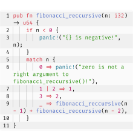

#### （实验性）HTML 导出

请参阅 [example-html.typ](example-html.typ) 或 [GitHub Pages](https://hongjr03.github.io/typst-zebraw/) 以获取更多信息。

要启用 HTML 导出，您需要在文档开头使用 `zebraw-init` 初始化 HTML 样式和脚本：

````typ
#import "@preview/zebraw:0.6.1": zebraw-init
#show: zebraw-init
````

您可以通过传递 `copy-button` 参数来控制是否包含复制按钮脚本：

````typ
#show: zebraw-init.with(copy-button: false)  // 禁用复制按钮
````

在代码块中，您可以使用 `copy-button` 参数按块控制复制按钮的显示：

````typ
#zebraw(
  copy-button: false,  // 隐藏此块的复制按钮
  ```typ
  #grid(
    columns: (1fr, 1fr),
    [Hello], [world!],
  )
  ```
)
````

### 自定义

在您的文档中有三种自定义代码块的方式：

1. **每块自定义**：使用带有参数的 `#zebraw()` 函数手动样式化特定块。
2. **局部自定义**：使用 `#show: zebraw.with()` 将样式应用于所有后续原始块。这会影响 `#show` 规则之后的所有原始块，**除了** 手动使用 `#zebraw()` 创建的那些。
3. **全局自定义**：使用 `#show: zebraw-init.with()` 来影响规则之后的所有原始块，**包括** 手动使用 `#zebraw()` 创建的那些。通过不带参数使用 `zebraw-init` 来重置为默认值。

#### 内边距

通过将字典传递给 `inset` 参数来自定义每个代码行周围的填充（行号不受影响）：

````typ
#zebraw(
  inset: (top: 6pt, bottom: 6pt),
  ```typ
  #grid(
    columns: (1fr, 1fr),
    [Hello], [world!],
  )
  ```
)
````

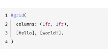

#### 圆角

通过将长度传递给 `radius` 参数来自定义代码块的角半径，与内边距无关。默认值为 `0.34em`。

````typ
#zebraw(
  radius: 10pt,
  ```typ
  #grid(
    columns: (1fr, 1fr),
    [Hello], [world!],
  )
  ```
)
````

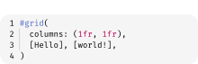

您还可以设置 `radius: 0pt` 以获得尖角：

````typ
#zebraw(
  radius: 0pt,
  ```typ
  #grid(
    columns: (1fr, 1fr),
    [Hello], [world!],
  )
  ```
)
````


#### 颜色

使用单一颜色或交替颜色的数组来自定义背景颜色：

````typ
#zebraw(
  background-color: luma(250),
  ```typ
  #grid(
    columns: (1fr, 1fr),
    [Hello], [world!],
  )
  ```,
)

#zebraw(
  background-color: (luma(235), luma(245), luma(255), luma(245)),
  ```typ
  #grid(
    columns: (1fr, 1fr),
    [Hello], [world!],
  )
  ```,
)
````


使用 `highlight-color` 参数设置标记行的突出显示颜色：

````typ
#zebraw(
  highlight-lines: 1,
  highlight-color: blue.lighten(90%),
  ```text
  I'm so blue!
              -- George III
  ```,
)
````

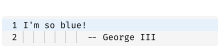

使用 `comment-color` 参数更改注释背景颜色：

````typ
#zebraw(
  highlight-lines: (
    (2, "auto indent!"),
  ),
  comment-color: yellow.lighten(90%),
  ```text
  I'm so blue!
              -- George III
  I'm not.
              -- Hamilton
  ```,
)
````


使用 `lang-color` 参数设置语言标签背景颜色：

````typ
#zebraw(
  lang: true,
  lang-color: teal,
  ```typst
  #grid(
    columns: (1fr, 1fr),
    [Hello], [world!],
  )
  ```
)
````

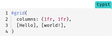

#### 字体

通过将字典传递给 `comment-font-args`、`lang-font-args` 或 `numbering-font-args` 参数分别为注释、语言标签和行号自定义字体属性。

如果未提供自定义 `lang-font-args`，语言标签将继承注释字体样式：

````typ
#zebraw(
  highlight-lines: (
    (2, "columns..."),
  ),
  lang: true,
  comment-color: white,
  comment-font-args: (
    font: "IBM Plex Sans",
    style: "italic"
  ),
  ```typst
  #grid(
    columns: (1fr, 1fr),
    [Hello], [world!],
  )
  ```
)
````

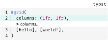

具有自定义语言标签样式的示例：

````typ
#zebraw(
  highlight-lines: (
    (2, "columns..."),
  ),
  lang: true,
  lang-color: eastern,
  lang-font-args: (
    font: "Buenard",
    weight: "bold",
    fill: white,
  ),
  comment-font-args: (
    font: "IBM Plex Sans",
    style: "italic"
  ),
  ```typst
  #grid(
    columns: (1fr, 1fr),
    [Hello], [world!],
  )
  ```
)
````


#### 扩展

默认情况下启用垂直扩展。当有页眉或页脚时，它将自动禁用。

````typ
#zebraw(
  extend: false,
  ```typst
  #grid(
    columns: (1fr, 1fr),
    [Hello], [world!],
  )
  ```
)
````

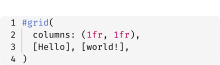

### 许可证

Zebraw 根据 MIT 许可证授权。有关更多信息，请参阅 [LICENSE](LICENSE) 文件。

### Star History

<a href="https://www.star-history.com/#hongjr03/typst-zebraw&amp;Date">

<picture>

<source media="(prefers-color-scheme: dark)" srcset="https://api.star-history.com/svg?repos=hongjr03/typst-zebraw&amp;type=Date&amp;theme=dark" /><source media="(prefers-color-scheme: light)" srcset="https://api.star-history.com/svg?repos=hongjr03/typst-zebraw&amp;type=Date" />

</picture>

</a>
