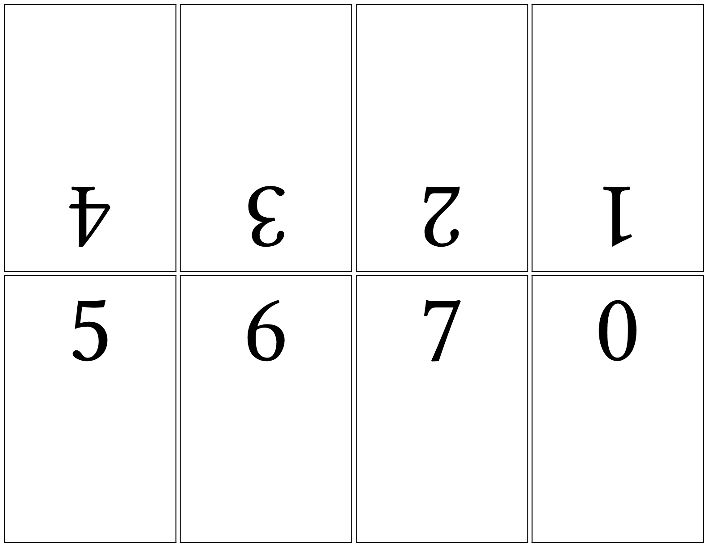

# zen-zine
Excellently type-set a cute little zine about your favorite topic!

Providing your eight pages in order will produce a US-Letter page with
the content in a layout ready to be folded into a zine! The content is
wrapped before movement so that padding and alignment are respected.

Here is the template and its preview:

```typst
#import "@preview/zen-zine:0.1.0": zine

#set document(author: "Tom", title: "Zen Zine Example")
#set text(font: "Linux Libertine", lang: "en")

#let my_eight_pages = (
  range(8).map(
    number => [
      #pad(2em, text(10em, align(center, str(number))))
    ]
  )
)

// provide your content pages in order and they
// are placed into the zine template positions.
// the content is wrapped before movement so that
// padding and alignment are respected.
#zine(
  // draw_border: true,
  // zine_page_margin: 5pt,
  contents: my_eight_pages
)
```



## Improvement Ideas
Roughly in order of priority.

- Write documentation and generate a manual
- Deduce `page` properties so that user can change the page they wish to use.
  - Make sure the page is `flipped` and deduce the zine page width and height
    from the full page width and height (and the zine margin)
  - I'm currently struggling with finding out the page properties (what's the `#get` equivalent to `#set`?)
- Add other zine sizes (there is a 16 page one I believe?)
- Digital mode where zine pages are separate pages (of the same size) rather than 'sub pages' of a printer page
