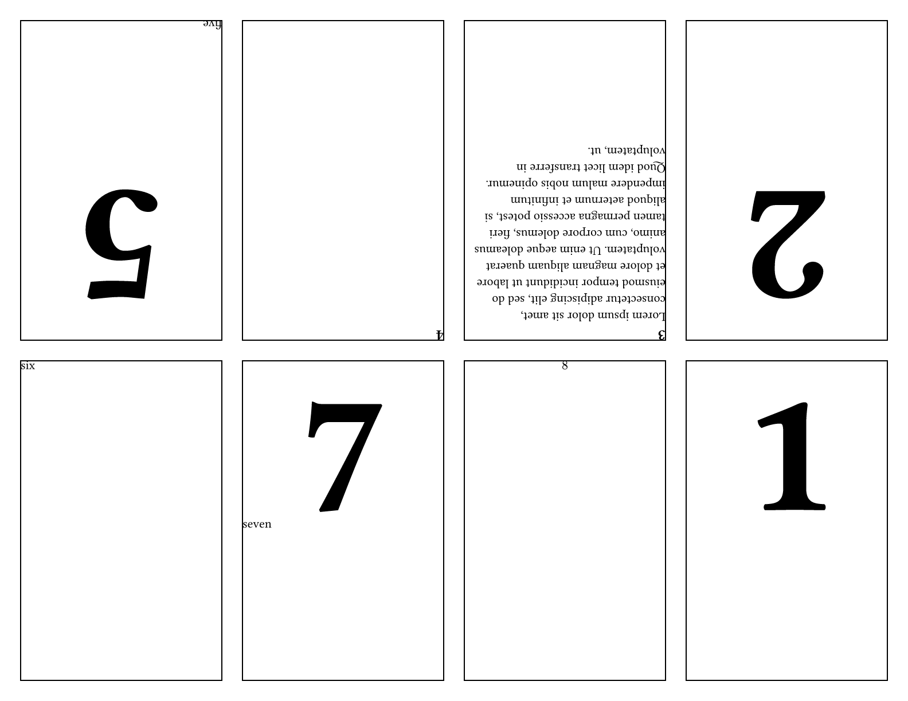

# zen-zine
Excellently type-set a cute little zine about your favorite topic!

Providing your eight pages in order will produce a US-Letter page with
the content in a layout ready to be folded into a zine! The content is
wrapped before movement so that padding and alignment are respected.

Here is the template and its preview:

```typst
#import "@preview/zen-zine:0.2.0": zine

#set document(author: "Tom", title: "Zen Zine Example")
#set text(font: "Libertinus Serif", lang: "en")

// this page size is what the printer page size is
// if building a digitial zine, the page will be re-set
// so that the PDF pages align with the zine page size
// and not the printer page size
#set page("us-letter")

// update heading rule to show that style is preserved
#show heading.where(level: 1): hd => {
  pad(top: 2em, text(10em, align(center, hd.body)))
}

#show: zine.with(
  // whether to make output PDF pages align with zine pages (true)
  // or have the zine pages located onto a printer page (false)
  // with this code, you can provide which kind you want on the command line
  //   typst compile input.typ output.pdf --input digital=(true|false)
  digital: json.decode(sys.inputs.at("digital", default: "false")),
  // zine-page-margin: 0.25in // margin of zine pages
  // draw-border: true // draw border boxes in printing mode
)

// provide your content pages in order and they
// are placed into the zine template positions.
// the content is wrapped before movement so that
// padding and alignment are respected.

= 1

#pagebreak()

= 2

#pagebreak()

== 3
#lorem(50)

#pagebreak()

== 4

#pagebreak()

= 5
#v(1fr)
five

#pagebreak()

six

#pagebreak()

= 7
seven

#pagebreak()

$ 8 $

```



## Development
Using [just](https://just.systems/man/en/) and [showman](https://github.com/ntjess/showman/tree/main) to help aid development.

After installing `just`, the additional initialization recipes are in the justfile.
```
just init-showman # create a python3 venv and install showman for packaging
just install # symlink local clone to local package area for testing
```

## Improvement Ideas
Roughly in order of priority.

- Write documentation and generate a manual
- ~~Deduce `page` properties so that user can change the page they wish to use.~~
  - [Commit 96fd477a](https://github.com/tomeichlersmith/zen-zine/commit/96fd477ac332f73b2d3cbbee11ca62fbcd5d1a19)
  - Make sure the page is `flipped` and deduce the zine page width and height
    from the full page width and height (and the zine margin)
  - Have `zine` function be provided `context` so `page.width` and `page.height` are available
- Add other zine sizes (there is a 16 page one I believe?)
- ~~Digital mode where zine pages are separate pages (of the same size) rather than 'sub pages' of a printer page~~
  - [Commit cc323123](https://github.com/tomeichlersmith/zen-zine/commit/cc323123592d6a9203a96c7652e939d07f35ffbb)
- ~~Figure out how syntax to enable `#show.zine(config)` syntax like other templates~~
  - [PR #3](https://github.com/tomeichlersmith/zen-zine/pull/3)
  - [can "unpack" argument sinks `..sink` with `sink.pos()` to get an array of positional arguments](https://typst.app/docs/reference/foundations/arguments/)
  - having user use `#pagebreak()` to signal where pages are within document content
- Tweak margins to optimize for folding
  - Zines have 4 borders - outer margin, cut, outer fold, inner fold
  - we can squeeze the inner folds to expand the outer folds so that there is more tolerance on the folds and text wrapping around the outside is less likely
  - the outer margin is limited by a user's printer's capabilities
- 🤯give user acces to two next pages next to each other (in final zine) so they can decide how to handle an inner fold🤯
