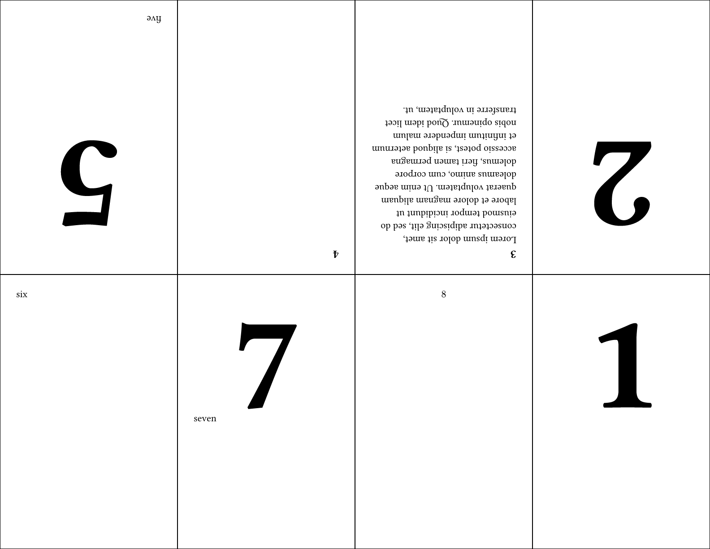

# zen-zine
Excellently type-set a cute little zine about your favorite topic!

Providing your eight pages in order will produce a printer page with
the content in a layout ready to be folded into a zine! The content is
wrapped before movement so that padding and alignment are respected.

Below is the template and its preview.
The [full manual](https://github.com/tomeichlersmith/zen-zine/releases/download/v0.3.0/zen-zine-v0.3.0-manual.pdf)
is available on GitHub attached to the release it documents.

```typst
#import "@preview/zen-zine:0.3.0": zine8

#set document(author: "Tom", title: "Zen Zine Example")
#set text(font: "Libertinus Serif", lang: "en")

// this page size is what the printer page size is
// if building a digital zine, the page will be re-set
// so that the PDF pages align with the zine page size
// and not the printer page size
#set page("us-letter")

// update heading rule to show that style is preserved
#show heading.where(level: 1): hd => {
  pad(top: 2em, text(10em, align(center, hd.body)))
}

#show: zine8.with(
  // whether to make output PDF pages align with zine pages (true)
  // or have the zine pages located onto a printer page (false)
  // with this code, you can provide which kind you want on the command line
  //   typst compile input.typ output.pdf --input digital=(true|false)
  digital: json(bytes(sys.inputs.at("digital", default: "false"))),
  // draw border in printer page zine to help with design
  draw-border: true
)

// provide your content pages in order and they
// are placed into the zine template positions.
// the content is wrapped before movement so that
// padding and alignment are respected.

= 1

#pagebreak()

= 2

#pagebreak()

== 3
#lorem(50)

#pagebreak()

== 4

#pagebreak()

= 5
#v(1fr)
five

#pagebreak()

six

#pagebreak()

= 7
seven

#pagebreak()

$ 8 $

```



## Development
Using [just](https://just.systems/man/en/), [showman](https://github.com/ntjess/showman/tree/main), and [tytanic](https://typst-community.github.io/tytanic/index.html) to help aid development.

After installing `just`, the additional initialization recipes are in the justfile.
```sh
just init-showman # create a python3 venv and install showman for packaging
just install # symlink local clone to local package area for easier live development
```

See the tytanic documentation for how to write tests, for a short reference:
```sh
# 1. create a new test (following my arbitrary naming convention)
tt new sixteen/page-numbers/digital
# 2. edit the test file
vim tests/sixteen/page-numbers/digital/test.typ
# 3. update the reference image
tt update
# 4. make sure reference image is correct and then commit if it is
# 5. check that future changes don't affect reference image
tt run
```
