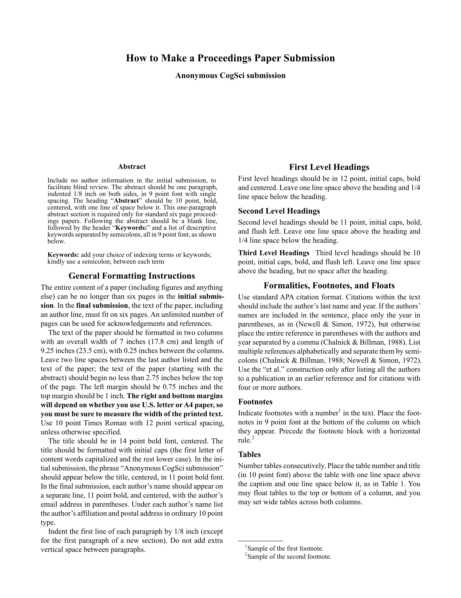

# CogSci Template

A [Typst](https://typst.app/) template for submissions to the _Annual Conference of the [Cognitive Science Society](https://cognitivesciencesociety.org/) (**CogSci**)_.

This template aims to be a visual clone of the official LaTeX template.

| Anonymized                                         | Final                                           |
| -------------------------------------------------- | ----------------------------------------------- |
|  |  |

## Usage

You can use this template in the [Typst web app](https://typst.app/) by clicking "Start from template" on the dashboard and searching for `cogsci`.

### Local usage

You can use the [Typst CLI](https://github.com/typst/typst) to initialize the template locally:

```bash
typst init @preview/cogsci
cd cogsci
```

To generate the PDF:

```shell
typst compile main.typ main.pdf
```

It's recommended that you use a [PDF standard](https://www.adobe.com/uk/acrobat/resources/document-files/pdf-types.html) to ensure that the PDF is searchable, e.g. `a-3u`:

```shell
typst compile --pdf-standard a-3u main.typ main.pdf
```

If you're using Typst locally (rather than the web app), I highly recommend trying the [Tinymist](https://github.com/Myriad-Dreamin/tinymist) extension for [Visual Studio Code](https://code.visualstudio.com/). It makes for a superb writing experience.

## TWO IMPORTANT NOTES

1. DOUBLE-BLIND REVIEWING

   - Starting in 2019, 6-page paper submissions are reviewed double-blind, so submissions must be anonymized.

   - You can toggle the author details in your submission using the `anonymize` flag (the flag also prevents author info from being stored in the PDF metadata).

2. CC-BY LICENSING

   - An online proceedings will be published by the Cognitive Science Society. At the time of final (camera-ready) submission authors will be required to agree to release of their proceedings contribution under a CC-BY license. This means that authors allow free reuse of their work provided the original authors are attributed. Please see the submissions website for more details.

## Key Parameters

The `cogsci()` function accepts the following parameters:

### Document Metadata

- **`title`** (content): The paper title. Required for proper display.

- **`authors`** (content): Pre-formatted author information. The template exports a `format-authors()` helper function that accepts an array of author dictionaries with keys `name`, `email`, and `affiliation`. You can also provide your own custom formatted content if you need different styling.

  ```typst
  #let authors = (
    (name: [Jane Doe], email: "jane@example.edu", affiliation: [University]),
    (name: [John Smith], email: "john@example.edu", affiliation: [Institute]),
  )
  #show: cogsci.with(
    authors: format-authors(authors),
    // ... other parameters
  )
  ```

- **`abstract`** (content): The paper abstract. Will be formatted according to CogSci style.

- **`keywords`** (array): Array of keyword strings, e.g., `("cognitive science", "typst", "template")`.

### Bibliography

- **`references`** (content): Accepts the result of calling Typst's `bibliography()` function. Pass the `bibliography()` function call directly—do not pass a file path string. The template applies CogSci-specific formatting (APA style) to the bibliography.

  ```typst
  #show: cogsci.with(
    references: bibliography("references.bib", style: "apa"),
    // ... other parameters
  )
  ```

  **Note**: Use BibLaTeX format (`.bib`), not BibTeX format.

### Submission Control

- **`anonymize`** (boolean): Set to `true` for double-blind review submissions (hides author information and uses "Anonymous CogSci submission" placeholder). Set to `false` for final camera-ready submissions with author details. Default is `false`.

### Formatting Options

- **`hyphenate`** (boolean): Set to `false` to disable hyphenation throughout the document (useful for spell-checking). Default is `true`.

## Preparing an anonymized submission

Set `#let anonymize = true`.

Remember that you need to leave at least 2.75 inches between the top of the first page and the abstract & text of your paper. Since the top margin needs to be 1 inch on all pages, this means that there needs to be at least 1.75 inches of space on page 1 in which nothing but your paper title and **Anonymous CogSci submission** appears. Additionally, please remember not to include acknowledgments in the final version of your paper.

## Preparing the de-anonymized final version of your accepted paper

Set `#let anonymize = false`.

In the final version of the paper, the title, author, abstract, and text of the paper must fit within six pages. Unlimited additional pages can be used for acknowledgments and references. In the final version of the paper for the proceedings (but not the initial anonymized submission), be sure to include any acknowledgments that may be appropriate.

Once again, make sure that you adhere to the general formatting instructions, including that there are at least 2.75 inches between the top of page 1 and the start of the abstract and text.

## Requirements

- Typst `v0.14.0` or later (use the [web app](https://typst.app/play/) or install locally, e.g. with `brew install typst`)

## License

This template is distributed under the MIT License.

## Author

**Dae Houlihan**, based on the LaTeX template by Ashwin Ram, Johanna Moore, David Noelle, Pat Langley, Ramin Charles Nakisa, Tina Eliassi-Rad, Trisha Yannuzzi, Mary Ellen Foster, Ken Forbus, Eli M. Silk, Niels Taatgen and Roger Levy.

[](https://daeh.info) [](https://bsky.app/profile/dae.bsky.social) [](https://github.com/daeh)
