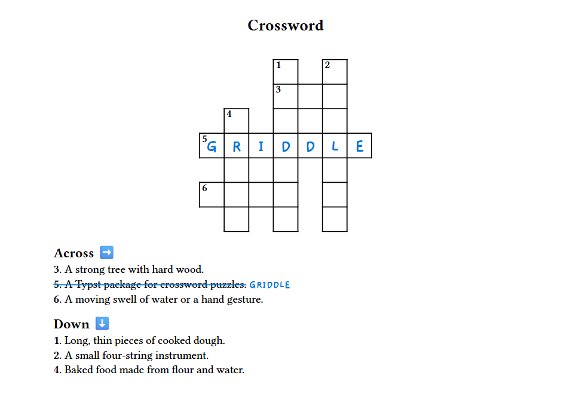
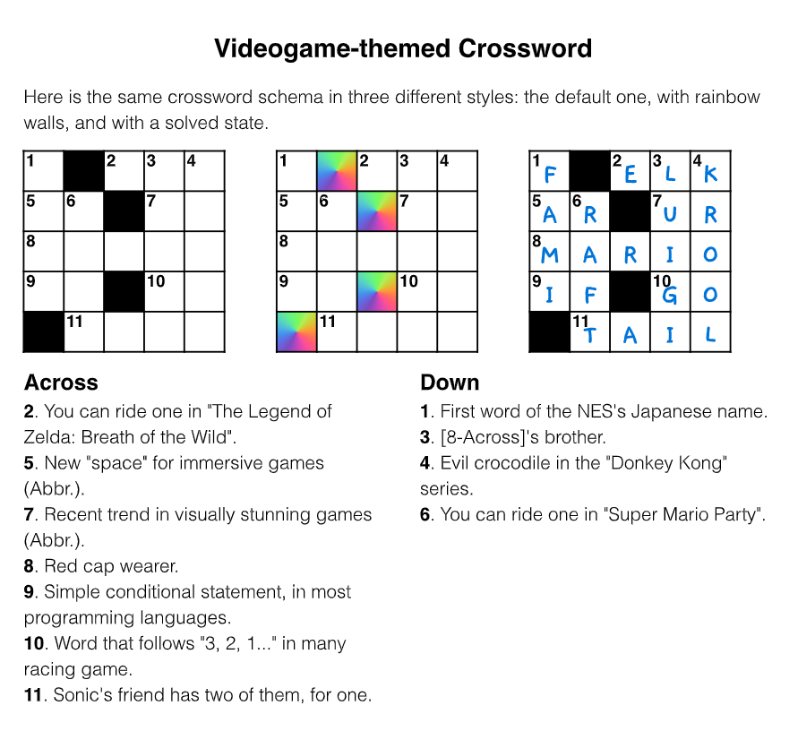
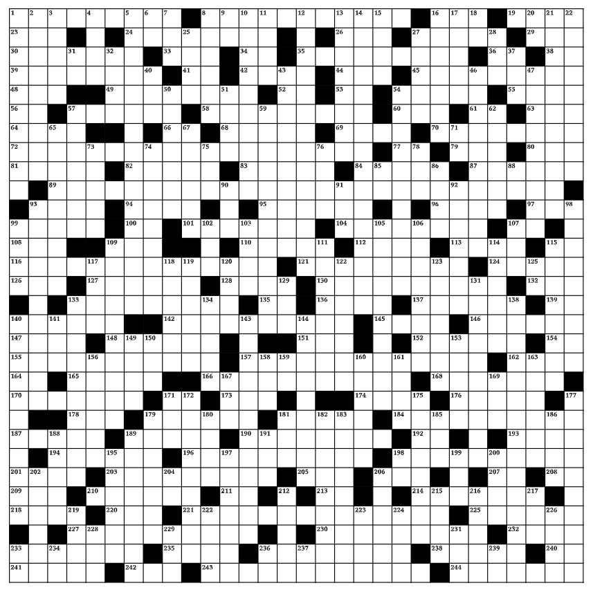
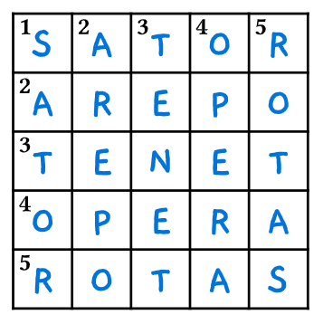

# Griddle

A customizable tool for designing and visualizing **crossword puzzles** in [Typst](https://typst.app/).



The name _"Griddle"_ mixes _"grid"_ and _"riddle"_, which kinda fit the idea of a crossword puzzle.

## Usage
_Griddle_ comes with three main functionalities: 
1. a function to **load your crossword** from a YAML file;
2. a second function to **visualize the grid**;
3. and a third function for **printing the definitions**.

As long as your YAML file is well-formatted, using _Griddle_ is as simple as writing three function calls in your Typst document.

### 1. Writing the data file
The words and their relative definitions and positions must be defined in a single file with the [YAML](https://en.wikipedia.org/wiki/YAML) format. This file should contains a list of entries for the crossword puzzle, and may be structured in two ways:
- as a **flat list of entries**, each of one specifying the direction of the word in the grid;
- or **grouped into two lists** of entries, associated respectively with _across_ (horizontal) and _down_ (vertical) definitions.

Here are two examples of the same crossword definitions structured in both ways:

```yaml
# File `data_flat.yaml`
# Entries are listed with no particular structure nor order.
- {number: 1, row: 0, col: 3, direction: "down", word: noodles, definition: 'Long, thin pieces of cooked dough'}
- {number: 2, row: 0, col: 5, direction: "down", word: ukulele, definition: 'A small four-string instrument'}
- {number: 3, row: 1, col: 3, direction: "across", word: oak, definition: 'A strong tree with hard wood'}
- {number: 4, row: 2, col: 1, direction: "down", word: bread, definition: 'Baked food made from flour and water'}
- {number: 5, row: 3, col: 0, direction: "across", word: griddle, definition: 'A Typst package for crossword puzzles', solved: true}
- {number: 6, row: 5, col: 0, direction: "across", word: wave, definition: 'A moving swell of water or a hand gesture'}
```
In the example above, notice how each entry has to specify the `direction` of the word in the grid. In the next example, this information is written once at the beginning of each group:

```yaml
# File `data_grouped.yaml`
# Entries are grouped in two sets, based on their direction.
across:
  - {number: 3, row: 1, col: 3, word: oak, definition: 'A strong tree with hard wood'}
  - {number: 5, row: 3, col: 0, word: griddle, definition: 'A Typst package for crossword puzzles', solved: true}
  - {number: 6, row: 5, col: 0, word: wave, definition: 'A moving swell of water or a hand gesture'}
down:
  - {number: 1, row: 0, col: 3, word: noodles, definition: 'Long, thin pieces of cooked dough'}
  - {number: 2, row: 0, col: 5, word: ukulele, definition: 'A small four-string instrument'}
  - {number: 4, row: 2, col: 1, word: bread, definition: 'Baked food made from flour and water'}
```

As it can be observed, each entry is composed by some mandatory and optional fields:
- `number`: *(mandatory)* the number of the entry in the grid, used to associate the word to its definition.
- `row`: *(mandatory)* the row-index of the word starting cell in the grid. Indices in the grid start from 0 in both horizontal and vertical directions.
- `col`: *(mandatory)* the column-index of the word starting cell in the grid.
- `word`: *(mandatory)* the string containing the word of this entry.
- `definition`: *(mandatory for now, might become optional in the future)* the string containing the description/riddle for this entry.
- `solved`: *(optional; default: false)* a boolean flag indicating whether this entry is already solved in the puzzle (i.e. the schema would show its letters) or not.


### 2. Loading the crossword puzzle
To load the crossword data into your Typst document, use the `load-crossword` function from the _Griddle_ library:
```typ
#import "@preview/griddle:0.1.0": load-crossword

#let cw = load-crossword("path/to/data.yaml")
```

This functions reads and checks your YAML file, producing a data structure (a `dictionary`) with the following fields:

```yaml
cw: the whole crossword data; 
  ☼ schema: represents the "table" with cells and walls (dictionary);
    - rows: the number of rows in the schema (int);
    - cols: the number of columns in the schema (int);
    - grid: the content of each cell of the grid, as a flat array;
  ☼ definitions: (dictionary);
    - across: the list of horizontal entries;
    - down: the list of vertical entries.
```

This data structure contains all the information needed to visualize the crossword schema and definitions in your document. This means that _Griddle_ processes your data file **only once**, allowing the user to call the visualization functions multiple time in their document with no processing downtime. 

### 3. Visualizing the schema

To visualize the schema of your crossword, just call the `show-schema` function where you want it to appear in your document. 

```typ
#import "@preview/griddle:0.1.0": show-schema
// [... Load the crossword data as before ...]
= Crossword
#show-schema(cw.schema)
```

This function requires the `schema` field of your crossword data structure as input, and produces a grid with the letters of the solved entries and empty cells for the unsolved ones.
The grid is automatically styled to have a standard size, but you can customize it by passing additional parameters to the function.

```typ
#show-schema(cw.schema, cell-size: (1fr, 1fr), wall: "empty")
```

The `cell-size` parameter allows you to set the size of each cell in the grid, by editing the width and height of the cells. The default value is `(24pt, 24pt)`, which is a good size for most crosswords.

The `wall` parameter allows you to set the color of the walls between cells, modifying the style of your crossword grid. It supports three options:
- `"black"`: the default value, which draws black walls between cells;
- `"empty"`: which removes the walls between cells and uses a transparent background;
- `"rainbow"`: which draws a fancy rainbow gradient between cells, creating a colorful effect.

See the examples in the next section for more details on how to use these parameters.

### 4. Printing the definitions
To print the definitions of your crossword, you can use the `print-definitions` function. This function takes a list of entries of your crossword data structure as input and prints each of them in a nicely formatted way.

Notice that, in order to print all the definitions, you would call the function on both the `cw.definitions.across` and `cw.definitions.down` fields of your crossword data structure.

```typ
#import "@preview/griddle:0.1.0": show-definitions
// [... Load the crossword data as before ...]
== Across
#show-definitions(cw.definitions.across)
== Down
#show-definitions(cw.definitions.down)
```

The `show-definitions` function automatically formats the entries in an ordered list, with the number of the entry and its definition. It also changes the style of the definition text based on whether the entry is solved or not, adding a strikethrough effect to the solved entries and the solution word next to the definition.

## Examples

### Example 1
Here is a complete example of a Typst document using _Griddle_ to visualize a crossword puzzle:

```typ
#import "@preview/griddle:0.1.0": *

#let cw = load-crossword("path/to/data.yaml")
// Data file is the one from the previous examples

#show heading.where(level: 1): set align(center)
#show table: set align(center)

= Crossword
#v(20pt)
#show-schema(cw.schema, wall: "empty")

== Across #emoji.arrow.r
#show-definitions(cw.definitions.across)
== Down #emoji.arrow.b
#show-definitions(cw.definitions.down)
```


### Example 2
Here's another example, with another data file and some customizations.

```yaml
# File `data.yaml`
across:
  - {number: 2, row: 0, col: 2, word: elk, definition: 'You can ride one in "The Legend of Zelda: Breath of the Wild"'}
  - {number: 5, row: 1, col: 0, word: ar, definition: 'New "space" for immersive games (Abbr.)'}
  - {number: 7, row: 1, col: 3, word: ur, definition: 'Recent trend in visually stunning games (Abbr.)'}
  - {number: 8, row: 2, col: 0, word: mario, definition: 'Red cap wearer'}
  - {number: 9, row: 3, col: 0, word: if, definition: 'Simple conditional statement, in most programming languages'}
  - {number: 10, row: 3, col: 3, word: go, definition: 'Word that follows "3, 2, 1..." in many racing game'}
  - {number: 11, row: 4, col: 1, word: tail, definition: "Sonic's friend has two of them, for one"}
down:
  - {number: 1, row: 0, col: 0, word: fami, definition: "First word of the NES's Japanese name"}
  - {number: 3, row: 0, col: 3, word: luigi, definition: "[8-Across]'s brother"}
  - {number: 4, row: 0, col: 4, word: krool, definition: "Evil crocodile in the \"Donkey Kong\" series"}
  - {number: 6, row: 1, col: 1, word: raft, definition: "You can ride one in \"Super Mario Party\""}
# Original schema from the Open-Crossword project by Alexis Andrew Martel.
```

```typ
#import "@preview/griddle:0.1.0": *

#let cw = load-crossword("path/to/data.yaml")

#show heading.where(level: 1): set align(center)
#set text(font: "Helvetica")

#heading(level: 1)[Videogame-themed Crossword]
#v(1em)
Here is the same crossword schema in three different styles: the default one, with rainbow walls, and with a solved state.
#table(columns: (1fr,)*3, rows: 1, stroke: none, align: left, inset: 0pt,
	show-schema(cw.schema), 
	show-schema(cw.schema, wall: "rainbow"), 
	show-schema(cw.schema, solved: true)
	)

#table(columns: 2, rows: 1, stroke: none, inset: 0pt, gutter: 20pt,
	[
		== Across
		#show-definitions(cw.definitions.across)
	],
	[
		== Down
		#show-definitions(cw.definitions.down)
	]
)
```



**Credits**: this puzzle was created by [Alexis Andrew Martel](https://github.com/alexis-martel) and is contained in the [Open-Crossword project](https://github.com/alexis-martel/Open-Crossword) repository on GitHub ([`crossword16`](https://github.com/alexis-martel/Open-Crossword/blob/master/data/puzzles/crossword16.json)), licensed under the _GNU General Public License v3.0 (GPL-3.0)_.

### Example 3
A more complex example of a crossword puzzle within a 30x30 grid, easily build and rendered with _Griddle_ in Typst:



### Example 4
And finally, here is an example of the famous [Sator Square](https://en.wikipedia.org/wiki/Sator_Square) crossword, which is a 5x5 grid with the same words in both horizontal and vertical directions. The inscription _"Sator arepo tenet opera rotas"_ is a five-word palindrome in Latin, meaning "The farmer Arepo holds the wheels with care".

```typ

```yaml
# In this example, the entries are listed in a flat structure. Furthermore, in order to have both horizontal and vertical entries, the same word is listed twice, once for each direction.
- {number: 1, row: 0, col: 0, direction: horizontal, word: sator, definition: ""}
- {number: 1, row: 0, col: 0, direction: vertical, word: sator, definition: ""}
- {number: 2, row: 1, col: 0, direction: horizontal, word: arepo, definition: ""}
- {number: 2, row: 0, col: 1, direction: vertical, word: arepo, definition: ""}
- {number: 3, row: 2, col: 0, direction: horizontal, word: tenet, definition: ""}
- {number: 3, row: 0, col: 2, direction: vertical, word: tenet, definition: ""}
- {number: 4, row: 3, col: 0, direction: horizontal, word: opera, definition: ""}
- {number: 4, row: 0, col: 3, direction: vertical, word: opera, definition: ""}
- {number: 5, row: 4, col: 0, direction: horizontal, word: rotas, definition: ""}
- {number: 5, row: 0, col: 4, direction: vertical, word: rotas, definition: ""}
```




## License
This package is released under the GNU General Public License v3.0 (GPL-3.0). You can find the full license text in the [LICENSE](LICENSE) file.

## Contributing
If you want to contribute to this project, feel free to open an issue or a pull request on the [GitHub repository](https://github.com/micheledusi/Griddle).

### Credits
This package was created by [Michele Dusi](https://github.com/micheledusi).