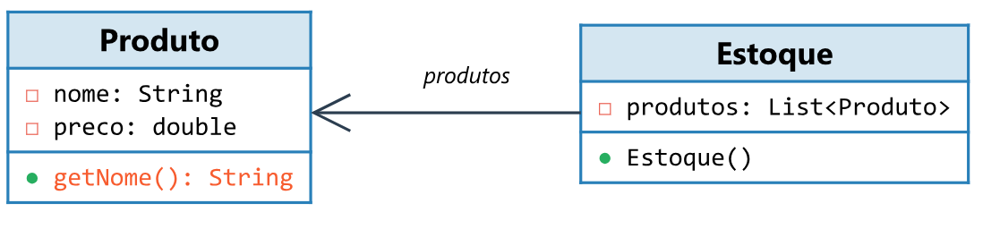
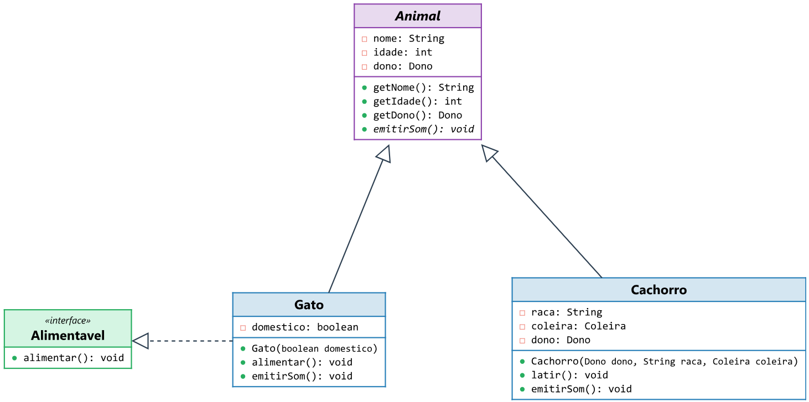
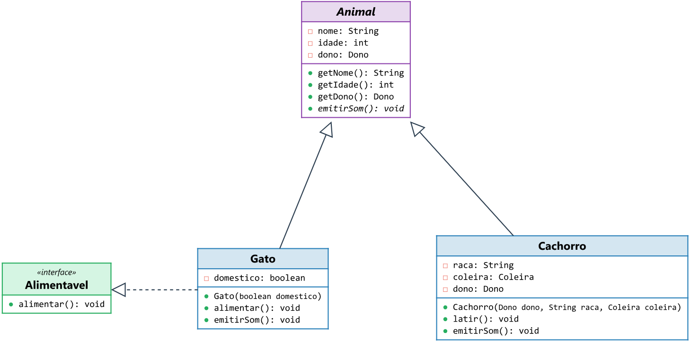
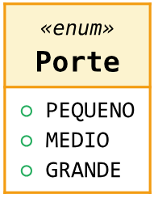

# ClassCraft

Generate UML class diagrams directly in Typst from Java or C# source code, built on top of the CeTZ engine with pluggable grammars.

## Overview

**classcraft** is a Typst package that automatically generates UML class diagrams. The package:

- **Infers relationships** (inheritance, implementation, association, aggregation, composition) by reading the actual source code.
- **Renders** the class box with attributes, methods and stereotypes (`«interface»`, `«enum»`, `«abstract»`).
- **Positions** classes using an automatic layout with support for manual positioning via the `@Layout` annotation.
- **Scales** the diagram to fit the available width and, optionally, a defined maximum height.

## Installation

Add the package to your Typst project:

```typst
#import "@preview/classcraft:0.1.0": setup-classuml, class-diagram
```

## Usage

### 1. Via code fences (show-rule)

Enable the code-fence interceptor with `setup-classuml`:

```typst
#import "@preview/classcraft:0.1.0": setup-classuml
#show: setup-classuml
```

Then use code blocks with the corresponding language:

````typst
```class-diagram-java
class Produto {
  private String nome;
  private double preco;
  public String getNome() {}
}
```
````

### 2. Via the `class-diagram` function

Use the function directly to control parameters per diagram:

```typst
#import "@preview/classcraft:0.1.0": class-diagram

#class-diagram(
  "class Foo { private Bar bar; }",
  grammar: "java",
  max-height: 8cm
)
```

#### Rendered Example



## Importing Source-Code Files

You can read `.java` or `.cs` files directly with Typst's `read()` function, keeping the diagram in sync with your real code.

```typst
#import "@preview/classcraft:0.1.0": class-diagram

#let src = (
  read("src/model/Animal.java"),
  read("src/model/Cachorro.java"),
  read("src/model/Gato.java"),
  read("src/model/Alimentavel.java"),
).join("\n\n")

#class-diagram(src, grammar: "java")
```

#### Example with Simplified Import



### Injecting Layout

You can interleave `@Layout` annotations without modifying the source files:

```typst
#let src = (
  "@Layout(level=0, order=0)",
  read("src/model/Animal.java"),
  "@Layout(level=1, order=0)",
  read("src/model/Cachorro.java"),
  "@Layout(level=1, order=1)",
  read("src/model/Gato.java"),
).join("\n\n")

#class-diagram(src, grammar: "java", max-height: 15cm)
```



## Size Control

- **Fit to width (`fit`)**: By default (`true`), the diagram scales to fit the page.
- **Maximum height (`max-height`)**: Limits the diagram height to avoid page breaks.

```typst
#class-diagram(src, grammar: "java", max-height: 12cm)
```

## Positioning with `@Layout`

Use it to force the organization of classes in the diagram:

| Property | Meaning                          |
| -------- | -------------------------------- |
| `level`  | Vertical row (0 = top)           |
| `order`  | Horizontal position (0 = left)   |

**Java:**

```java
@Layout(level=0, order=0)
class Animal { ... }
```

**C#:**

```csharp
[Layout(Level = 0, Order = 0)]
public class Animal { ... }
```

## Relationship Inference

The package analyzes the code and detects:

- **Inheritance/Implementation**: `extends`, `implements`, `:`.
- **Association**: Fields of non-primitive types.
- **Composition**: Detected by the use of `new Foo()` inside the class.
- **Aggregation**: Detected when the type is received in the constructor.
- **Dependency**: Detected by `throw new Exception()`.

## Enums

Enum values are listed automatically:


## Creating New Grammars

The system is pluggable. To add a new language:

1. Create the file in `src/grammars/`.
2. Implement the `parse(source) -> IR` function.
3. Register it in `mod.typ`.

See the [Complete Manual](docs/manual.typ) for more technical details.